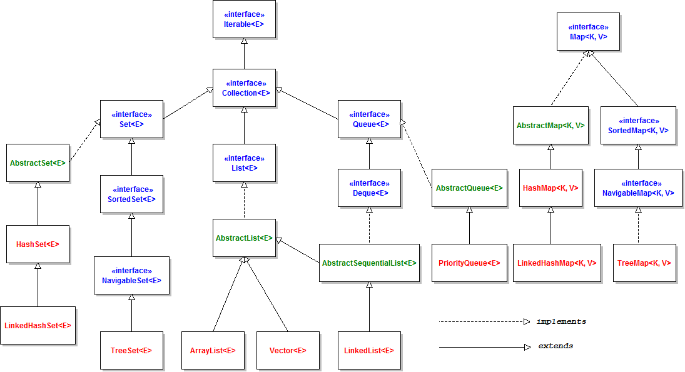

# OOP Principles

## Constructors

All Java classes have a constructor, which is the method called upon object instantiation.

- An object can have multiple overloaded constructors
- A constructor can have any access modifier
- Constructors can call other constructors through the `this()` method.
- If no constructor is specified, a default constructor is generated which takes no arguments and does nothing.
- The first call in any constructor is to the superclass constructor.
  - This can be elided, and the default constructor is called
    - If there is no default constructor, a constructor must be called explicitly
  - Can call explicitly with `super()`

## Access Modifiers

Access modifiers apply to methods and member variables.

- `private`: only the members of the class can see
- `public`: anyone can see
- `protected`: only class and subclasses can see
- Default: package-private, only members of the same package can see

## Inheritance

- To avoid the diamond/multiple inheritance problem, Java only allows for single inheritance
- This is done using the `extends` keyword in the class definition
- Inherits all public and protected methods and members
- Can, however, implement multiple interfaces

Example:

```java
public class Car extends Vehicle implements Drivable, Crashable{
    // insert class body here
}
```

The `Car` class extends the `Vehicle` base class (can be abstract or concrete) and implements the behaviours defined by the interfaces `Drivable` and `Crashable`.

## `static`

The static keyword defines a method, a field, or a block of code that belongs to the class instead of the object.

- Static fields share a mutable state accross all instances of the class
- Static methods are called from the class instead of from the object
- Static blocks are executed once, the first time the class is loaded into memory

## Polymorphism

Polymorphism: of many forms. A broad term describing a few things in java.

### Dynamic Polymorphism

An object is defined as polymorphic if it passes more than one `instanceof` checks. An object can be referred to as the type of any one of it's superclasses. Say for example there is a `Tiger` class, which subclasses `Cat`, which subclasses `Animal`, giving an inheritance chain of `Animal` <- `Cat` <- `Tiger`, then the following is valid:

```java
Animal a = new Tiger();
Cat c = new Tiger();
Tiger t = new Tiger();
```

When referencing an object through one of it's superclass types, you can only call objects that the reference type implements. For example, if there was two methods, `Cat::meow` and `Tiger::roar`, then:

```java
c.meow() //valid
t.meow() //valid
a.meow() //not valid - animal has no method meow
t.roar() //valid
c.roar() // not valid - cat has no method roar
```

Even though all these variables are of the same runtime type, they are being called from a reference of another type.

When calling a method of an object, the actual method run is the one that is _furthest down the inheritance chain_. This is dynamic/runtime dispatch.

```java
public class Animal{
    public speak(){return "...";}
}

public class Dog extends Animal{
    public speak(){return "woof";}
}

public class Cat extends Animal{
    public speak(){return "meow";}
}

Animal a = new Animal();
Animal d = new Dog();
Animal c = new Cat();

a.speak() // "..."
d.speak() // "woof"
c.speak() // "meow"
```

Even though the reference was of type `Animal`, the actual method called was the overridden subclass method.

### Static Polymorphism (Method Overloading)

Note: different to over*ridding*

- Multiple methods with the same name can be written, as long as they have different parameter lists
- The method that is called depends upon the number of and type of the arguments passed

Example:

```java
public class Addition{
    private int add(int x, int y){return x+y;}
    private float add(float x, float y){return x+y;}
    public static void main(String[] args){
        add(1,2); //calls first method
        add(3.14,2.72); //calls second method
        add(15,1.5); //calls second method
    }
}
```

## Abstraction

Abstraction is the process of removing irrelevant details from the user, while exposing the relevant details. For example, you don't need to know how a function works, it's inner workings are _abstracted_ away, leaving only the function's interface and details of what it does.

In the example below, the workings of the sine function are abstracted away, but we still know what it does and how to use it.

```java
float sin(float x){
    //dont care really
}
sin(90); // 1.0
```

## Encapsulation

Encapsulation is wrapping the data and the code that acts on it into a single unit. The process is also known as **data hiding**, because the data is often hidden (declared `private`) behind the methods that retrieve them (getters/setters).

## Reference Variables

There is no such thing as an object variable in Java. Only primitives (`int`,`char`,`float`...), and references. All objects are heap-allocated (`new`), and a reference to them stored. Methods are all pass by value: either the value of the primitive, or the value of the reference. _Java is not pass by reference_ . Objects are never copied/cloned/duplicated implicitly.

If a reference type is required (ie `Integer`), but a primitive is given (`(int) 1`), then the primitive will be _autoboxed_ into it's equivalent object type.

## Abstract Classes and Interfaces

- Abstract classes are are classes that contain one or more `abstract` methods.
  - A class must be declared `abstract`
  - Abstract methods have no body, ie are unimplemented.
  - The idea of them is to generalise behaviour, and leave it up to subclasses to implement
  - Abstract classes cannot be instantiated directly, though can still have constructors for subclasses to call
- Interfaces are a special kind of class that contain only abstract methods (and fields declared `public static final`)
  - Used to define behaviour
  - Technically can contain methods, but they're default implementations
    - This raises all sorts of issues so is best avoided
  - Don't have to declare methods abstract, it's implicit

The diagram shows the inheritance hierarchy of the java collections framework, containing interfaces, abstract classes, and concrete classes.

