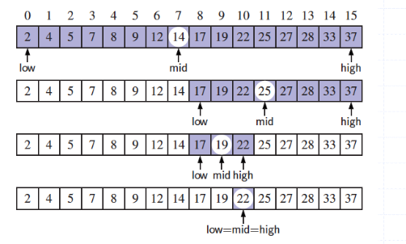

# Recursive Algorithms

Recursion allows a problem to be broken down into sub-problems, defining a problem in terms of itself. Recursive methods work by calling themselves. As an example, take the factorial function:

$$
n! =
\begin{cases}
1 & \text{if } n =0 \\
n \times (n-1)!&  \text{otherwise}
\end{cases}
$$

In java, this can be written:

```java
public static int factorial(int n){
    if(n == 0) return 1;
    return n * factorial(n-1);
}
```

Recursive algorithms have:

- A base case
  - This is the case where the method _doesn't_ call itself, and the stack begins to unwind
  - Every possible chain of recursive calls _must_ reach a base case
    - If not the method will recurse infinitely and cause an error
- A recursive case
  - Calls the current method again
  - Should always eventually end up on a base case

## Binary Search

Binary search is a recursively defined searching algorithm, which works by splitting an array in half at each step. Note that for binary search, the array must already be ordered.

Three cases:

- If the target equals `data[midpoint]` then the target has been found
  - This is the base case
- If the target is less than `data[midpoint]` then we binary search everything to the left of the midpoint
- If the target is greater than `data[midpoint]` then we binary search everything to the right of the midpoint



```java
public static boolean binarySearch(int[] data, int target, int left, int right){
    if (left > right)
        return false;
    int mid = (left + right) / 2;
    if(target == data[mid])
        return true;
    else if (target < data[mid])
        return binarySearch(data,target,low,mid-1);
    else
        return binarySearch(data,target,mid+1,high);

}
```

Binary search has $O(\log \,n)$, as the size of the data being processed halves at each recursive call. After the $i^{th}$ call, the size of the data is at most $n/2^i$.

## Linear Recursion

- The method only makes one recursive call
- There may be multiple possible recursive calls, but only one should ever be made (ie binary search)
- For example, a method used in computing powers by repeated squaring:

$$
pow(x,n) =
\begin{cases}
1 & \text{if } n =0 \\
x \left(pow(x,\frac{n-1}{2})\right)^2 &  n \text{ is odd} \\
\left(pow(x,\frac{n}{2})\right)^2 &  n \text{ is even}
\end{cases}
$$

```java
public static int pow(int x, int n){
    if (n == 0) return 1;
    if (n % 2 == 0){
        y = pow(x,n/2);
        return x * y * y;
    }
    y = pow(x,(n-1)/2);
    return y * y;
}
```

Note how despite multiple cases, `pow` only ever calls itself once.

## Binary Recursion

Binary recursive methods call themselves _twice_ recursively. Fibonacci numbers are defined using binary recursion:

- $F_0$ = 0
- $F_1 = 1$
- $F_i = F_{i-1} + F_{i-2}$

```java
public static int fib(int n){
    if (n == 0) return 0;
    if (n == 1) return 1;
    return fib(n-1) + fib(n-2);
}
```

This method calls itself twice, which isn't very efficient. It can end up having to compute the same result many many times. A better alternative is shown below, which uses linear recursion, and is therefore much much more efficient.

```java
public static Pair<Integer,Integer> linearFib(int n){
    if(k = 1) return new Pair(n,0);
    Pair result = linearFib(n-1);
    return new Pair(result.snd+1, result.fst);
}
```

## Multiple Recursion

Multiple recursive algorithms call themselves recursively more than twice. These are generally very inefficient and should be avoided.
