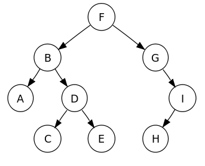
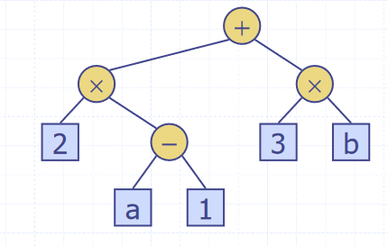

# Trees

- A tree is an abstract model of a heirarchical structure
- A tree consists of nodes with a parent-child relationship
  - A parent has one or more children
  - Each child has only one parent
- The root is the top node in the tree, the only node without a parent
- An internal node has at least one child
- An external node (or leaf) is a mode with no children
- Nodes have ancestors (ie, the parent node of a parent)
- The depth of a node is its number of ancestors
- The height of a tree is its maximum depth

## Tree ADT

Tree ADTs are defined using a similar concept to positional lists, as they don't have a natural ordering/indexing in the same way arrays do.

```java
public interface Tree<E>{
    int size();
    boolean isEmpty();
    Node<E> root(); //returns root node
    Node<E> parent(Node<E> n); //returns parent of Node n
    Iterable<Node<E>> children(Node<E> n); //collection of all the children of Node n
    int numChildren(Node<E> n);
    Iterator<E> iterator(); //an iterator over the trees elements
    Iterator<Node<E>> nodes(); //collection of all the nodes
    boolean isInternal(Node<E> n); //does the node have at least one child
    boolean isExternal(Node<E> n); //does the node have no children
    boolean isRoot(Node<E> n); //is the node the root

}
```

## Tree Traversal

Trees can be traversed in 3 different orders. As trees are recursive data structures, all 3 traversals are defined recursively. The tree below is used as an example in all 3 cases.



### Pre-order

- Visit the root
- Pre order traverse the left subtree
- Pre order traverse the right subtree

Pre-order traversal of the tree gives: F B A D C E G I H

### In-order

- In order traverse the left subtree
- Visit the root
- In order traverse the right subtree

In-order traversal of the tree gives: A B C D E F G H I

### Post-order

- Post order traverse the left subtree
- Post order traverse the right subtree
- Visit the root

Post-order traversal of the tree gives: A C E D B H I G F

## Binary Trees

A binary tree is a special case of a tree:

- Each node has at most two children (either 0, 1 or 2)
- The children of the node are an ordered pair (the left node is less than the right node)

A binary tree will always fulfil the following properties:

- $e = i+1$
- $n = 2e-1$
- $h \leq i$
- $h \leq (n-1)/2$
- $e \leq 2^h$
- $h \geq \log_2 e$
- $h \geq \log_2 (n+1) -1$

Where:

- $n$ is the number of nodes in the tree
- $e$ is the number of external nodes
- $i$ is the number of internal nodes
- $h$ is the height/max depth of the tree

### Binary Tree ADT

The binary tree ADT is an extension of the normal tree ADT with extra accessor methods.

```java
public interface BinaryTree<E> extends Tree<E>{
    Node<E> left(Node<E> n); //returns the left child of n
    Node<E> right(Node<E> n); //returns the right child of n
    Node<E> sibling(Node<E> n); //returns the sibling of n
}
```

### Arithmetic Expression Trees

Binary trees can be used to represent arithmetic expressions, with internal nodes as operators and external nodes as operands. The tree below shows the expression $(2 \times (a - 1)) + (3 \times b)$. Traversing the tree in-order will can be used to print the expression infix, and post-order evaluating each node with it's children as the operand will return the value of the expression.



### Implementations

- Binary trees can be represented in a linked structure, similar to a linked list
- Node objects are positions in a tree, the same as positions in a positional list
- Each node is represented by an object that stores
  - The element
  - A pointer to the parent node
  - A pointer to the left child node
  - A pointer to the right child node
- Alternatively, the tree can be stored in an array `A`
- `A[root]` is 0
- If p is the left child of q, `A[p] = 2 * A[q] + 1`
- If p is the right child of q, `A[p] = 2 * A[q] + 2`
- In the worst, case the array will have size $2^n -1$

## Binary Search Trees

- Binary trees can be used to implement a sorted map
- Items are stored in order by their keys
- For a node $p$ with key $K_p$, every key in the left subtree is less than $K_p$, and every node in the right subtree is greater than $K_p$
- This allows for support of nearest-neighbour queries, so can fetch the key above or below another key
- Binary search can perform nearest neighbour queries on an ordered map to find a key in $O(\log n)$ time
- A search table is an ordered map implemented using a sorted sequence
  - Searches take $O(\log n) time$
  - Insertion and removal take $O(n)$ time
  - Only effective for maps of small size

### Methods

Binary trees are recursively defined, so all the methods operating on them are easily defined recursively also.

- Search
- To search for a key $K$
  - Compare it with the key at $K_{root}$
  - If $K_{root} = K$, the value has been found
  - If $K_{root} < K$, search the right subtree
  - If $K_{root} > K$, search the left subtree
- Insertion
  - Search for the key being inserted $K$
  - Insert $K$ at the leaf reached by the search
- Deletion
  - Find the internal node that is follows the key being inserted in an in order traversal (the in order successor)
  - Copy key into the in order successor node
  - Remove the node copied out of

### Performance

- Consider a binary search tree with $n$ items and height $h$
- The space used is $O(n)$
- The methods get, put, remove take $O(h)$ time
  - The height h is $O(\log n)$ in the best case, when the tree is perfectly balanced
  - In the worst case, when the tree is basically just a linked list, this decays to $O(n)$

## AVL Trees

- AVL trees are balanced binary trees
  - For every internal node $v$ of the tree, the heights of the subtrees of $v$ can differ by at most 1
- The height of an AVL tree storing $n$ keys is $O(\log n)$
- Balance is maintained by _rotating_ nodes every time a new one is inserted/removed

### Performance

- The runtime of a single rotation is $O(1)$
- The tree is assured to always have $h= \log n$, so the runtime of all methods is $O(\log n)$
- This makes AVL trees an efficient implementation of binary trees, as their performance does not decay as the tree becomes unbalanced
