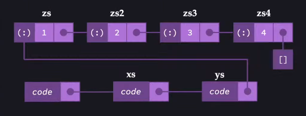
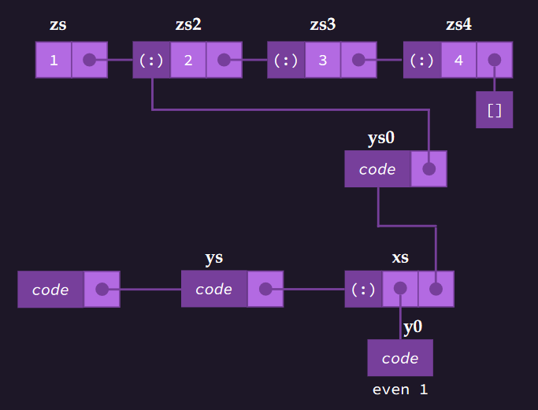

# Lazy Evaluation

## Evaluation Strategies

How are programs evaluated? There are a number of strategies for evaluating a program. For example, the expression `(4+8) * (15 + 16)` can be evaluated in different ways:

```haskell
(4+8) * (15 + 16)
=> 12 * (15+16)
=> 12 * 31
=> 372

-- or

(4+8) * (15 + 16)
=> (4 + 8) * 31
=> 12 * 31
=> 372
```

The final value when reducing an expression (it cannot be reduced further) is the _normal form_, 372 in this case. No matter how the expression is reduced, the normal form is the same. Haskell's type system prevents us from writing anything that cannot reduce to normal form.

A sub-expression (anything partially reduced that can still be reduced further) is called a _redex_, short for reducible expression. Evaluation strategies only matter when there are multiple redexes, otherwise there is only one route we can take to evaluate an expression.

## Strict Evaluation

**A programming language is strict if the arguments of the function are evaluated _before_ the function is called**.

Evaluating `fac 500` using a strict method:

```haskell
fac :: Int -> Int
fac n = fac' n 1

fac' :: Int -> Int -> Int
fac n m = case n of
  0 -> m
  _ -> fac' (n-1) (n*m)

fac 500      -- a redex, function application
=> fac' 500 1   -- another redex
=> fac' (500-1) (500*1)     -- 3 redexes, two multiplications and function application
=> fac' 499 (500*1)     -- two redexes now as 500-1=499 is now in normal form
=> fac' 499 500         -- now only one redex
=> fac' (499-1) (499*500) -- back to 3 redexes
... -- this goes on for a while
```

**Call-by-value** means that all function arguments are reduced to their normal forms (values), and then passed as such to the function. The call-by-value strategy is an example of strict evaluation. This is the evaluation strategy used by most programming languages: Java, JS, PHP, C/C++, OCaml, F#, Python, Scala, Swift. Note that some of these are also functional languages.

Haskell, on the other hand, is far superior. It is non-strict: aka **lazy**.

## Call-by-name

A non-strict evaluation strategy by which expressions given to functions as arguments are not reduced before the function call is made.  
Expressions are only reduced when their value is needed. Same example as before:

```haskell
fac 2
=> fac' 2 1  -- still a redex here
=> case 2 of
     0 -> 1
     _ -> fac' (2-1) (2*1)   -- the function call is expanded to its expression
=> fac' (2-1) (2*1) -- left with 3 redexes now
=> case 2-1 of
     0 -> 2*1
     _ -> fac' ((2-1)-1) ((2-1) * (2*1)) -- a lot of redexes, but we don't need to know the value of any except the one in the case expression. this one is evaluated but not the others
=> case 1 of
     0 -> 2*1
     _ -> fac' ((2-1)-1) ((2-1) * (2*1)) -- something actually got evaluated, as we needed it's value. we still have a lot of redexes though
```

Note how that the same argument (`(2-1)`) is there 3 times, but it is only evaluated when it is needed. This means that it is evaluated possibly more than once, as it may be needed more than once at different points. With call-by-value (strict), an expression is only reduced once but will only ever be reduced once, but with call-by-name (lazy), expressions may end up being evaluated more than once.

## Sharing

Sharing avoids duplicate evaluation. Arguments to functions are turned into local definitions, so that when an expression is evaluated, any expressions that are identical are also evaluated. The same example again, using both call-by-name and sharing:

```haskell
fac' :: Int -> Int -> Int
fac' n m = case n of
  0 -> m
  _ -> let x = n-1
           y = n*m
       in fac' x y

-- the compiler has replaced the expression arguments with let-bound definitions

fac 2
=> fac' 2 1
=> case 2 of
     0 -> 1
     _ -> let x0 = 2-1
              y0 = 2*1
          in fac' x0 y0 --expressions bound to variables

=> let x0 = 2-1
       y0 = 2*1 -- two redexes
   in fac' x0 y0
=> let x0 = 2-1
       y0 = 2*1
   in case x0 of
        0 -> y0
        _ -> let x1 = x0-1
                 y1 = x0 * y0
            in fac' x1 y1 -- even more redexes and bindings
    -- x0 can be replaced by 1, which evaluates the expresion in all places where x0 is used
```

Can think of let or where bindings as storing expressions in memory in such a way that we can refer to them from elsewhere using their names.

The combination of call-by-name and sharing is known as lazy evaluation, which is the strategy haskell uses. Nothing is evaluated until it is needed, and work is only ever done once. (Strict evaluation is done sometimes if the compiler decides to, so it is technically _non-strict_ instead of lazy.)

## Evaluation in Haskell

An example, using haskell's lazy evaluation strategy:

```haskell
length (take 2 (map even [1,2,3,4]))
=> length (take 2 (even 1 : map even [2,3,4])) -- check argument is non-empty list
=> length (even 1 : take (2-1) (map even [2,3,4])) -- even 1 cons'd to take 1 of map
=> 1 + length (take (2-1) (map even [2,3,4])) --know length is at least 1, take out
=> 1 + length(take 1 (map even [2,3,4]))
=> 1 + length (take 1 (even 2 : map even [3,4])) --another map call
=> 1 + (1 + length (take (1-1) (map even [3,4])) -- length again
=> 1 + (1 + length []) --take 0 so empty list
=> 1 + 1 + 0 -- return 0
=> 2 -- done
```

Note how half the map wasn't evaluated, because haskell knew we only cared about the first 2 elements. However this trace doesn't show any of the internal bindings haskell makes for sharing expressions. The compiler does this by transforming the expression:

```haskell
length (take 2 (map even [1,2,3,4]))
-- becomes
let
  xs = take 2 (map even [1,2,3,4])
in length xs
-- becomes
let
  ys = map even [1,2,3,4]
  xs = take 2 ys
in length xs
-- becomes
let
  ys = map even (1:(2:(3:(4:[]))))
  xs = take 2 ys
in length xs
-- finally
let
  zs4 = 4:[]
  zs3 = 3:zs4
  zs2 = 2:zs3
  zs  = 1:zs2
  ys  = map even zs
  xs  = take 2 ys
in length xs
```

In this representation, everything is let bound it it's own definition, and nothing is applied except to some literal or to another let bound variable. The representation in memory looks something like this:



These things in memory are called _closures_. A closure is an object in memory that contains:

- A pointer to some code that implements the function it represents (not shown)
- A pointer to all the free variables that are in scope for that definition
  - A free variable is any variable in scope that is not a parameter

The closures form a graph, where the closures all point to each other.

Another example, using `map`:

```haskell
map :: (a -> b) -> [a] -> [b]
map _ [] = []
map f (x:xs) = f x : map f xs

-- removing all syntactic sugar, done by compiler

map = \f -> \arg ->
  case arg of
    []      -> []
    (x: xs) -> let
                 y  = f x
                 ys = map f xs
                in (y:ys)
```

Using this definition of `map` to evaluate the expression from before (`length (take 2 (map even [1,2,3,4]))`):

```haskell
let
  zs4 = 4:[]
  zs3 = 3:zs4
  zs2 = 2:zs3
  zs  = 1:zs2
  xs  = map even zs
  ys  = take 2 xs
in length ys
-- new closures allocated by map, using 2nd case of map function
let
  zs4 = 4:[]
  zs3 = 3:zs4
  zs2 = 2:zs3
  zs  = 1:zs2
  y0 = even 1
  ys0 = map even zs2 -- new closures
  xs  = y0 : ys -- updated to be a cons cell
  ys  = take 2 xs
in length ys
```

The graph of closures representing this:



## Strictness in Haskell

Things _can_ be evaluated strictly in haskell, if you want. This is prefereable in some cases for performance reasons. The `\$!` operator forces strict function application. The version of the function below forces the recursive call to be evaluated first.

```haskell
fac' :: Int -> Int -> Int
fac' 0 m = m
fac' n m = (fac' \$! (n-1)) (n*m)
```

## Infinite Data Structures

Laziness means data structures can be infinite in haskell. This is also facilitated by the lack of call stack, as there is no "max recursion depth" like in strict languages.

```haskell
from :: Int -> [Int]
from n = n : from (n+1)
```

This function builds an infinite list of a sequence of `Int`s, starting with the `Int` passed. An example usage, showing how lazy evaluation works with it:

```haskell
take 3 (from 4)
=> take 3 (4 : from 5)
=> 4 : take 2 (from 5)
=> 4 : take 2 (5 : from 6)
=> 4 : 5 : take 1 (from 6)
=> 4 : 5 : take 1 (6 : from 7)
=> 4 : 5 : 6 : take 0 (from 7)
=> 4 : 5 : 6 : []
=> [4,5,6]
```

The infinite evaluation is _short-circuited_, as the compiler knows it only needs the first 3 elements.
