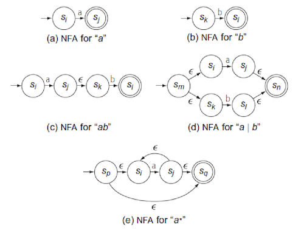

# Lexing

We want to transform a stream of characters into a stream of tokens `(token name, attribute value)`

- A lexeme is the sequence of chars from source code
- A Regex is formal notation for a recogniser
- Recognisers are represented as finite automata
  - $S$ - finite set of states in the recogniser along with error state $S_e$
  - $\Sigma$ is finite alphabet used by recogniser
  - $\delta(s,c)$ is transition function
    - Maps states $s$ and characters $c$ to next state
  - $s_0$ is the start state
  - Set $S_A$ are accepting states
- An alphabet is a finite set of symbols
  - String is sequence of symbols from alphabet
  - Language is set of strings over the alphabet
    - Defined using grammars
  - We want to check if string on alphabet is a member of language
    - Use a recognising automaton
      - Diagrams are large, use regex to express
  - A language defined by a regex is the set of all strings that can be described by that regex

## Tokenising

- Construct a regex matching all lexemes for all tokens
  - Union of regexes for the token classes gives a regex $R$ that defines a language
- Given an input sequence of characters, want to check if some number of characters belong to the language $R$
  - Gor $1 \leq i \leq n$ check if $C_1, ..., C_i$ is in $L(R)$
  - If true then we remove that string as a token and continue
  - Always select the longer sequence - **maximal munch**
  - If more than one token matches use the token class specified first
  - If no match then error
- Can build a scanner from regex
  - Require simulation of a DFA
  - Thompson’s construction goes from NFA -> RE
  - Subset construction builds a DFA that simulates an NFA
  - Hopcroft’s algorithm minimises a DFA
  - Kleene’s contruction dervices an RE from a DFA
- NFAs allow transitions on the empty string
  - States may have multiple transitions on the same character.
  - Can combine multiple FAs by just joining them with epsilon transisions
- DFAs only have a single transition on the each character from each state
  - No epsilon transitions
  - Can simulate any NFA

## Thompson's Construction - RE to NFA

- Use a template for building an NFA that corresponds to
  - A single letter regex
  - Transformation on NFAs that models the effect of regex operators
  - Combine fragments using epsilon transitions
  - Take into account precedence

## Subset Construction - NFA to DFA

Convert NFA to DFA to make it easier to simulate.

- Combine states based on epsilon transitions to eliminate them
- Create subset of states, then only consider transitions between subsets
- Set of states that can be reached from some state $n$ along only epsilon transitions is the epsilon closure of $n$

**Where there are several possible choices of next state, take all choices simultaneously and form a set of the possible next states. This set of NFA states becomes a single DFA state.**

## Hopcroft's algorithm - Minimising a DFA

Some states can be merged - partition states into groups of states that produce the same behaviour on any input string.

- Start by partitioning into accepting and non-accepting states
- Consider each subgroup
  - Partition into new subgroups such that two states $s$ and $t$ are in the same subgroup iff for all input symbols $a$, $s$ and $t$ have transitons on $a$ into the same group $G$
  - Replace group with new partitioning
- Keep going until convergence
