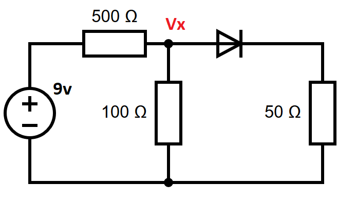

# Diodes

Diodes are semiconductor devices that allow current to flow _only in one direction._ Diodes look like this:

The diagram is labelled with an anode and a cathode. The voltage drop accross the diode is from anode -> cathode, and the current is conducted in the direction pointed by the really big black arrow.

The type's of diode's we're concerned with are silicon diodes, which have a forward voltage of about 0.7V. This is only an approximation, but is the value to use in calculations.

## IV characteristics

Diodes are _non-linear_ components:

- When current is flowing from anode to cathode, the diode is _forward-biased_, and will conduct current
- When the current is flowing backwards (the wrong way), the diode is _reverse-biased_.
- At a large negative voltage, the diode will break down, and start to conduct current again
  - Don't let the voltage get this high, you wont like what happens.

### Forward Voltage

For the diode to conduct, it must have a minimum voltage accross it, known as the forward voltage. This is also _always_ the total voltage drop accross the diode. For a silicon diode, this is 0.7V, which is why the I-V graph does not go up from zero. The diode can be said to "open" or "switch on" at about this voltage.

- If there is a voltage of 0.2V accross a diode, no current will flow
- If there is a voltage of 0.6V accross a diode, a tiny amount of current may flow
- At >0.7V, the full current will flow with no resistance.

## Example 1

Find the current and the voltages accross each component in the circuit below.

By Ohm's law, the current is:

$$I = \frac{V_{in} - V_D}{R_t} = \frac{10 - 0.7}{100 + 300} = 23.25 \, mA$$

Thefore, the voltages are
$$V_{300R} = 300 \times 23.25 = 6.98 \, V$$
$$V_{100R} = 100 \times 23.25 = 2.32 \, V$$
$$V_D = 0.7V$$

## Example 2

Find the current through each resistor in the circuit below.

Doing KCL around node $V_x$:

$$\frac{V_x - 9}{500} + \frac{V_x}{100} + \frac{V_x - 0.7}{50} = 0$$
$$V_x = 1 \, V$$

The three currents are then:

$$I_{500R} = \frac{9-1}{500} = 16 \, mA$$
$$I_{100R} = \frac{1}{100} = 10 \, mA$$
$$I_{50R} = \frac{1 - 0.7}{50} = 6 \, mA$$
