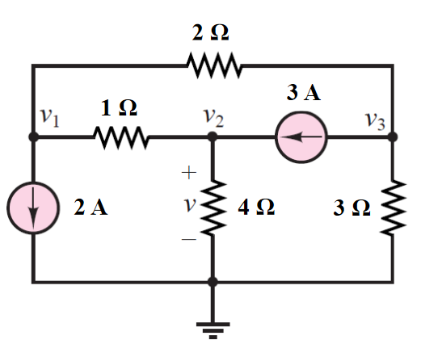

# Nodal Analysis

## Kirchhoff's Current Law

**The sum of currents entering a node is equal to the sum of currents leaving a node.**

$$ -I_1 -I_2 + I_3 + I_4 + I_5 = 0 $$
$$ I_1 + I_2 = I_3 + I_4 + I_5 $$

- Currents flowing into a node are denoted as negative
- Currents flowing out of a node are denoted positive
- The sum of currents around a node _must_ always be 0

## Nodal Analysis

A technique used to analyse circuits to calculate unknown quantities. Allows the voltage at each circuit node to be calculated, using KCL.

An important point to remember is that the bottom of any circuit diagram is ground (0V), by convention.

### Steps

- Choose 1 node as the reference node
- Label any remaining voltage nodes $V_1, V_2, etc...$
- Substitute any known voltages
- Apply KCL at each unknown node to form a set of simultaneous equations
- Solve simultaneous equations for unknowns
- Calculate any required values (usually currents)

Generally speaking, there will be a nodal equation for each node, formed using KCL, and then these equations will solve simultaneously.

## Example

Calculate the voltages at nodes $V_1$ and $V_2$.

There are 4 currents at $V_1$

- Flowing from 15V source to $V_1$ accross 2 $\Omega$ resistor
- Flowing from $V_1$ to ground accross 16 $\Omega$ resistor
- Flowing between $V_1$ and $V_2$ accross 7 $\Omega$ resistor
- 5A, from current source

Each current is calculated using ohm's law, which gives the following nodal equation:

$$\frac{V_1 - 15}{2} + \frac{V_1}{16} + 5 + \frac{V_1-V_2}{7} = 0$$

When the direction of each current is not known it is all assumed to be positive, and the voltage at the node is labelled as postive, with any other voltages being labelled as negative. Similar can be done for node $V_2$:

$$\frac{V_2 - V_1}{7} - 8 + \frac{V_2+30}{9} = 0$$

We now have two equations with two unknowns, which can easily be solved.

$$11.29 V_1 - 2.29 V_2 = 40$$
$$-9 V_1 + 16 V_2 = 294$$
$$ V_1 = 8.2V , V_2 = 23.0V$$

## Admittance Matrices

The system of equations above can also be represented in matrix form

$$
\begin{pmatrix}
11.29 & -2.29\\
-9 & 16
\end{pmatrix}
\,
\begin{pmatrix}
V_1 \\ V_2
\end{pmatrix}
=
\begin{pmatrix}
40 \\ 294
\end{pmatrix}
$$

This matrix equation always takes the form $Y \times V = I$.

$Y$ is known as the _Admittance Matrix_.

## Calculating Power Dissapated

Sometimes, it is required that the power dissapated by voltage/current sources is calculated. For example, calculate the power supplied by the current sources in the following:

KCL at node $V_1$: $2 + \frac{V_1 - V_2}{1} + \frac{V_1 - V_3}{2} = 0$

KCL at node $V_2$: $-3 + \frac{V_2}{4} + \frac{V_2 - V_1}{1} = 0$

KCL at node $V_3$: $3 + \frac{V_3}{3} + \frac{V_3 - V_1}{2} = 0$

$$
\begin{pmatrix}
3 & -2 & -1\\
4 & -5 & 0 \\
3 & 0 & -5
\end{pmatrix}

\,

\begin{pmatrix}
V_1 \\ V_2 \\ V_3
\end{pmatrix}

=

\begin{pmatrix}
-4 \\ -12 \\ 18
\end{pmatrix}

\Longrightarrow

\begin{pmatrix}
V_1 \\ V_2 \\ V_3
\end{pmatrix}

=

\begin{pmatrix}
-3.5 \\ -0.4 \\ -5.7
\end{pmatrix}
$$

From the node voltages, the power dissapated in the sources can be calculated. In the 2A source:

$$ P = IV = 2 \times (0 - V_1) = 2 \times (0 - 3.5) = 7 \, W$$

And in the 3A source:

$$ P = 3 \times (V_2 - V_3) = 3 \times (-0.4 + 5.7) = 15.9 \, W$$

Note that the voltage accross the current source is always calculated as the node the current is flowing to, minus the node the current is flowing from, ie (to - from). This makes the sign correct so it is known whether the source is delivering or absorbing power. **If the direction of the current source oppose the direction of the voltage rise, it will be absorbing power.**.

If correct, the total power delivered to the circuit will equal the total dissapated. This calculation can be done to check, if you're bothered.

## Dependant Sources

Some circuits contain current/voltage sources which are dependant upon other values in the circuit. In the example below, a current $I$ is assumed between the two nodes where the dependant voltage source is.

Calculate the power dissipated by the 50 $\Omega$ resistor, and the power delivered by the current source.

At Node $V_1$: $\frac{V_1 - 50}{5} + \frac{V_1}{50} + I = 0$

At Node $V_2$: $-I + \frac{V_2}{100} -4 = 0$

We have two equations in 3 unknowns, so another equation is needed. Using $I_a$:

$$I_a = \frac{V_1 - 50}{5},\;\;\; 10I_a = V_2 - V_1$$
These can be equated about $I_a$ to give
$$V_2 - V_1 = 2V_2 - 100$$

This system of equations solves to give $V_1 = 60 V$, and $V_2 = 80 V$.

Therefore,

- The power delivered by the current source $P = IV = 4 \times 80 = 320 W$
- The power dissapated by the 50 $\Omega$ resistor is $P = \frac{V^2}{R} = \frac{60^2}{50} = 72 W$
