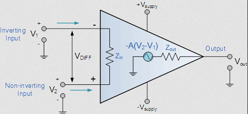
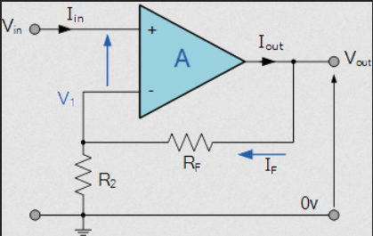
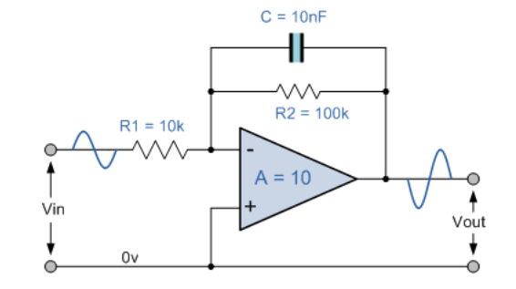
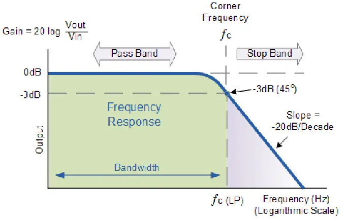
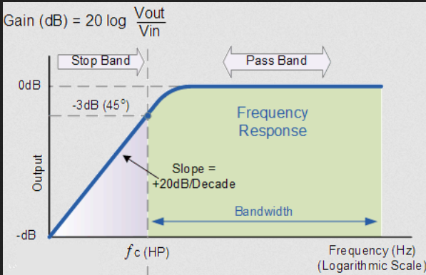
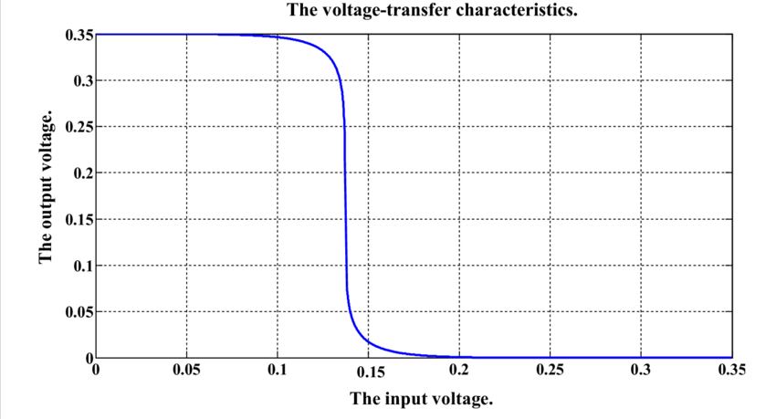

# Op Amps

Operational Amplifiers (Op-Amps) are high-gain electronic voltage amplifiers. They have two inputs, an output, and two power supply inputs. Op amps require external power, but this is implicit so is often emitted in circuit diagrams.

Op amps are differential amplifiers, meaning they output an amplified signal that is proportional to the difference of the two inputs. They have a very high gain, in the range of $10^4$ to $10^6$, but this is assumed to be infinite in ideal amplifiers. The output voltage is calculated by:

$$V_0 = A(V_2 - V_1)$$

## Ideal Model

An ideal model of an op amp is shown below

- Open loop gain is infinite
  - The gain of the op amp when there is no positive or negative feedback
- Input impedance ($Z_{in}$) is infinite
  - Ideally, no current flows into the amplifier
- Output impedance ($Z_{out}$) is zero
  - The output is assumed to act like a perfect voltage source to supply as much current as possible
- Bandwith is infinite
  - An ideal op amp can amplify any input frequency signal
- Offset Voltage is zero
  - The output will be zero when the input and output voltage are the same

## Ideal Circuits

Op amps can be used to design inverting and non-inverting circuits.

### Inverting

- Negative feedback is used to create an amplifier that is stable, ie doesn't produce a massive voltage output.
- This creates closed loop gain, which controls the output of the amplifier
- The non-inverting input is grounded
- The negative feedback reverses the polarity of the output voltage
- As the output of the op amp is only a few volts, and the gain of the op amp is very high, it can be assumed that the voltage at both inputs is equal to zero volts
  - This creates a "virtual earth" at the node shown on the diagram

Using KCL at this node, it can be shown that:

$$\frac{V_{out}}{V_{in}} = \frac{ - R_{in}}{R_F}$$

The gain of the amplifier is set by the ratio of the two resistors.

### Non-Inverting

Non-inverting amplifiers don't invert the voltage output, and use input at the non-inverting terminal of the op amp instead.

The output of the amplifier is calculated by:

$$\frac{V_{out}}{V_{in}} =  1 + \frac{ R_F}{R_2}$$

## Op Amps as Filters

Filters take AC signals as input, and amplify/attenuate them based upon their frequency.

### Low Pass Filter

Take a simple inverting amplifier circuit, and add a capacitor in parallel.

The gain is now a function of the input frequency, which makes the circuit a filter. The reactance of the capacitor $X_C = \frac{1}{ \omega C}$. The impedance of the capacitor and resistor in parallel:

$$Z = \frac{R_2 jX_C}{R_2 + j X_C} = \frac{R_2}{1 + j \omega C R_2}$$

The gain as a function of $j\omega$ is therefore:

$$A(j \omega ) = \frac{V_{out}(j \omega)}{V_{in}(j \omega)} = \frac{-Z}{R_1} = - \frac{R_2}{1 + j \omega C R_2} \times \frac{1}{R_1}$$

- Gain is measured in decibels
- As the input frequency increases, gain decreases
- At very low frequencies, the gain is constant (0dB)
  - The capacitor has high reactance at low frequencies, and is open circuit at very low frequencies
- At very high frequencies, the gain tends towards $-\infty$ dB
  - The capacitor has a very low reactance at high frequencies (short circuit)

### Cutoff Frequency

The cutoff frequency of a filter is the point at which the gain is equal to -3 dB, which corresponds to a fall in output by a factor of $\frac{1}{\sqrt{2}}$. For the filter shown above, this is:

$$f_c = \frac{1}{2 \pi R_2 C}$$

### High Pass Filter

A high pass filter is designed in a similar way

This time, the impedance of the capacitor-resistor combination is:

$$Z = R_1 + \frac{1}{j \omega C} = \frac{1 + j \omega C R_1}{j \omega C}$$

Which makes the gain:

$$A(j \omega ) = \frac{V_{out}(j \omega)}{V_{in}(j \omega)} = \frac{-R_2}{Z} = - R_2 \times \frac{j \omega C}{1 + j \omega C R_1}$$

The cutoff frequency for this filter is:

$$f_c = \frac{1}{2 \pi R_1 C}$$

Which is similar to the other one, just with the other resistor.

## Voltage Transfer Characteristics

- The voltage transfer characteristic of an amplifier shows the output voltage as a function of the input voltage
- The output range is equal to the range of the power supplies
- Where the slope = 0, the amplifier is saturated
- Where the slope > 0, the gain is positive
- Where the slope < 0, the gain is negative
- When the amplifier is saturated the signal becomes distorted

