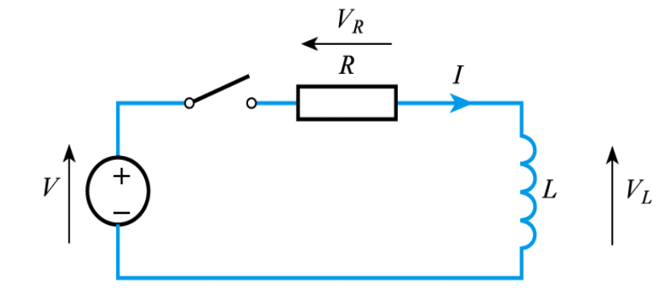
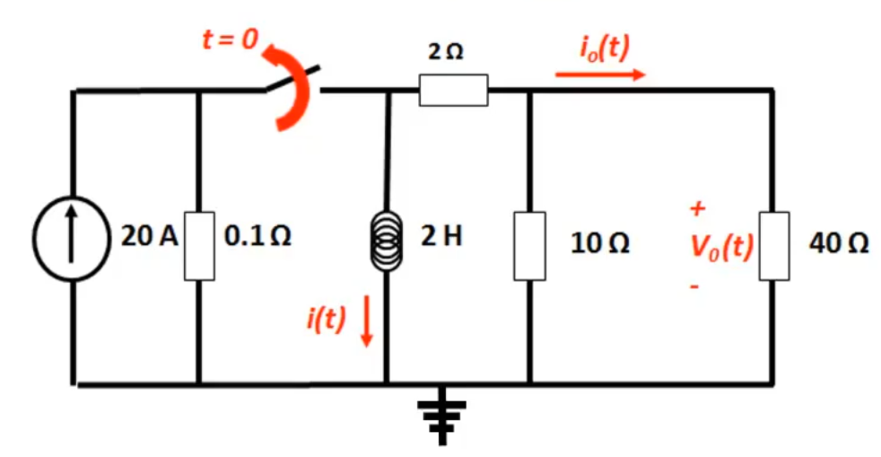

# First Order RL Circuits

Basically the same as RC circuits, but with inductors instead.

## Inductors

Inductors are reactive components, similar to capacitors. The difference is that while capacitors store energy in electric fields, inductors store it in magnetic fields. They do this with coils of wire wrapped around ferromangetic cores. Inductance is measured in Henries H and has symbol $L$.

Inductance can be calculated as
$$L = \frac{\mu_0 \mu_r A N^2}{l}$$
where

- $N$ is the number of turns in the coil
- $l$ is the circumference of the core
- $A$ is the cross-sectional area of the core
- $\mu_0$ is the permeability of free space
- $\mu_r$ is the relative permeability of the core

### Inductance

- Current passing through a conductor (the coil of wire) causes a change in magnetic flux which magnetises the coil.
- This change in flux induces an EMF (Electro-Motive Force) in any conductor within it.
- Faraday's Law states that the magnitude of the EMF induced in a circuit is proportional to the rate of change of flux linking the circuit
- Lenz's Law states that the direction of the EMF is such that it tends to produce a current that opposes the change of flux responsible for inducing the EMF in the first place
- Therefore, as we attempt to magnetise an inductor with a current, it induced a back EMF while it's field charges
- One the inductor is fully charged, the back EMF dissapears and the inductor becomes a short circuit (it is just a coil of wire, after all).
    
- When a circuit forms a single coil, the EMF induced is given by the rate of change of the flux
- When a circuit contains many coils of wire, the resulting EMF is the sum of those produced by each loop
- If a coil contains N loops, the induced voltage $V$ is given by the following equation, where $\Phi$ is the flux of the circuit.
  $$ V = -N \frac{d\Phi}{dt}$$

- This property, where an EMF is induced by a changing flux, is known as inductance.

### Self - Inductance

- A changing current causes a changing field
- which then induced an EMF in any conductors in that field
- When any current in a coil changes, it induced an EMF in the coil

$$V= L \frac{dI}{dt}$$

This equation describes the I-V relationship for an inductor. It can be derived from the equations for faraday's law and inductance.

### Energy Stored

The energy stored in an inductor is given by
$$W = \frac{1}{2}LI^2$$

### Series & Parallel Combinations

Inductors sum exactly the same way as resistors do. In series:

$$L_t = L_1 + L_2$$

And in parallel:

$$\frac{1}{L_t} = \frac{1}{L_1} + \frac{1}{L_2}$$

### DC Conditions

The final constant values of a circuit, where current and voltage are both in a "steady-state" is known as DC conditions. Under DC conditions:

- Capacitor acts as open circuit
- Inductor acts as short circuit

## Response of RL Circuits

Inductors exhibit the same exponential behaviour as capacitors. In a simple first order RL circuit:

- Inductor is initially uncharged with a current at 0
- When the circuit is switched on at time t=0, $I$ is initially 0 as the inductor is open circuit.
  - $V_R$ is initially 0
  - $V_L$ is initially V
- As the inductor energises, $I$ increases, $V_R$ increases, so $V_L$ decreases
  - This is where the exponential behaviour comes from

### Equations for Step Response

Consider the circuit above, where thw switch is closed at time t=0. KVL can be used to derive an equation for the current in the circuit over time, which is shown below:

$$I(t) = \frac{V_{in}}{R} + (I_0 - \frac{V_{in}}{R}) e^{-\frac{t}{\tau}}$$

Where the time constant $\tau = \frac{L}{R}$. The inductor voltage at time $t$ is equal to:
$$V_L(t) = (V_{in} - I_0R) e^{-\frac{t}{\tau}}$$

When discharging, the current at time $t$ is equal to:
$$I(t) = I_0 e^{-\frac{t}{\tau}}$$

## RC vs RL Circuits

RC circuits and RL circuits are similar in some respects, but different in others.

### RC Equations

$$I = C \frac{dV}{dt}$$
$$V_{in} = IR + V_C = RC \frac{dV}{dt} + V_C$$
$$V_C(t) = V_{in} + (V_0 - V_{in})e^{-frac{t}{\tau}}$$
$$\tau = RC$$

### RL Equations

$$V = L \frac{dI}{dt}$$
$$V_{in} = IR + V_L = IR + L \frac{d}{dt}I_L$$
$$I_L(t) = \frac{V_{in}}{R} + (I_0 - \frac{V_{in}}{R}) e^{-\frac{t}{\tau}}$$
$$\tau = \frac{L}{R}$$

## Examples

In the circuit below, the switch is opened at time $t=0$. Find:

- $I(t)$ for $t > 0$
- $I_0(t)$ for $t > 0$
- $V_0(t)$ for $t > 0$

### $I(t)$

Looking for something of the form $I_L(t) = \frac{V_{in}}{R} + (I_0 - \frac{V_{in}}{R}) e^{-\frac{t}{\tau}}$

In steady state, before the switch is opened, all of the current flows through the inductor as it is short circuit, meaning $I_0 = 20 \, A$.

When the switch is opened there is no energy supplied to the circuit, so the inductor discharges through the right hand half of the circuit. The inductor can see a resistance of $R_{eq} = 2 + 10 || 40$:

$$R = 2 + \frac{1}{\frac{1}{10} + \frac{1}{40}} = 10 \, \Omega$$

There is no input voltage, so:
$$I_L(t) = 0 + (I_0 - 0) e^{-\frac{t}{\tau}}$$
$$\tau = \frac{2}{10} = 0.25$$
$$I(t) = 20 e^{-5t}$$

### $I_0(t)$

This can simply be calculated using the current divider rule:

$$I_0(t) = -20e^{-5t} \times \frac{10}{10 + 40} = -4 e^{-5t}$$

### $V_0(t)$

Using ohm's law:

$$V_0(t) = I_0(t)R = 40 \times -4 e^{-5t} = -160 e^{-5t} $$
