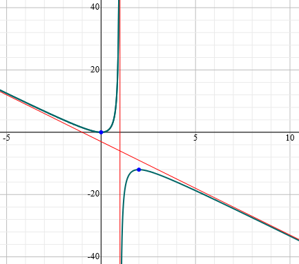

# Functions, Conics & Asymptotes

## Domain & Range

- The domain of a function is the set of all valid/possible input values
  - The x axis
- The range of a function is the set of all possible output values
  - The y axis

## Odd & Even Functions

$$f(x) = f(-x) \Rightarrow \text{f is even}$$
$$f(-x) = -f(x) \Rightarrow \text{f is odd}$$
$$f(x) = -f(-x) \Rightarrow \text{f is odd}$$

## Conics

Equation of a circle with radius $r$ and centre $(x_0, y_0)$
$$(x-x_0)^2 + (y - y_0)^2 = r^2$$

Equation of an ellipse with centre $(x_0, y_0)$, major axis length $2a$ and minor axis length $2b$:
$$\frac{(x-x_0)^2}{a^2} + \frac{(y - y_0)^2}{b^2} = 1$$

Equation of a Hyperbola with vertex $(x_0, y_0)$:

$$\pm \frac{(x-x_0)^2}{a^2} \mp \frac{(y - y_0)^2}{b^2} = 1 $$
The asymptotes of this hyperbola are at:
$$(y-y_0) = \pm \frac{b}{a} (x-x_0) $$

## Asymptotes

There are 3 kinds of asymptotes:

- Vertical
- Horizontal
- Oblique (have slope)

For a function $y = \frac{P(x)}{Q(x)}$:

- Vertical asymptotes lie where $Q(x) = 0$ and $P(X) \neq 0$
- Horizontal asymptotes
  - If the degree of the denominator is bigger than the degree of the numerator, the horizontal asymptote is the x-axis
  - If the degree of the numerator is bigger than the degree of the denominator, there is no horizontal asymptote.
  - If the degrees of the numerator and denominator are the same, the horizontal asymptote equals the leading coefficient of the numerator divided by the leading coefficient of the denominator
- Oblique asymptotes
  - A rational function will approach an oblique asymptote if the degree of the numerator is one order higher than the order of the denominator
  - To find
    - Divide $P(x)$ by $Q(x)$
    - Take the limit as $x \to \infty$

Example: find the asymptotes of $y = \frac{-3x^2 +2}{x-1}$:

- Vertical asymptotes:
  - Where the denominator is 0

$$x-1 = 0  \Rightarrow x = 1$$

- Horizontal asymptotes:
  - There are none, as degree of the numerator is bigger than the degree of the denominator
- Oblique asymptotes:
  - Divide the top by the bottom using polynomial long division
  - Find the limit

$$y = \frac{-3x^2}{x-1} = -3x - 3 + \frac{-1}{x-1}$$

As $x \to \infty$, $y \to -3x -3 $, giving $y = -3x -3$ as an asymptote.

