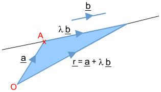
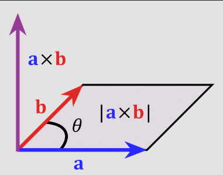

# Vectors

## Vector Equation of a Straight Line

The vector $\bm{r}$ is the vector of any point along the line.

$$\bm{r} = \bm{a} + \lambda\bm{b}$$

$\bm{a}$ is any point on the line, and \bm{b} is the direction of the line. $\lambda$ is a parameter that represents the position of $\bm{r}$ relative to $\bm{a}$ along the line. The carteian form of this can be derived:
$$x = a_1 + \lambda b_1$$
$$y = a_2 + \lambda b_2$$
$$z = a_3 + \lambda b_3$$

Equating about lambda:
$$\frac{x - a_1}{b_1} = \frac{y - a_2}{b_2} = \frac{z - a_3}{b_3}$$

## Scalar/Dot Product

The dot product of two vectors:
$$\bm{a} \cdot \bm{b} = |\bm{a}||\bm{b}|\cos\theta = \sum a_n b_n$$

- If $\bm{a} \cdot \bm{b} = 0$, then $\theta = 90$ and $\cos\theta = 0$
  - The two vectors are perpendicular
- $\bm{a} \cdot \bm{a} = |\bm{a}|^2$

The angle between two vectors can be calculated using the dot product
$$\cos\theta = \frac{\bm{a}\cdot\bm{b}}{ |\bm{b}| |\bm{a}| }$$

## Projections

The projection of vector $\bm{a}$ in the direction of $\bm{b}$ is given by the scalar product:

$$\frac{\bm{b}}{ |\bm{b}| } \cdot \bm{a} = \hat{\bm{b}} \cdot \bm{a}$$

This gives a vector in the direction of $\bm{b}$ with the magnitude of $\bm{a}$.

## Equation of a Plane

The vector equation of a plane is given by
$$\bm{r} \cdot \bm{n} = \bm{a} \cdot \bm{n}$$

Where $\bm{n}$ is the normal to the plane, and $\bm{a}$ is any point in the plane. This expands to the cartesian form:

$$n_1 x+ n_2 y + n_3 z = \bm{a} \cdot \bm{n}$$

## Angle Between Planes

The angle between two planes is given by the angle between their normals.
$$\cos\theta = \frac{\bm{n_1}\cdot\bm{n_2}}{ |\bm{n_1}| |\bm{n_2}| }$$

## Intersection of 2 Planes

Two planes will only intersect if their normal vectors intersect.

- First, check the two normals are non parallel
  - $\bm{n_1}\cdot\bm{n_2} \neq 0$
- Equate all 3 variables about either a parameter $\lambda$ or one of $x$, $y$, or $z$ to get an equation for the line along which the planes intersect in cartesian form

### Example

Find the intersection of the planes $3x + y - 4z = 4$ (1) and $-x + y = 2$ (2).

(1) - (2):
$$4x - 6z = 2 \Rightarrow z = \frac{2x-1}{3}$$

(1) + 3(2):
$$4y + 2z = 10 \Rightarrow z = \frac{2y-5}{-1}$$

Equating the two with z:

$$\frac{2x-1}{3} = \frac{2y-5}{-1} = z$$

### Using Cross Product

For two normals to planes $\bm{n_1}$ and $\bm{n_2}$, the vector $\bm{b} = \bm{n_1} \times \bm{n_2}$ will lie in both planes. The line

$$\bm{r} = \bm{a} + \lambda (\bm{n_1} \times \bm{n_2}) $$

lies in both planes.

## Distance from Point to Plane

The shortest distance from the point $(x_0,\,y_0,\,z_0)$ to the plane $Ax + By + Cz + D = 0$ is given by:

$$\frac{ |Ax_0 + By_0 + Cz_0 + D | }{\sqrt{A^2 + B^2 + C^2}}$$

## Vector/Cross Product

The cross product of two vectors produces another vector, and is defined as follows

$$\bm{a} \times \bm {b} = |\bm{a}||\bm{b}|\sin\theta\,\hat{\bm{n}} $$

$\theta$ is the angle between the two vectors, and $\hat{\bm{n}}$ is a unit vector perpendicular to both $\bm{a}$ and $\bm{b}$. The right-hand rule convention dictates that $\hat{\bm{n}}$ should always point up (ie, if $\bm{a}$ and $\bm{b}$ are your fingers, then $\hat{\bm{n}}$ is your thumb). The cross product is not commutative, as $\bm{a} \times \bm{b}$ = $-(\bm{b} \times \bm{a})$.

- The magnitude of the cross product $|\bm{a} \times \bm{b}|$ is equal to the area of the parallelogram formed by the two vectors.
- Can be used to find a normal given 2 vectors/2 points in a plane

### Angular Velocity

A spheroid rotates with angular velocity $\bm{\omega}$. A point $\bm{A}$ on the spheroid has velocity $\bm{v}= \bm{\omega} \times \bm{A}$
