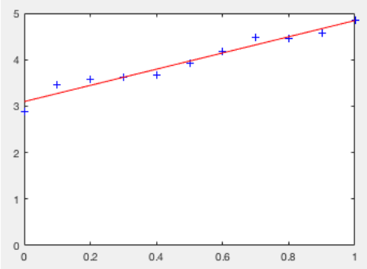

# Data Driven Models

- A system model can be developed from data describing the system
- Computational techniques can be used to fit data to a model

## Modelling Approaches

### White Box

- A white box model is a physical modelling approach, used where all the information about a system and its components is known.
- For example: "What is the voltage accross a 10 $\Omega$ resistor?"
  - The value of the resistor is known, so a mathematical model can be developed using knowledge of physics (Ohm's law in this case)
  - The model is then tested against data gathered from the system

### Grey Box

- A grey box model is similar to white box, except where some physical parameters are unknown
- A model is developed using known physical properties, except some parameters are left unknown
- Data is then collected from testing and used to find parameted
- For example: "What is the force required to stretch this spring by $x$mm, when the stiffness is unknown"
  - Using knowledge, $F=Kx$
  - Test spring to collect data
  - Find value of $K$ that best fits the data to create a model
  - Final model is then tested
- Physical modelling used to get the _form_ of the model, testing used to _find unknown parameters_
- This, and white box, is mostly what's been done so far

### Black box

_"Here is a new battery. We know nothing about it. How does it performance respond to changes in temperature?"_

- Used to build models of a system where the internal operation of it is completely unknown: a "black box"
- Data is collected from testing the system
- An appropriate mathematical model is selected to fit the data
- The model is fit to the data to test how good it is
- The model is tested on new data to see how closely it models system behaviour

## Modelling in Matlab

### Regression

- Regression is predicting a continuous response from a set of predictor values
  - eg, predict extension of a spring given force, temperature, age
- Learn a function that maps a set of predictor variables to a set of response variables

For a linear model of some data $y = p_1x + p_0$:

- $y$ and $x$ are the predictor variables from the data set
- $p_1$ and $p_0$ are the unknowns to be estimated from the data
- Polynomial models can be used for more complex data

### In Matlab

```matlab
% data points
x = 0:0.1:1.0;
y = 2 * x + 3;
%introduce some noise into the data
y_noise = y + 0.1*randn(11,1)';

%see the data
figure;
plot(x,y_noise);
axis([0 1 0 5])
```

In matlab, the `polyfit` function ([matlab docs](https://uk.mathworks.com/help/matlab/ref/polyfit.html)) is used to fit a polynomial model of a given degree to the data.

- Inputs: x data, y data, polynomial degree
- Output: coefficients of model

```matlab
P = polyfit(x,y_noise,1) % linear model
hold on;
plot(x,polyval(P,x),'r');
```



In the example shown, the model ended up as $y = 1.7456x + 3.0976$, which is close, but not exact due to noise introduced into the data.

### Limitations

- Too complex of a model can lead to overfitting, where the model contains unwanted noise
- To overcome this:
  - Use simpler model
  - Collect more data
