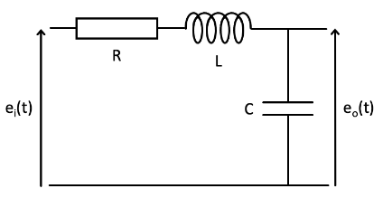

# Electrical Systems

Similar to mechanical systems, models of electrical systems can be constructed. Similar deal to ES191.

## Variables

- Current $I(t)$ in amps (A)
- Voltage $e(t)$ in volts (V) -- *not v for voltage, e is used in systems*
- Power in watts $P = I(t)\cdot e(t)$

## Elements

### Capacitors
- Store electrical energy in a reversible form
- Capacitance $C$ measured in Farads (L)

Elemental equation:

$$I(t) = C \frac{d}{dt}e_{12}(t)$$

Energy stored:
$$W = \frac{1}{2}Ce^2$$

### Inductors
- Store magnetic energy in a reversible form
- Inductance $L$ measured in Henries (H)

Elemental equation:
$$e_{12}(t) = C \frac{d}{dt}I(t)$$

Energy Stored:
$$W = \frac{1}{2}LI^2$$

### Resistors
- Dissapates energy
  - Non-reversible
- Resistance $R$ measured in Ohms ($\Omega$)

Elemental Equation (Ohm's law):
$$e_{12}(t) = I(t) \cdot R$$

### Voltage Source
- Provides an input of energy to the system.
- Input voltage $e_i(t)$

## Kirchhoff's Laws
- Describe how elements interconnect and transfer energy between them
- KVL - voltages around a closed loop sum to zero
- KCL - currents about a node sum to zero

## Example

Form a differential equation to model the following electrical system/circuit:

Elements:
- Resistor: $e_r = IR$
- Capacitor: $I = C \frac{d}{dt}e_c$
- Inductor: $e_L = L \frac{d}{dt}I$

KVL - the voltages round the loop sum to zero:

$$e_i - e_r - e_l - e_o = 0$$
$$e_i - IR - L\frac{dI}{dt} - e_o = 0$$

Using the capacitor equation, and the fact that $e_o = e_c$:

$$e_i - RC \frac{d}{dt}e_o - LC \frac{d^2}{dt^2}e_o - e_o = 0$$
$$LC \frac{d^2}{dt^2}e_o(t) + RC \frac{d}{dt}e_o(t) + e_o(t) = e_i(t)$$
