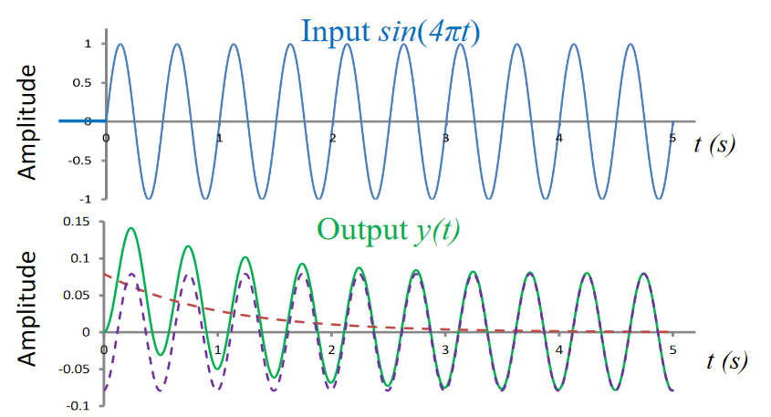
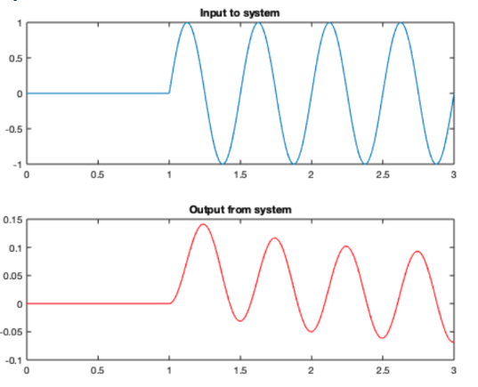
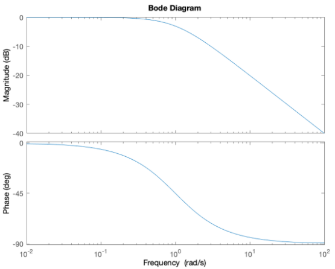

# First Order Frequency Response

Frequency response is is the response of a system to a sinusoidal/oscillating input.

## Response to Sinusoidal input

For a standard first order system $T=\frac{d}{dt}y(t) + y(t) = u(t)$, with a sinusoidal input $u(t) = Asin(\omega t)$:

$$U(s) = \mathcal{L}(u(t)) = \frac{A\omega}{s^2 + \omega^2}$$
$$Y(s) = U(s)G(s) = \frac{A\omega}{s^2 + \omega^2} \frac{1}{Ts+1}$$
$$y(t) =  \mathcal{L}^{-1}(Y(s)) = \frac{A}{\sqrt{1+\omega^2T^2}} sin(\omega t - tan^{-1}\omega T) + \frac{A \omega T}{1 + \omega^2 T^2} e^{-\frac{t}{T}}$$

The sinusoidal part of the equation is the steady-state that the response tends to, and the exponential part is the transient part that represents the rate of decay of the offset of the oscillation.

- The frequency of input and output is always the same
  - It is the amplitude and phase shift $\phi$ that change
  - These depend on the input frequency $\omega$
    - This dependence _is_ the frequency response

### Example

The example below shows an input $sin(4 \pi t)$, and its output with $G(s) = \frac{1}{s+1}$



$$y(t) = 0.0793sin(4\pi t + \phi) + 0.079 e^{-t}, \;\; \phi = -tan^{-1} 4\pi = -85^{\circ}$$

The steady state sinusoidal and transient exponential part of this response can be seen in the equation.

### Matlab Example

The following code generates the following plot

```matlab
system = tf(1,[1 1]);
t = 0:0.01:3; % time value vector
u = (t>=1).*sin(4 * pi * t) %input signal for t >= 1
y = lsim(sys,u,t); % simulate system with input u

figure;
subplot(2,1,1); plot(t,u); title("input");
subplot(2,1,2); plot(t,y,'r'); title("outputA");
```



## Gain and Phase

Gain is the _ratio of output to input amplitude_, ie how much bigger or smaller the output is compared to input.

$$G = \frac{E}{A}(\omega)$$

Phase difference $\phi (\omega )$ is how much the output signal is delayed compared to the input signal. Both are functions of input frequency $\omega$.

The frequency response can be obtained by substituting $j \omega$ for $s$ in the transfer function. This gives a complex function as shown

$$G(s) = \frac{1}{Ts+1} \Longrightarrow G(j\omega) = \frac{1}{Gj\omega + 1}$$

Magnitude $|G(j \omega) |$ gives the amplitude of the response, and the argument of the complex number $\angle G(j \omega)$ gives the phase shift $\phi$. The substitution $s=j \omega$ is used, is because in the Laplace domain, both signals and systems are represented by functions of $s$.

- The $s$-plane is the complex plane on which Laplace transforms are graphed.
- Generally, $s=\sigma + j\omega$
- $\sigma$ is the Neper frequency, the rate at which the function decays
- $\omega$ is the radial frequency, the rate at which the function oscillates
- Periodic sinusoidal inputs are non decaying, so $\sigma = 0$, giving $s=j\omega$

To find the frequency response parameters:

$$G(j\omega) = \frac{1}{1 + j \omega T} \times \frac{1 - j \omega T}{1 - j \omega T} = \frac{1 - j \omega T}{1 + \omega^2 T^2} $$
$$ = \frac{1}{1 + \omega^2 T^2} - j \frac{\omega T}{1 + \omega^2 T^2}$$
$$ = Re(G) - j Im(G)$$
$$|G(j \omega) | = \sqrt{(Re(G))^2 + (Im(G))^2} = \frac{1}{\sqrt{1+\omega^2T^2}}$$

$$\angle G(j\omega) = tan^{-1} \frac{Im(G)}{Re(G)} = - tan^{-1} \omega T$$

The graphs below show the frequency response in terms of $T$ for varying frequency $\omega$:


### Example

Given a transfer function $G= \frac{1}{s}$, what is the magnitude and phase of frequency response?
$$G(j \omega) = \frac{1}{j\omega} = \frac{-j}{\omega} = 0 - \frac{1}{\omega}j$$
$$|G(j\omega)| = \sqrt{\frac{1}{\omega^2}} = \frac{1}{\omega}$$
$$\angle G(j\omega) = tan^{-1} \frac{\frac{-1}{\omega}}{0} = - \frac{\pi}{2}$$

## Bode Plots

Bode plots show frequency and amplitude of frequency response on a log$_{10}$ scale. Information is not spread linearly accross the frequency range, so it makes more sense to use a logarithmic scale. An important feature of bode plots is the _corner frequency_: the frequency at the point where the two asymptotes of the magnitude-frequency graph. This point is where $\omega =\frac{1}{T}$.



The plot above is for the function $G(s) = \frac{1}{s+1}$. The gain is measured in decibels $dB$ for the magnitude of the response.
