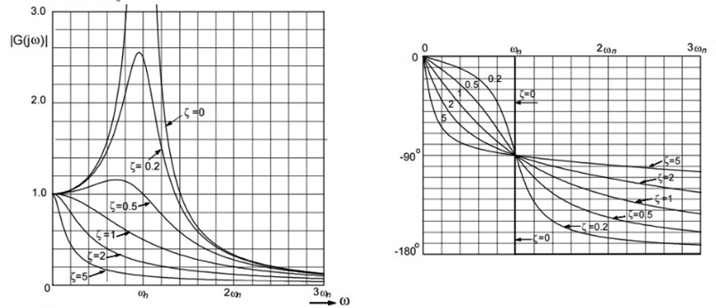
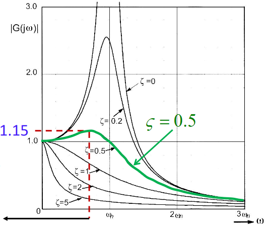
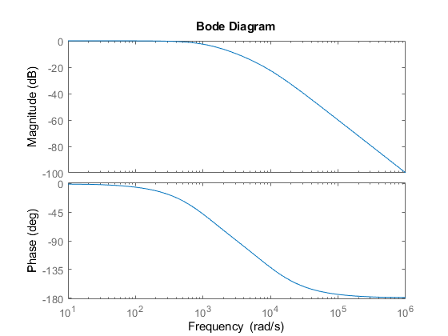

# Second Order Frequency Response

How second order systems respond to sinusoidal/oscillating input. Similar to first order.

## Gain and Phase for Second Order Systems

For a 2nd order system in standard input-output form:

$$\frac{1}{\omega_n^2} \frac{d^2}{dt^2}y(t) + \frac{2\zeta}{\omega_n} \frac{d}{dt} y(t) + y(t) = u(t), \;\; y(0) = 0, \;\; \frac{d}{dt}y(0) = 0$$
$$G(s) = \frac{\omega_n^2}{s^2 + 2\zeta\omega_n s + \omega_n^2}$$
$$G(j\omega) = \frac{\omega^2_n}{(\omega_n^2 - \omega^2) + 2j\zeta \omega_n \omega}$$

The gain and phase of the frequency response are therefore:

$$|G(j\omega)| = \frac{\omega_n^2}{[(\omega_n^2 - \omega^2)^2 + 4 \zeta^2 \omega_n^2 \omega^2]^{1/2}}$$

$$\phi(\omega) = \angle G(j\omega) = -tan^{-1}\frac{2 \zeta \omega_n \omega}{\omega_n^2 - \omega^2}$$

### Bode Plots, from Data Book



The plots show gain and phase shift for varying values of $\zeta$

## Example

For the electrical system shown below with the values $R = 1 k \,\Omega$, $C = 0.1 \, \mu F$, $L = 0.1 H$ find:

- The undamped natural frequency $\omega_n$
- The damping factor $\zeta$
- Sketch the magnitude of the frequency response $|G(j\omega)|$
  - At what frequency is this at it's maximum?
- Sketch a bode plot using matlab


The system equation is:
$$LC \frac{d^2}{dt^2}e_o(t) + RC \frac{d}{dt}e_o(t) + e_o(t) = e_i(t)$$

Undamped natural frequency:
$$\frac{1}{\omega^2_n} = LC = 10^{-8} \Longrightarrow \omega_n = 10^4 \,  rads^{-1} $$

Damping factor:
$$\frac{2\zeta}{\omega_n} = RC = 10^4 \Longrightarrow \zeta = 0.5$$

Using the graph from the data book



The graph peaks at approx $|G(j\omega)| = 1.15$, so:
$$\omega \approxeq 0.71 \omega_n = 0.71 \times 10^4 \,rads^{-1}$$
$$f = \frac{0.71 \times 10^4}{2 \pi} = 1129 \,Hz$$

Matlab plot:

```matlab
R = 1000
C = 10e-7
L = 0.1
sys = tf([1],[L*C R*C 1]); figure; step(sys);
bode(sys);
```


