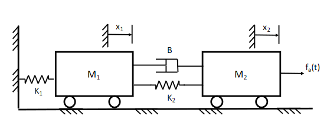
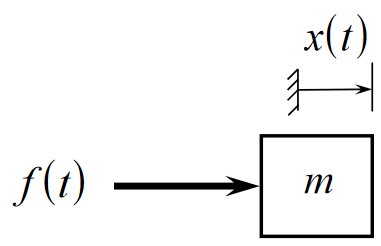

# Translational Mechanical Systems

- Translational systems involve movement in 1 dimension
- For example, the suspension in a car going up and down over bumps
- System diagrams can be used to represent systems

- Diagrams include:
  - Masses
  - Springs
  - Dampers

## Elements

There are element laws to model each of the three elements involved in mechanical systems. They are modelled using two key variables:

- Force $F(t)$ in newtons ($N$)
- Displacement $x(t)$ in meters ($m$)
  - Also sometimes velocity $v(t) = \dot{x}$ in meters per second ($ms^{-1}$)

When modelling systems, some assumptions are made:

- Masses are all perfectly rigid
- Springs and dampers have zero mass
- All behaviour is assumed to be linear

### Mass

- Stores kinetic/potential energy
- Energy storage is reversible
  - Can put energy in OR take it out

Elemental equation (Newton's second law):

$$m \frac{d^2}{dt^2}x = m\ddot{x} = ma = f(t)$$

Kinetic energy stored:

$$W = \frac{1}{2}mv^2$$

### Spring

- Stores potential energy
- Also reversible energy store
  - Can be stretched/compressed

Elemental equation (Hooke's law):

$$f(t) = k(x_1(t) - x_2(t))$$

The spring constant k has units $Nm^{-1}$. Energy Stored:

$$W = \frac{1}{2} k (x_1 - x_2)$$

In reality, springs are not perfectly linear as per hooke's law, so approximations are made. Any mechanical element that undergoes a change in shape can be described as a _stiffness element_, and therefore modelled as a spring.

### Damper

Dampers are used to reduce oscillation and introduce friction into a system.

- Dissapates energy as heat
- Non reversible energy transfer
- Takes energy out of the system

Elemental equation:

$$f(t) = B(\dot{x_1} - \dot{x_2})$$

B is the damper constant and has units $Nsm^{-1}$

## Interconnection Laws

Compatibility Law

- Elemental velocities are identical at points of connection

Equilibrium Law

- Sum of external forces acting on a body equals _mass x acceleration_
- All forces acting on a body in equilibrium equals zero

### Fictitious/D'alembert Forces

D'alembert principle is an alternative form of Newtons' second law, stating that the force on a body is equal to mass times acceleration: $F - ma = 0$. $-ma$ is the inertial, or fictitious force. When modelling systems, the _inertial force always opposes the direction of motion._

## Example:

Form a differential equation describing the system shown below.

4 forces acting on the mass:

- Spring: $F = kx$
- Damper: $F = B\dot{x}$
- Inertial/Fictitious force: $F = m\ddot{x}$
- The force being applied, $f(t)$

The forces all sum to zero:

$$f(t) - kx - B\dot{x} - m\ddot{x} = 0$$
$$f(t) = m\ddot{x} + B\dot{x} + kx$$
