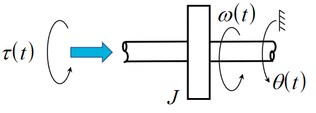
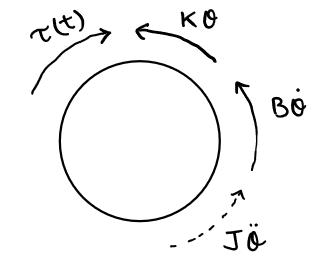

# Rotational Mechanical Systems

## Dynamic Systems

- A system is a set of interconnected elements which transfer energy between them
- In a dynamic system, energy between elements varies with time
- Systems interact with their environments through:
  - Input
    - System depends on
    - Do no affect environment
  - Output
    - System does not depend on
    - Affects Environment
- Mathematical models of dynamic systems are used to describe and predict behaviour
- Models are _all, always_ approximations

### Lumped vs Distributed Systems

- In a lumped system, properties are concentrated at 1 or 2 points in an element
  - For example
    - Inelastic mass, force acts at centre of gravity
    - Massless spring, forces act at either end
  - Modelled as an ODE
  - Time is only independent variable
- In a distributed system, properties vary throughout an element
  - For example, non-uniform mass
  - Time and position are both independent variables
  - Can be broken down into multiple lumped systems

### Linear vs Non-Linear Systems

- For non-linear systems, model is a non-linear differential equation
- For linear systems, equation is linear
- In a linear system, the resultant response of the system caused by two or more input signals is the sum of the responses which would have been caused by each input individually
  - This is not true in non-linear systems

### Discrete vs Continuous Models

- In discrete time systems, model is a _difference_ equation
  - output happens at discrete time steps
- In continuous systems, model is a _differential_ equation
  - output is a continuous function of the input

## Rotational Systems

Rotational systems are modelled using two basic variables:

- Torque $\tau$ measured in $Nm$
  - A twisting force
  - Analogous to force in Newtons
- Angular displacement $\theta$ measured in radians
  - Angular velocity $\omega = \dot{\theta}$
  - Analogous to displacement in meters

## Element Laws

### Moment of Inertia

- Rotational mass about an axis
- Stores kinetic energy in a reversible form
- Shown as rotating disc with inertia $J$, units $Kgm^2$

Elemental equation:
$$\tau (t) = J \frac{d^2}{dt^2}\theta(t) = J \ddot{\theta}(t)$$

Energy Stored:
$$W = \frac{1}{2} J \omega^2$$

**_The force $J \ddot{\theta}$ acts in the opposite direction to the direction the mass is spinning_**

### Rotational Spring

- Stores potential energy by twisting
- Reversible energy store
- Produced torque proportional to the angular displacement at either end of spring

Elemental Equation:

$$\tau(t) = k(\theta_1(t) - \theta_2(t))$$

Stored Energy:

$$W = \frac{1}{2} k (\theta_1(t) - \theta_2(t))^2$$

### Rotational Damper

- Dissapates energy as heat
- Non-reversible
- Energy dissapated $\propto$ angular velocity

Elemental Equation:

$$\tau(t) = B(\omega_1(t) - \omega_2(t))$$

## Interconnection Laws

### Compatibility Law

Connected elements have the same rotational displacement and velocity

### Interconnection Law

D'alembert law for rotational systems:

$$\sum_i(\tau_{ext})_i - J\dot{\omega} = 0 $$

$J\dot{\omega}$ is considered an inertial/fictitious torque, so for a body in equilibrium, $\sum_i \tau_i = 0$.

## Example

Form an equation to model the system shown below.

4 torques acting upon the disk:

- Stiffness element, $\tau=k\theta$
- Friction element, $\tau=B\dot{\theta}$
- Input torque $\tau(t)$
- Inertial force $\tau = J\ddot{\theta}$

The forces sum to zero, so:

$$ \tau(t) - k\theta - B\dot{\theta} - J\ddot{\theta} = 0$$

$$
\tau(t) = J\ddot{\theta}(t) + B\dot{\theta}(t)  + k\theta(t)
$$
