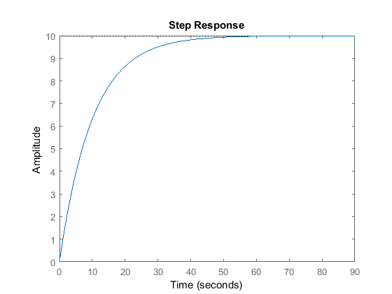

# First Order Step Response

Modelling is about predicting the behaviour of a system. Often, need to know

- What is the output for a given input?
- Is the system stable?
- If the input changes quickly, how will the output change?

## First Order Systems

First order systems are those with only one energy store, and can be modelled by a first order differential equation.

| _Type_     | _Equation_                                  |
| ---------- | ------------------------------------------- |
| Electrical | $RC \frac{de_o}{dt} + e_o = e_i$            |
| Thermal    | $RC \frac{d\theta}{dt} + \theta = \theta_a$ |
| Mechanical | $M\dot{v} + Bv = f(t)$                      |
| General    | $T \frac{dy}{dt} + y = x$                   |

For the general form of the equation $T \frac{dy}{dt} + y = x$, the solution for a step input $x=H$ at time $t=0$, with $y(0) = 0$:
$$y = H(1 - e^{-\frac{t}{T}})$$
T is the time constant of the system.

## Free and Forced Response

- Free response:
  - The response of a system to its stored energy when there is no input
  - Zero Input
  - Non-zero initial Conditions
  - Homogenous differential equation
- Forced response:
  - The response of a system to an input when there is no energy initially in the system
  - Non-zero input
  - Zero initial Conditions
  - Non-homogeneous differential equation
- Total system response is a linear combination of the two

## System Inputs

Different inputs can be used to determine characteristics of the system.

### Step Input

$$
u(t) =
\begin{cases}
0  & t < 0 \\
H  & t \geq 0
\end{cases}
$$

- A sudden increase of a constant amplitude input
- Can see how quickly the system responds
- Is there is any delay/oscillation?
- Is it stable?

### Sine Wave

- Can vary frequency and amplitude
- Shows frequency response of a system

### Impulse

$$
u(t) =
\begin{cases}
0  & t \neq 0 \\
\infty  & t = 0
\end{cases}
$$

- A spike of infinite magnitude at an infinitely small time step

### Ramp

$$
u(t) =
\begin{cases}
0  & t < 0 \\
kt  & t \geq 0
\end{cases}
$$

- An input that starts increasing at a constant rate, starting at $t=0$.

## Step Response

- The step response of the system is the output when given a step input
  - System must have zero initial conditions
- Characteristics of a response:
  - Final/resting value
  - Rise time
  - Delay
  - Overshoot
  - Oscillation (frequency & damping factor)
  - Stability

For a system with time constant $T=1$, the response looks something like this:

The time constant $T$ of a system determines how long the system takes to respond to step input. After 1 time constant, the system is at about $1-\frac{1}{e}$ (63) % of its final value.

| Time (s) | % of final value |
| -------- | ---------------- |
| $0.5T$   | 39.3%            |
| $T$      | 63.2%            |
| $2T$     | 86.5%            |
| $3T$     | 95.0%            |
| $4T$     | 98.2%            |
| $5T$     | 99.3%            |
