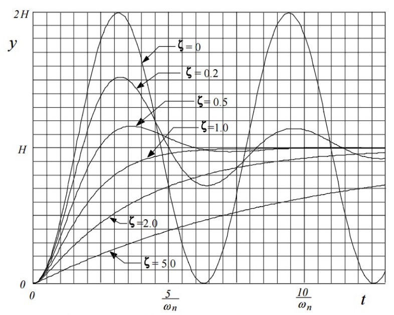

# Second Order Step Response

How 2nd order systems (those with 2 energy storing elements) respond to step inputs.

## Standard form

$$\frac{1}{\omega_n^2} \frac{d^2}{dt^2}y(t) + \frac{2\zeta}{\omega_n} \frac{d}{dt} y(t) + y(t) = u(t)$$

- $\omega_n$ is the undamped frequency of the system response
  - Indicates the speed of the response
- $\zeta$ is the damping factor
  - Indicates the shape of the response

## Forced Response

- Forces response is the response to a non-zero input, namely
  - Step
  - Sinusoidal
- Initial conditions are zero, it $y(0) = 0$, $\frac{d}{dt}y(0) = 0$
- The response is the solution to a non-homogeneous second order differential equation

## Damped Response

There are 4 different cases for system response:

| Damping Factor  | Response          |
| --------------- | ----------------- |
| $\zeta = 0$     | No Damping        |
| $0 < \zeta < 1$ | Underdamped       |
| $\zeta = 1$     | Critically Damped |
| $\zeta > 1$     | Overdamped        |

The response of a system to the same input with varying damping factors is shown in the graph below, from the data book. The equations are also given in the data book.

### Undamped

The system is not damped at all and is just a normal sinusoidal wave.

$$y(t) = H(1-\cos \omega_n t)$$

### Underdamping

The amplitude of the sinusoidal output decreases slowly over time to a final "steady state" value.

$$y(t) = H [ 1 - \frac{e^{-\zeta \omega_n t}}{\sqrt{1-\zeta^2}} \sin(\sqrt{1-\zeta^2}\omega_nt + \phi)]$$
$$\tan \phi = \frac{\sqrt{1-\zeta^2}}{\zeta}$$

### Critical Damping

This gives the fastest response, where the output rises to its final steady state value.

$$y(t) = H (1-(\omega_nt)e^{-\omega_nt})$$

### Overdamping

The output rises slowly to its steady state value.
$$y(t) = H [ 1 - \frac{e^{-\zeta \omega_n t}}{\sqrt{\zeta^2 -1}} \sinh(\sqrt{\zeta^2-1}\omega_nt + \phi)]$$
$$\tan \phi = \frac{\sqrt{\zeta^2-1}}{\zeta}$$
