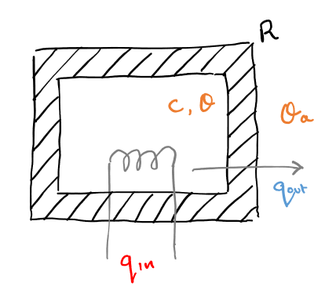

# Thermal Systems

- Used to model heat transfer
  - For example in a house
  - Or in electronic components
- Determine efficiency of elements
- Determine thermal operating ranges for components

## Variables

- Rate of heat flow $q(t)$ in watts ($Js^{-1}$)
- Temperature, $\theta(t)$ in Kelvins (K)

- Analogous to current and voltage in electrical systems

## Elements

### Thermal Capacitor

- Stores heat energy in a reversible way

Elemental equation:
$$q_c(t) = C \frac{d\theta}{dt}$$

Where $q_c(t)$ is the net heat flowing in, ie $q_{in}(t)-q_{out}(t)$.

### Thermal Resistor

- Dissapates heat
  - Non-reversible

Any object that restricts heat flow when heat flows from on medium to another can be modelled as a resistor. Elemental equation:
$$q(t) = \frac{1}{R}\theta_{12}(t)$$

Where $q_t$ is the flow of heat from the temperature $\theta_1$ on one side of the resistor to the temperature $\theta_2$ on the other.

## Interconnection Laws

Compatibility Law:

- Temperatures are identical where elements touch,
- $\theta_1 = \theta_2 = ... = \theta_n$

Equilibrium Law:

- Elemental heat flow rates sum to zero at connection points
- $q_1 + q_2 + ... + q_n = 0$

## Examples

Develop a thermal model for someone doing winter sports. Assume:

- Ambient temperature $\theta_a$
- Body temperature $\theta$
- Thermal resistance between body and ambient (the person is wearing a coat) $R$
- Heat generated by body $q_{in}$

The rate of heat flow out is the difference in ambient and body temperature accross the resistor:
$$q_{out} = \frac{\theta-\theta_a}{R}$$

In the thermal capacitor, the net input heat is proportional to the rate of change of temperature:
$$q_{in}-q_{out} = C \frac{d\theta}{dt}$$

Combining the two equations gives:
$$RC \frac{d}{dt}\theta + \theta = R q_{in} + \theta_a$$
