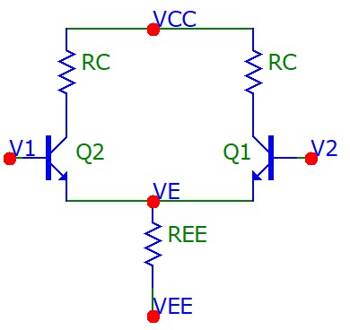
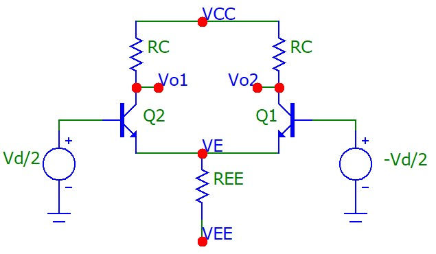
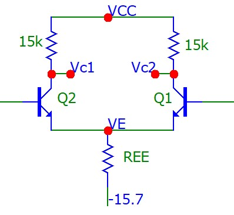
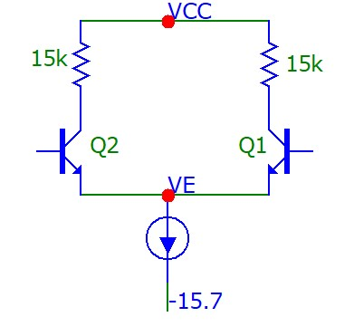

# Differential Amplifiers

Op-amps are differential amplifiers, designed to amplify the difference between two inputs. In an op-amp, the gain $A$ is usually very large, approaching $\approx 10^6$ in practice, and is modelled as infinite.

$$
V_{out} = A(V_1 - V_2)
$$

Op-amps are based on a circuit known as a long-tailed pair:

- $Q_1$ and $Q_2$ are a **matched pair** of transistors, meaning they have the exact same electrical properties (
  - $\beta_{Q_1} = \beta_{Q_2}$
- The quiescent current $I_Q$ is the current through the shared emitter resistor, $R_{EE}$
- $I_Q = I_{E_1} + I_{E_2}$
- If $\beta$ is large, then $I_C = I_E$

## Biasing

When doing bias calculations, the two inputs $V_1$ and $V_2$ are assumed to be grounded, $V_B = 0$. As $V_{BE} = 0.7$, $V_E = -0.7$. $V_{EE}$, the tail voltage, is always taken as negative. Using this, we can calculate $I_Q$:

$$
I_Q = \frac{-0.7 - (-V_{EE})}{R_{EE}} = \frac{V_{EE} - 0.7}{R_{EE}} = 2 I_E
$$

$R_{EE}$ sets the quiscent collector current.

When the two inputs are grounded, the output at the collectors $V_{C_1}$ and $V_{C_2}$ are the same.

$$V_{C_1} = V_{C_2} = V_{CC} - I_C R_C$$

For matched transistors, $V_{C_1} - V_{C_2} = 0$.

## AC Analysis

The long-tailed pair can operate in two modes, depending upon how input is applied

- Differential mode amplifies the difference between the two input signals
- Common mode works similar to a regular BJT amplifier
- Better amplifiers have a high ratio of differential to common gain, called the **Common Mode Rejection Ratio (CMRR)**

### Differential Mode

The circuit below shows two AC sources connected, $V_d/2$ and $-V_d/2$, to give a differential input signal of $V_d$.

The differential output is the difference between the two outputs:

$$V_{o1} - V_{o2} = V_{od}$$

And the differential mode gain:

$$
A_{id} = \left| \frac{V_{od}}{V_d}\right| = g_m R_C
$$

The way this circuit is usually used, however, is with one output referenced to ground:

This gives a single-ended output, with a gain of:

$$
\left| \frac{V_{o}}{V_d}\right| = \frac{g_m R_C}{2}
$$

The input and output resistances for differential mode inputs are:

$$R_{id} = 2 r_\pi$$
$$R_{od} = 2 R_E$$

### Common Mode

Common mode input is when the same signal is connected to both input terminals, $V_1 = V_2 = V_{cm}$. An ideal differential amplifier would reject common mode input, but this is often not the case. The performance of a differential amplifier is defined by it's **CMRR**, which would ideally be infinite, but is usually just very large in practice.

$$
A_{cm} = \left|\frac{V_{o1}}{V_{cm}}\right| = \frac{-\beta R_C}{r_\pi + 2(1+\beta)R_{EE}} \approx \frac{-R_C}{2R_EE}
$$

The common mode input resistance:

$$
R_{ic} = \frac{r_\pi}{2} + R_{EE} (1+\beta)
$$

The generalised output of a differential amplifier, factoring in both common mode and differential mode input signals is:

$$
V_{out} = A_{id} V_{id} + A_{cm} V_{cm}
$$

## Example

Find $R_{EE}$ to give $I_Q = 1 mA$, and $R_C$ for max AC swing, when $V_{CC} = 15 V$.

$$I_Q = \frac{15.7-0.7}{1m} = 15 k\Omega$$

For max AC swing, $R_C \approx 7.5V$:

$$R_C = \frac{7.5}{0.5 mA} = 15 k \Omega$$

Using $\beta = 100$, calculate the differential and common mode gains, and the CMRR of the circuit.

$$
r_\pi = \frac{\beta V_T}{I_C} = \frac{100 \times 25}{0.5} = 5 k \Omega
$$

$$
A_{id} = \frac{g_m R_C}{2} = \frac{\beta R_C}{2 r_\pi} = \frac{100 \times 15k}{ 2 \times 5k} = 150
$$

$$
A_{cm} = \frac{-\beta R_c}{r_\pi + 2(1+\beta)R_{EE}} = \frac{-100 \times 15k}{5k + 202 \times 15k} = -0.49
$$

$$
CMRR =\left|\frac{A_{id}}{A_{cm}}\right| = \frac{150}{0.49} = 303.5 = 49.6 dB
$$

The common mode rejection ratio for this circuit is fairly low, because $R_{EE}$ is low. $A_{cm} \to \infty$ as $R_{EE} \to \infty$, so ideally $R_{EE}$ is as large as possible. Replacing it with an ideal current source with infinite resistance can acheive this.

