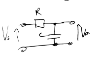
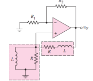
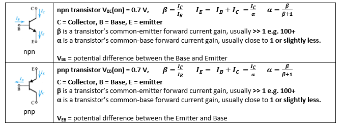
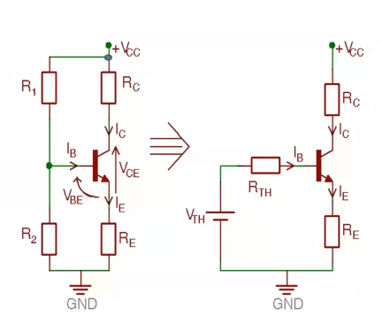
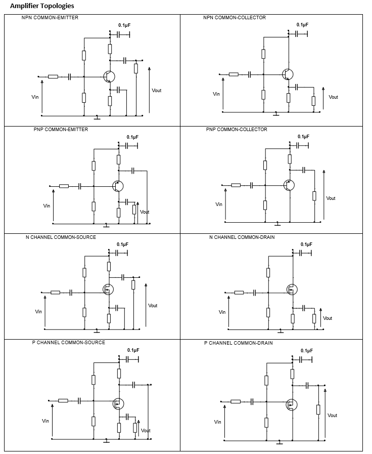

# Equations 
Below are some of the main equations that I have found useful to have on hand.

Use `./generateTables.sh ../src/es2c0/equations.md ` in the scripts folder.

<equation-table>

| [Oscillators](#oscillators)                                                                                                         |                                                                                         |
| ----------------------------------------------------------------------------------------------------------------------------------- | --------------------------------------------------------------------------------------- |
| [Closed Loop Gain](#closed-loop-gain)                                                                                               | $A_{cl}(j \omega) = \frac{v_o}{v_i} = \frac{A}{1-A\beta(j\omega)}$                      |
| [Loop Gain](#loop-gain)                                                                                                             | $L(jw) = A\beta{}(jw)$                                                                  |
| [Frequency Potential Divider ($s$)](#frequency-potential-divider-s)                                                                 | $\frac{V_o}{V_i}(s) = \frac{Z_2}{Z_1 + Z_2} = \frac{sCR}{1 + 3sCR + s^2 C^2 R^2}$       |
| [Frequency Potential Divider ($jw$)](#frequency-potential-divider-jw)                                                               | $\frac{V_o}{V_i}(jw) = \frac{j\omega CR }{1 - \omega^2 C^2 R^2 + 3j \omega CR}$         |
| [Frequency of Unity Gain (0 phase shift)](#frequency-of-unity-gain-0-phase-shift)                                                   | $\omega_0 = \frac{1}{RC} \Rightarrow f_0 = \frac{1}{2\pi RC}$                           |
| [60 Degrees of phase shift in CR network](#60-degrees-of-phase-shift-in-cr-network)                                                 | $\omega_{60\degree} = \frac{1}{sqrt{3} \times{}RC}$                                     |
| [Transfer function of CR Network](#transfer-function-of-cr-network)                                                                 | $\frac{v_o}{v_i} = \frac{j \omega RC}{1 + j \omega RC}$                                 |
| [Transfer function of RC Network](#transfer-function-of-rc-network)                                                                 | $\frac{v_o}{v_i} = \frac{1}{1+sCR} = \frac{1}{1+jwCR}$                                  |
| [Transfer function of Inverse Frequency potential divider ($s$)](#transfer-function-of-inverse-frequency-potential-divider-s)       | $\frac{V_o}{V_i}(s) = \frac{Z_2}{Z_1 + Z_2} = \frac{(1+sCR)^2}{1 + 3sCR + s^2 C^2 R^2}$ |
| [Transfer function of Inverse Frequency potential divider ($jw$)](#transfer-function-of-inverse-frequency-potential-divider-jw)     | $\frac{V_o}{V_i}(jw) = \frac{(1+jwCR)^2 }{(1-w^2C^2R^2) + 3jwCR}$                       |
| [Transfer function of Frequency potential divider (Inductor) ($s$)](#transfer-function-of-frequency-potential-divider-inductor-s)   | $\frac{V_o}{V_i}(s)  = \frac{sLR}{(R^2 + s^2L^2) + 3sLR}$                               |
| [Transfer function of Frequency potential divider (Inductor) ($jw$)](#transfer-function-of-frequency-potential-divider-inductor-jw) | $\frac{V_o}{V_i}(jw) = \frac{jwLR}{(R^2-w^2L^2) + 3jwLR}$                               |
| [Frequency of Unity Gain (0 phase shift) (Inductor)](#frequency-of-unity-gain-0-phase-shift-inductor)                               | $\omega_0 = \frac{R}{L} \Rightarrow f_0 = \frac{R}{2\pi{}L}$                            |

| [BJT Transitors](#bjt-transitors)                                                     |                                                                                   |
| ------------------------------------------------------------------------------------- | --------------------------------------------------------------------------------- |
| [Common Emitter Forward Gain, $\beta$](#common-emitter-forward-gain-beta)             | $\beta{} = \frac{I_C}{I_B} = \frac{\alpha}{1-\alpha}$                             |
| [Common Base Forward current gain, $\alpha$](#common-base-forward-current-gain-alpha) | $\alpha = \frac{\beta}{\beta + 1}$                                                |
| [NPN Emitter Current](#npn-emitter-current)                                           | $I_E = I_B + I_C = \frac{I_C}{\alpha} = I_C + \frac{I_C}{\beta} = (1+\beta{})I_B$ |
| [Emmitter Voltage Rule of Thumb](#emmitter-voltage-rule-of-thumb)                     | $V_E \approx \frac{V_{cc}}{10}$                                                   |
| [Thevin Resistance Rule of Thumb](#thevin-resistance-rule-of-thumb)                   | $R_{TH} = \frac{\beta{}R_E}{10}$                                                  |
| [Four Resistor Bias Circuit $R_{TH}$](#four-resistor-bias-circuit-r_th)               | $R_{TH} = R_1//R_2 = \frac{R_1R_2}{R_1 + R_2}$                                    |
| [Four Resistor Bias Circuit $V_{TH}$](#four-resistor-bias-circuit-v_th)               | $V_{TH} = V_{CC} \frac{R_2}{R_1 + R_2}$                                           |

| [AC BJT Analysis](#ac-bjt-analysis)                           |                                                                                                        |
| ------------------------------------------------------------- | ------------------------------------------------------------------------------------------------------ |
| [Amplifier Topologies](#amplifier-topologies)                 | $x$                                                                                                    |
| [Transistor Input Impedance](#transistor-input-impedance)     | $r_\pi{} = \frac{\beta{}V_T}{I_{CQ}}$                                                                  |
| [Gain of Emmitter Follower AC](#gain-of-emmitter-follower-ac) | $A_v = \frac{V_O}{V_{in}} = \frac{-\beta{}R_C}{r_{\pi{}} + (1 + \beta{})R_E} \approx -\frac{R_C}{R_E}$ |

| [Impedance Laplace](#impedance-laplace)                     |                                                     |
| ----------------------------------------------------------- | --------------------------------------------------- |
| [Resistor](#resistor)                                       | $Z = R$                                             |
| [Capacitor](#capacitor)                                     | $Z = \frac{1}{sC} = \frac{1}{jwC} = -\frac{1}{wC}j$ |
| [Inductor](#inductor)                                       | $Z = sL$                                            |
| [Resistor Capacitor Series](#resistor-capacitor-series)     | $Z = R + \frac{1}{sC}$                              |
| [Resistor Capacitor Parallel](#resistor-capacitor-parallel) | $Z = \frac{R}{1+sCR}$                               |
| [Resistor Inductor Series](#resistor-inductor-series)       | $Z = R + sL$                                        |
| [Resistor Inductor Parallel](#resistor-inductor-parallel)   | $Z = \frac{sLR}{R+sL}$                              |

| [Op-Amps](#op-amps)                       |                         |
| ----------------------------------------- | ----------------------- |
| [Non-inverting Gain](#non-inverting-gain) | $A = 1 + \frac{R2}{R1}$ |
| [Inverting Gain](#inverting-gain)         | $A = -\frac{R2}{R1}$    |

| [Misc](#misc)                           |                                     |
| --------------------------------------- | ----------------------------------- |
| [Source Regulation](#source-regulation) | $\frac{\Delta{V_L}}{\Delta{V_i}}$   |
| [Load Regulation](#load-regulation)     | $\frac{\Delta{V_L}}{V_{Lexpected}}$ |

</equation-table>

## Oscillators

### Closed Loop Gain
$$A_{cl}(j \omega) = \frac{v_o}{v_i} = \frac{A}{1-A\beta(j\omega)}$$
- $A_{cl}$ is the closed loop gain of the system.
- $A$ is the open loop gain (with no feedback)
- $\beta$ is the feedback fraction, that feeds back a portion of the output voltage back to the input

### Loop Gain
$$ L(jw) = A\beta{}(jw)$$
For oscillation, need unity gain, so angle $=0\degree$ therefore must be real, so $\beta$ also must be real.
### Frequency Potential Divider ($s$)
$$\frac{V_o}{V_i}(s) = \frac{Z_2}{Z_1 + Z_2} = \frac{sCR}{1 + 3sCR + s^2 C^2 R^2}$$

### Frequency Potential Divider ($jw$)
$$\frac{V_o}{V_i}(jw) = \frac{j\omega CR }{1 - \omega^2 C^2 R^2 + 3j \omega CR}$$

### Frequency of Unity Gain (0 phase shift)
$$\omega_0 = \frac{1}{RC} \Rightarrow f_0 = \frac{1}{2\pi RC}$$

### 60 Degrees of phase shift in CR network
$$\omega_{60\degree} = \frac{1}{sqrt{3} \times{}RC}$$

### Transfer function of CR Network
$$\frac{v_o}{v_i} = \frac{j \omega RC}{1 + j \omega RC}$$
 $\frac{v_o}{v_i}$= Gain of CR network

### Transfer function of RC Network
$$\frac{v_o}{v_i} = \frac{1}{1+sCR} = \frac{1}{1+jwCR}$$
 $\frac{v_o}{v_i}$= Gain of RC network

### Transfer function of Inverse Frequency potential divider ($s$)
$$\frac{V_o}{V_i}(s) = \frac{Z_2}{Z_1 + Z_2} = \frac{(1+sCR)^2}{1 + 3sCR + s^2 C^2 R^2}$$

### Transfer function of Inverse Frequency potential divider ($jw$)
$$\frac{V_o}{V_i}(jw) = \frac{(1+jwCR)^2 }{(1-w^2C^2R^2) + 3jwCR}$$

### Transfer function of Frequency potential divider (Inductor) ($s$)
$$\frac{V_o}{V_i}(s)  = \frac{sLR}{(R^2 + s^2L^2) + 3sLR}$$

### Transfer function of Frequency potential divider (Inductor) ($jw$)
$$\frac{V_o}{V_i}(jw) = \frac{jwLR}{(R^2-w^2L^2) + 3jwLR}$$

### Frequency of Unity Gain (0 phase shift) (Inductor)
$$\omega_0 = \frac{R}{L} \Rightarrow f_0 = \frac{R}{2\pi{}L}$$

## BJT Transitors

### Common Emitter Forward Gain, $\beta$
$$ \beta{} = \frac{I_C}{I_B} = \frac{\alpha}{1-\alpha}$$

### Common Base Forward current gain, $\alpha$
$$ \alpha = \frac{\beta}{\beta + 1}$$
### NPN Emitter Current
$$ I_E = I_B + I_C = \frac{I_C}{\alpha} = I_C + \frac{I_C}{\beta} = (1+\beta{})I_B$$

### Emmitter Voltage Rule of Thumb
$$ V_E \approx \frac{V_{cc}}{10} $$

### Thevin Resistance Rule of Thumb
$$ R_{TH} = \frac{\beta{}R_E}{10} $$

### Four Resistor Bias Circuit $R_{TH}$
$$ R_{TH} = R_1//R_2 = \frac{R_1R_2}{R_1 + R_2}$$

### Four Resistor Bias Circuit $V_{TH}$
$$ V_{TH} = V_{CC} \frac{R_2}{R_1 + R_2}$$

## AC BJT Analysis

### Amplifier Topologies
$$x$$

### Transistor Input Impedance
$$ r_\pi{} = \frac{\beta{}V_T}{I_{CQ}}$$
Where $V_T$ = 25mV, $I_CQ$ = Collector current at Q point.

### Gain of Emmitter Follower AC
$$ A_v = \frac{V_O}{V_{in}} = \frac{-\beta{}R_C}{r_{\pi{}} + (1 + \beta{})R_E} \approx -\frac{R_C}{R_E}$$

## Impedance Laplace

### Resistor
$$Z = R$$

### Capacitor
$$Z = \frac{1}{sC} = \frac{1}{jwC} = -\frac{1}{wC}j$$

### Inductor
$$Z = sL$$

### Resistor Capacitor Series
$$ Z = R + \frac{1}{sC} $$

### Resistor Capacitor Parallel
$$ Z = \frac{R}{1+sCR} $$

### Resistor Inductor Series
$$ Z = R + sL $$
### Resistor Inductor Parallel
$$ Z = \frac{sLR}{R+sL} $$

## Op-Amps

### Non-inverting Gain
$$A = 1 + \frac{R2}{R1}$$
### Inverting Gain
$$A = -\frac{R2}{R1}$$

## Misc

### Source Regulation
Fraction of change in load and input voltage
$$\frac{\Delta{V_L}}{\Delta{V_i}}$$

### Load Regulation
Fraction of change in load to expected
$$\frac{\Delta{V_L}}{V_{Lexpected}}$$

