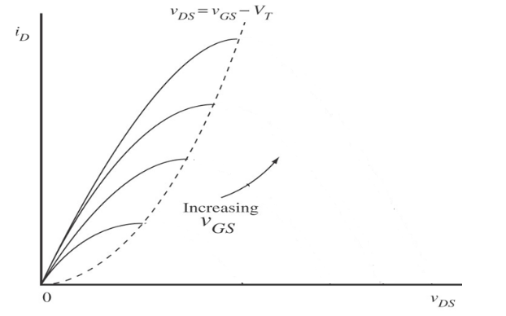
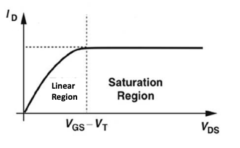

# MOSFETs

Metal Oxide Semiconductor Field Effect Transistors are the dominant type of transistor nowadays, due to their simplicity to fabricate in VLSI applications. They are voltage controlled current sources, unlike BJTs, which are current-controlled.

- By convention, the source terminal is at lower voltage than drain, so $V_{DS} > 0$
- MOSFETs have three regions of operation
  - Cutoff
  - Linear
  - Saturation
    - Different to BJT saturation

A MOS transistor is characterised by it's transconductance:

$$
g_m = \frac{2I_{DQ}}{V_{GS} - V_{TN}}
$$

## Operating Regions

In the linear region:

$$
i_D = K_n \left[ 2(V_{GS} - V_{TN})-V_{DS}\right]V_{DS} \quad \text{for} \quad  0 < V_{DS} < (V_{GS} - V_{TN})
$$

- $K_n$ is the transconductance constant, a function of the semiconductor physics and geometry, and will be given.
- $V_{TN}$ is the N-channel **threshold voltage** for the MOSFET

In this region, the relationship betwen $i_D$ and $V_{DS}$ is (mostly) linear. The graph below shows the the current set by different voltages for different values of $V_{GS}$. The current begins to saturate at higher voltages, but is linear at lower values.

When operating in saturation, the drain current begins to saturate when:

$$
V_{DS} \geq V_{DS(sat)} = V_{GS} - V_{TN}
$$

$i_D$ in saturation:

$$
i_D = K_n (V_{GS} - V_{TN})^2
$$

In the cutoff region, no current flows, as $V_{GS} < V_{TN}$.

- The saturation voltage $V_{DS(sat)} = V_{GS} - V_{TN}$
- Device is in saturation when $V_{DS} > V_{DS(sat)}$
- Device is in linear region when $V_{DS} < V_{DS(sat)}$

## MOSFET Bias Networks

MOSFETs are useful in amplifiers when operating in saturation, when drain current is a function of gate-source voltage. As there is no gate current in a MOSFET:

$$
i_G = 0 \Longrightarrow i_D = i_S
$$

KVL around the gate-source loop:

$$
V_{th} = i_G R_{th} + V_{GS} + i_D R_S = V_{GS} + i_D R_S
$$

Combinging this equation with $i_D = K_n (V_{GS} - V_{TN}) ^2$ gives the following quadratic equation in $\sqrt {i_D}$:

$$
i_D R_S + \frac{1}{\sqrt{K_n}} \sqrt{i_D} + (V_{TN} - V_{TH}) = 0
$$

As the equation for drain current is quadratic, there are two possible solutions:

$$
\sqrt{i_D} = \frac{-K_n^{-1/2} \pm \sqrt{K_n^{-1} - 4R_s(V_{TN} - V_{TH})}}{2R_s}
$$

Only one of the solutions will be valid, so both must be calculated and checked. Using the following values:

- $K_n = 25 mA^{-1}V^2$
- $V_{TN} = 1.5V$
- $R_S = 330 \Omega$
- $R_D = 560 \Omega$
- $V_{CC} = 15V$
- $V_{TH} = 4.78V$

Gives $i_D = 8.2mA$ or $i_D = 12.1mA$. Checking the first one:

$$
V_{D} = 15 - 8.2m \times 560 = 10.408V \\
V_{S} = 8.2m \times 330 = 2.706V \\
V_{G} = V_{TH} = 4.78V \\
V_{GS} = V_G - V_S = 2.074V > V_{TN} = 1.5V \\
V_{DS} = V_D - V_S = 7.7V \\
V_{DS(sat)} = V_{GS} - V_{TN} = 2.074 - 1.5 = 0.574 \\
$$

$i_D = 8.2mA$ is a valid solution as $V_{GS} > V_{TN}$, and $V_{DS} > V_{DS(sat)}$.

Doing the same calculations for the other value yields a gate-source voltage that is below the threshold voltage, so the transistor is not operating in saturation and not conducting, meaning it can be disregarded.
