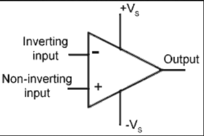
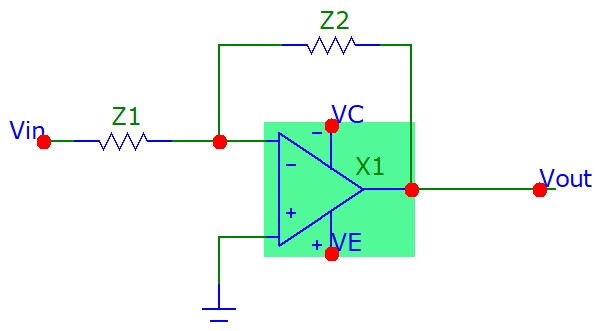

# Op-Amps

Operational Amplifiers are fundamental to modern electronics

$$V_{out} = A(V_2 - V_1)$$

Properties of an ideal Op-Amp:

- $A \to \infty$
- $R_{in} \to \infty$
  - $I_{in} \to 0$
- $R_{out} \to 0$
- Slew rate $\to \infty$
  - Output can change as fast as we want
- Common Mode Rejection Ratio (CMRR) $\to \infty$
  - Signals where $V_2 = V_1$ are rejected and not amplified
- Power supply rejection ratio $\to \infty$
- Bandwith $\to \infty$

A large gain $A$ drives the differential input to zero $(V_2 - V_1) \to 0$, as the op-amp always tries to keep the two inputs the same.

## Buffers

A buffer provides unity gain while acting as a signal buffer.

$$V_{out} = V_{in} \\ A_v = 1$$

As $R_{in}$ is high and $R_{out}$ is low, no current flows in and there is no impedance to current flowing out, meaning the buffer acts to isolate stages of a circuit.

## Active Filters

(they aren't really active, according to Ryan.)

$$
\frac{V_{out}}{V_{in}} = A(j \omega)=  -\frac{Z_2}{Z_1}
$$

$Z_1$ and $Z_2$ are generalised impedances and can take any value. If $Z_2 = R_2 || C$, for example, then:

$$
A(j \omega) = - \frac{R_2/R_1}{1 + j \omega C R_2}
$$

A limits test shows that this would make a low pass filter:

- As $f \to 0$, $A(j \omega) \to -R_2 / R_1$
- As $f \to \infty$, $A(j \omega) \to 0$
- The mid-band is where $A(j \omega) = R_2 / R_1$

Cutoff frequency is where $A(j \omega) = 1 + j$, which is $\frac{1}{2 \pi R_2 C}$Hz

The other way round, where $Z_1 = C + R_1$ and $Z_2 = R_2$ is a high pass filter:

$$
A(j \omega) = - \frac{j \omega C R_1}{1 + j \omega C R_1}
$$

This gives a cutoff frequency of $f_c = \frac{1}{2 \pi R_1 C$, where the max gain as $f \to \infty$ is $R_2/R_1$
