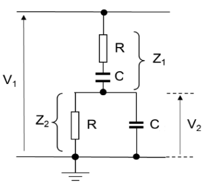

# Oscillators

Oscillators employ feedback through amplifiers and frequency selective networks (capacitors/resistors) to create sinusoidal oscillation.

$$
A_{cl}(j \omega) = \frac{v_o}{v_i} = \frac{A}{1-A\beta(j\omega)}
$$

- $A_{cl}$ is the closed loop gain of the system.
- $A$ is the open loop gain (with no feedback)
- $\beta$ is the feedback fraction, that feeds back a portion of the output voltage back to the input
  - Negative feedback reduces the gain of the system, which is desirable because $A$ is often very large
    - Stabilises circuits
    - Reduces noise and distortion
    - Increases bandwith
  - Positive feedback is employed in the circuit above, which is how oscillators are built
    - $A\beta = 1$ leads to oscillation
- Both positive and negative feedback are used in oscillators
- Loop gain $L(j\omega) = A\beta(j\omega)$ is the gain just before the summing junction in the feedback

If at a specific frequency $f_0$, the loop gain $A\beta$ is unity, $A_{cl}$ will tend to infinity. This is an oscillator. The condition for sinusoidal oscillations of frequency $\omega_0$ is:

$$
L(j\omega) = A \beta(j\omega) = 1
$$

At $\omega_0$ the **phase of the loop gain must be zero** and the **magnitude of the loop gain must be unity**. This is known as the **Barkhausen criterion**.

- The loop must produce and sustain an output with no input applied ($v_i = 0$)
- The frequency $\omega_0$ is determined by the phase characteristics of the feedback loop
- If loop gain $A\beta > 1$, output grows $\to \infty$
- If loop gain $A\beta < 1$, output decays $\to 0$

It is difficult to get exactly unity loop gain. In terms of sinusoidal functions in the laplace domain, we are trying to place both the poles of the function on the imaginary axis in the s-plane. Poles in the right hand side of the plane will initiate oscillation, but bringing them back to the imaginary axis will reduce loop gain to unity and sustain oscillation. Poles in the left hand side of the plane will give a decaying sinusoid.

## Wien-Bridge Oscillator

A Wien Bridge employs frequency selective positive feedback through the capacitor/resistor connected to the non-inverting op-amp terminal, and frequency independent negative feedback connected to the inverting op-amp terminal.

- $A$ is the open loop gain
- $A\beta(j\omega)$ is the loop gain

For oscillation, we require $|A\beta| =1$, as this gives closed loop gain $A_{cl} = \frac{A}{1-1} \to \infty$, which causes oscillation.

First analysing the positive feedback network in the laplace domain (capacitor has capacitance $1/sC$ in the s-domain)

$$
Z_1 = R + \frac{1}{sC} \qquad Z_2 = \frac{R}{1 + sCR}
$$

This is a frequency-dependant potential divider, so:

$$
\frac{V_2}{V_1}(s) = \frac{Z_2}{Z_1 + Z_2} = \frac{sCR}{1 + 3sCR + s^2 C^2 R^2}
$$

This is the transfer function of the frequency-selective positive feedback, as a function of $j\omega + \sigma$. We require $\sigma = 0$ for a sinusoid, so:

$$
\frac{sCR}{1 + 3sCR + s^2 C^2 R^2} = \frac{j\omega CR }{1 - \omega^2 C^2 R^2 + 3j \omega CR}
$$

The fraction above is real when $1 - \omega^2 C^2 R^2 = 0$, so:

$$\omega_0 = \frac{1}{RC} \Rightarrow f_0 = \frac{1}{2\pi RC}$$

Which gives:

$$
\frac{V_2}{V_1} = \beta = \frac{j \omega RC}{ j 3\omega R C} = \frac{1}{3}
$$

**The gain loss of the positive feedback network is $\beta = \frac 1 3$ when $\omega_0 = \frac{1}{RC}$**

As the feedback fraction $\beta = \frac{1}{3}$, we require that $A=3$ for unity gain. The negative feedback circuit with the two resistors forms a non-inverting amp, so:

$$A = 3 = 1 + \frac{R_2}{R_1} \Rightarrow R_2 = 2R_1$$

Verifying this using the overall loop gain:

$$
L(j\omega) = A\beta(j\omega_0) =  \left[1 + \frac{R_2}{R_1} \right]\left[ \frac{j \omega CR}{(1 - \omega^2 C^2 R^2) + j \omega 3 C R}\right] = \left[1 + \frac{R_2}{R_1} \right]\left[\frac{j\omega_0CR}{j\omega_0 3CR}\right] = \left[1 + \frac{R_2}{R_1} \right]\frac{1}{3}
$$

## Phase Shift Oscillator

A phase shift oscillator relies on 180 degrees of phase shift from inverting op-amp A3, and then 3 lots of 60 degrees of additional phase shift from 3 voltage-buffered RC networks. With 360 degrees of phase shift around the loop, the final stage gain is set such that $L(j\omega) = A\beta(j\omega) = 1 \angle 0 $

- The unity gain buffers provide voltage isolation between RC stages so the voltages
  - Buffers have high input impedance and low output impedance, isolating stages to simplify analysis
- The maximum phase shift an RC network can provide is 90 degrees, but it is hard to achieve this so three 60 degree networks are used instead
- The final op-amp A3 creates a non inverting amplifier using $R$ and $R_2$ to give 180 degrees of phase shift

For 60 degrees of phase shift in an RC network, we require:

$$
60 \degree = 90 - \tan^{-1}(\omega RC)
$$

$$
\omega_0 = \frac{\tan 30}{RC} = \frac{1}{\sqrt 3 RC}
$$

At the RC network also acts as a high pass filter, there will be a gain loss through them.

$$
\frac{v_o}{v_i} = \frac{j \omega RC}{1 + j \omega RC}
$$

Using $\omega = \omega_0 = 1/\sqrt{3} RC$:

$$
\frac{v_o}{v_i} = \frac{1/\sqrt 3}{\sqrt{1 + 1/3}} = 0.5
$$

The gain loss for one RC stage is 0.5, so the 3 stages has a gain loss of $0.5^3 = 1/8$. The inverting op-amp therefore must have a gain of -8 to give overall unity gain.

$$
A_3 = \frac{-R_2}[R] = -8
$$

So the value of $R_2$ must be set accordingly.
