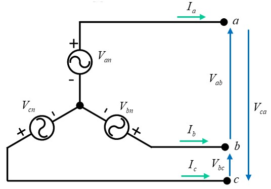
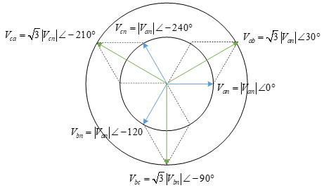
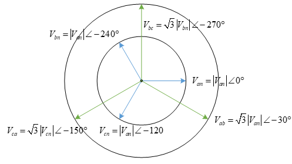
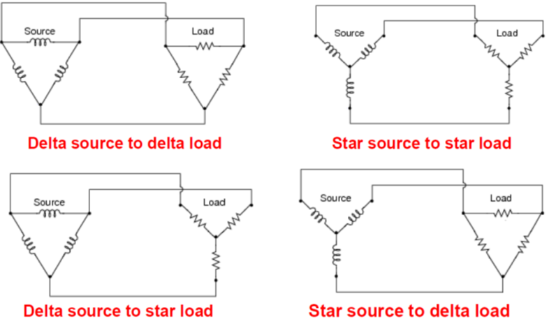
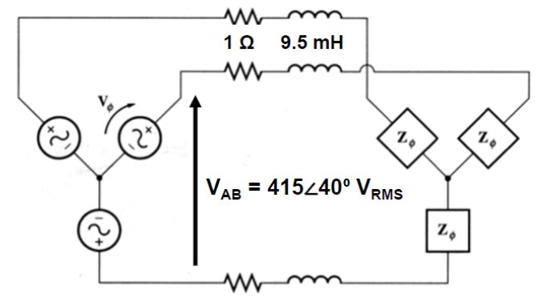
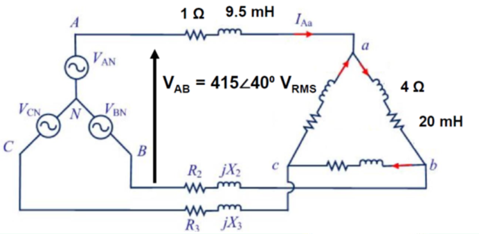

# Three Phase AC Systems

- 3 phase systems exist because generators are usually design to have 3 outputs
- Power is transmitted as 3 phase AC power
- The 3 phases are all AC signals 120° degrees out of phase with each other
- A **balanced** system has voltages and currents of the same amplitude and frequency shifted 120°
  - Assumes all 3 transmission lines and loads have the same impedance
  - Each of the three phases can be connected to identical loads, and the system would consist of three single phase circuits
- **Phase sequence** determines the order that the peaks of each phase pass
- Positive phase sequence means the peaks pass in the order ABC
  - Phase A leads B by 120°
  - Phase B leads C by 120°
- Negative phase sequence means the peaks pass in the order ACB
  - Phase A leads C by 120°
  - Phase C leads B by 120°
  - Phasors are rotating clockwise

## Star and Delta Connected Systems

There are two ways to connect 3 phase sources and loads:

- Star connected systems
  - The negative of each phase is connected to ground
- Delta connected systems
  - The negative of each phase is connected to another phase
- The phase voltage is the voltage between a phase and the ground, eg $V_{an}$
- The line voltage is the voltage between two transmission lines, eg $V_{ab}$
- The phase current is the current flowing through a phase, eg $I_{ab}$
- The line current is the current flowing out of each phase, eg $I_{a}$

### Star Connected

The phase voltages are measured accross a single phase:

$$
V_{an} = V_{ph} \angle 0 \qquad V_{ab} = V_{ph} \angle -120 \qquad V_{cn} = V_{ph} \angle -240
$$

- Line voltages are measured between each pair of lines, and are different from the phase voltages
- Phase currents are measure in each phase, and are the same as the line currents

#### Positive Sequence

All three line voltages are $\sqrt 3 \times$ the phase voltages, and **lead** them by 30°:

$$
V_{ab} = \sqrt 3 |V_{an}| \angle 30 \qquad V_{bc} = \sqrt 3 |V_{bn}| \angle -90 \qquad V_{ca} = \sqrt 3 |V_{cn}| \angle -210 \qquad
$$

All 6 voltage phasors are shown in the diagram below:

#### Negative Sequence

All three line voltages are $\sqrt 3 \times$ the phase voltages, and **lag** them by 30°:

$$
V_{ab} = \sqrt 3 |V_{an}| \angle 30 \qquad V_{bc} = \sqrt 3 |V_{bn}| \angle -90 \qquad V_{ca} = \sqrt 3 |V_{cn}| \angle -210 \qquad
$$

### Delta connected

Phase voltages are measured accross a single phase:

$$
V_{an} = V_{ph} \angle -30 \qquad V_{ab} = V_{ph} \angle -150 \qquad V_{cn} = V_{ph} \angle -270
$$

- Line voltages are measured between the lines, and are the same as the phase voltages
- Phase currents are measured in each phase, and are different from the line currents

#### Positive Sequence

All three line currents are $\sqrt 3 \times$ the phase currents, and **lag** them by 30°:

$$
I_{a} = \sqrt 3 |I_{ab}| \angle -30 \qquad I_{b} = \sqrt 3 |I_{bc}| \angle -150 \qquad I_{c} = \sqrt 3 |I_{ca}| \angle -270 \qquad
$$

#### Negative Sequence

All three line currents are $\sqrt 3 \times$ the phase currents, and **lead** them by 30°:

$$
I_{a} = \sqrt 3 |I_{ab}| \angle 30 \qquad I_{b} = \sqrt 3 |I_{bc}| \angle -90 \qquad I_{c} = \sqrt 3 |I_{ca}| \angle -210 \qquad
$$

## Three Phase Loads

- 3-phase loads can also be star or delta connected
- Phases are assumed to be balanced because shit gets fucked if they're not
- Sometimes it is necessary to convert between star and delta loads

- $R_{\Delta}$ denotes the load in a delta connected system
- $R_{Y}$ denotes the load in a star connected system

### Delta to Star

$$
R_a = \frac{R_2 R_3}{R_1 + R_2 + R_3} \qquad R_b = \frac{R_1 R_3}{R_1 + R_2 + R_3} \qquad R_c \frac{R_1 R_2}{R_1 + R_2 + R_3}
$$

For a balanced load where $R_1 = R_2 = R_3 = R_{\Delta}$:

$$
R_Y = \frac{R_{\Delta}}{3}
$$

### Star to Delta

$$
R_1 = R_b + R_c + \frac{R_bR_c}{R_a} \qquad R_2 = R_a + R_c + \frac{R_aR_c}{R_b} \qquad R_3 = R_a + R_b + \frac{R_aR_b}{R_c}
$$

For a balanced load where $R_a = R_b = R_c = R_Y$:

$$
R_{\Delta} = 3 R_Y
$$

### System Configurations

There are four possible configurations of sources and loads. It easiest to perform analysis on star to star connected systems as it allows single phase analysis, so converting delta to star loads is often needed.

## Power in Three Phase Circuits

The total power delivered by a 3-phase generator and absorbed by a three phase load is the sum of the power in each of the three phases, or 3 times the power in one phase in a balanced system.
Power can be expressed in terms of phase voltages and currents.

For both star and delta connected loads:

| Power                      | Equation                                                      |
| -------------------------- | ------------------------------------------------------------- |
| Active power per phase     | $P_{ph}=\vert I_{ph}\vert \vert  V_{ph}\vert\cos\phi$         |
| Three phase active power   | $P_{3ph}= 3 \vert I_{ph}\vert \vert  V_{ph}\vert\cos\phi$     |
| Reactive power per phase   | $Q_{ph}=\vert I_{ph}\vert \vert  V_{ph}\vert\sin\phi$         |
| Three phase reactive power | $Q_{3ph}=3\vert I_{ph}\vert \vert  V_{ph}\vert\sin\phi$       |
| Apparent power per phase   | $\vert S_{ph} \vert=\vert I_{ph}\vert \vert  V_{ph}\vert$     |
| Three phase apparent power | $\vert S_{3ph} \vert= 3 \vert I_{ph}\vert \vert  V_{ph}\vert$ |

## Example 1

A balanced 3-phase star connected positive sequence source delivers power to a balanced 3-phase star connected load:

- Line-to-Line voltage at each source is $V_{AB} = 415 \angle 40 \, V_{rms}$
- Each transmission line had a resistance of 1 Ohm and an inductance of 9.5 mH
- Each phase is a 4 Ohm resistance and a 20 mH inductor
- System operates at 50Hz

Converting line voltage to phase voltage:

$$
V_{an} = \frac{V_{ab}}{\sqrt 3} \angle -30 = \frac{415}{\sqrt 3} \angle (40-30) = 239.6 \angle 10
$$

The impedance of the load and the transmission line :

$$
Z_Y = 4 + j 2 \pi \times 20 \times 10^{-3}  = 7.44 \angle 57.5 \qquad Z_{line} = 1 + j 2 \pi \times 9.5 \times 10^{-3} = 3.14 \angle 71.45
$$

The line and load current (they're the same in star systems) are calculated using the phase voltage and the total impedance:

$$
I = \frac{V_{an}}{Z_Y + Z_{line}} = \frac{239.6 \angle 10}{10.52 \angle 61.6} = 22.8 \angle -51.6
$$

The voltage across each phase load is the line current and the load impedance:

$$
V_{ph, load} = I Z_Y = (22.8 \angle -51.6)(7.44 \angle 57.5) = 169.6 \angle 5.9
$$

The total active and reactive power dissipated by all phases of the load can then be calculated:

$$
P_{load} = 3 |V_{ph, load}||I| \cos\phi = 3 |169.9|  |22.8| \cos (57.5) = 6.233 kW
$$

$$
Q_{load} = 3 |V_{ph, load}||I| \sin\phi = 3 |169.9|  |22.8| \sin (57.5) = 9.784 kVARS
$$

$$
S_{load} = 6.233 + j9.784 kVA
$$

The total active and reactive power consumed by the line:

$$
P_{line} = 3 |I^2|R_{line} = 3 \times 22.8^2 \times 1 = 1.56 kW
$$

$$
Q_{line} = 3 |I^2|X_{line} = 3 \times 22.8^2 \times 2.98 = 4.647kVARS
$$

$$
S_{line} = 1.56 + j4.647 kVA
$$

Therefore the total complex power delivered by the source is:

$$
S = S_{load} + S_{line} = 1.56 + 6.233 + j(4.647 + 9.784) = 7.78 + j14.38 kVA
$$

## Example 2

A balanced 3-phase star connected positive sequence voltage source delivers power to a balanced 3-phase delta connected load:

- Line-to-Line voltage at each source is $V_{AB} = 415 \angle 40 \, V_{rms}$
- Each transmission line had a resistance of 1 Ohm and an inductance of 9.5 mH
- Each phase is a 4 Ohm resistance and a 20 mH inductor
- System operates at 50Hz

The delta connected load must be converted to it's star equivalent, by dividing the impedences and phase shifting voltages and currents where necessary.

Converting line to phase voltage to get the voltage of each phase at the source:

$$
V_{an} = \frac{V_{ab}}{\sqrt 3} \angle -30 = \frac{415}{\sqrt 3} \angle (40-30) = 239.6 \angle 10
$$

The impedance of each line:

$$
Z_{line} = 1 + j 2 \pi \times 9.5 \times 10^{-3} = 3.14 \angle 71.45
$$

The impedance of each load, then converted to it's star equivalent to calculate individual line currents:

$$
Z_{\Delta} = 4 + j 2 \pi \times 20 \times 10^{-3}  = 7.44 \angle 57.5
$$

$$
Z_Y = \frac{Z_{\Delta}}{3} = 2.48 \angle 57.5
$$

The line and phase currents in a delta load are different, so the line current is calculated from the source phase voltage and total impedance (star equivalent load and line impedances):

$$
I_L = \frac{V_{an}}{Z_Y + Z_{line}} = \frac{239.6 \angle 10}{2.48 \angle 57.5 +  3.14 \angle 71.45} = 42.76 \angle - 55.33
$$

The phase current of the delta load can then be calculated from the line current:

$$
I_{ph, \Delta} = \frac{I_L}{\sqrt 3} \angle 30 = \frac{42.67}{\sqrt 3} \angle (30 - 55.33) = 24.7 \angle - 25.33
$$

The phase voltage of each delta load is then:

$$
V_{ph, \Delta} = I_{ph, \Delta} Z_{\Delta} = (24.7 \angle - 25.33)(7.44 \angle 57.5) = 183.8 \angle 31.17
$$

The power consumed by the load is then:

$$
P_{\Delta} = 3 |I_{ph, \Delta}^2|R_{\Delta}= 3 \times 24.7^2 \times 4 = 7.3 kW
$$

$$
Q_{\Delta} = 3 |I_{ph, \Delta}^2|X_{\Delta}= 3 \times 24.7^2 \times (2\pi \times 50 \times 20 \times 10^{-3})= 11.45 kVARS
$$

$$
S_{load} = 7.3 + j11.45 kVA
$$

The power consumed by the line:

$$
P_{line} = 3 |I_L^2| R_{line} = 3 \times 42.67^2 \times 1 = 5.49 kW
$$

$$
Q_{line} = 3 |I_L^2| X_{line} = 3 \times 42.67^2 \times 2.98 = 16,37 kVARS
$$

$$
S_{line} = 5.49 + j13.37 kVA
$$

Total power delivered:

$$
S = 7.3 + j11.45 + 5.49 + j13.37 = 12.8 + j27.9 kVA
$$
