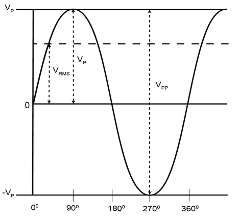
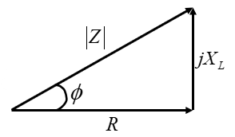
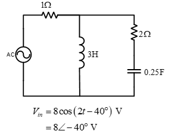
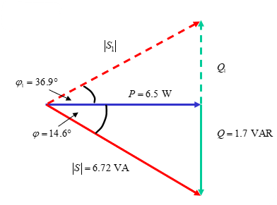
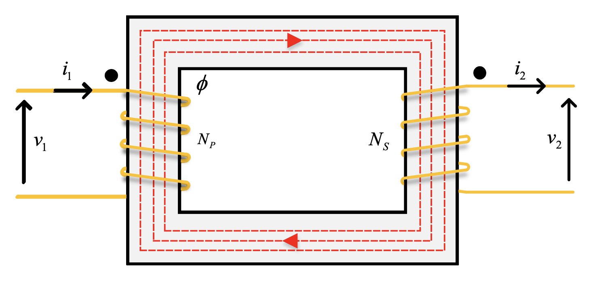
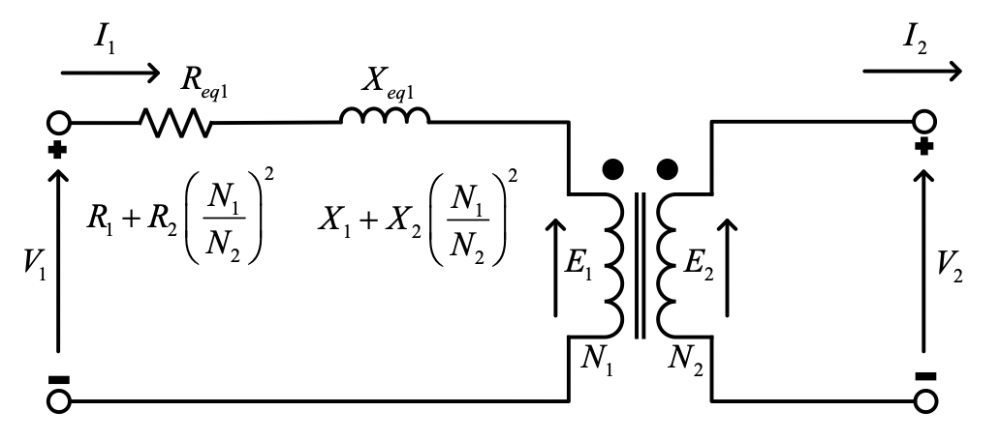
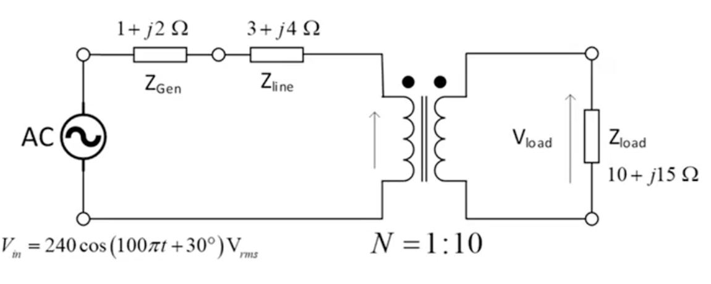

# AC Power

The overwhelming majority of electrial power is AC power, single phase power from the mains at 240V 50-60 Hz.

## Reactance of Capcitors and Inductors

$$
X_L = \omega L = 2 \pi f L \\
Z_L = jX_C = j\omega L = j(2\pi f C)
$$

$$
X_C = \omega L = 2 \pi f C\\
Z_C = \frac{1}{jX_C} = \frac{1}{j\omega C} = \frac{1}{j\times 2\pi fC} = -j\frac{1}{2\pi fC}
$$

When in parallel the impedances is:

$$
\frac{1}{Z_t} = \frac{1}{Z_1} + \frac{1}{Z_2} \\
Z_t = \frac{Z_1 Z_2}{Z_1 + Z_2}
$$

## RMS Power

AC voltages and currents alternate polarities so it is useful to define a DC equivalent, an average voltage/current. This is obtained by taking the root mean square of the sine wave:

$$
V_{RMS} = \frac{1}{\sqrt 2} V_p \qquad I_{RMS} = \frac{1}{\sqrt 2} I_p \qquad
$$

## Real Power

Assume a simple circuit with just an AC source and resistor. The time taken for voltage and current to complete one cycle is $T = 2\pi / \omega = 1 / f$. The power dissapated in a resistor over a full cycle is:

$$
P = \frac{1}{T} \int^{\frac{2\pi}{\omega}}_0 (VI) \, dt = \frac{\omega}{2\pi} \int^{\frac{2\pi}{\omega}}_0 (VI) \, dt = \frac{V_pI_p}{2} = V_{RMS} I_{RMS}
$$

- There is a real power dissipated by a resistor
  - Also called active, average or useful power.
- Measured in Watts
- Useful because it is converted to non-electrical forms like heat, light, or torque

## Reactive Power

Assume a simple circuit with just an AC source and an inductor:

$$
V = V_p \cos \omega t
$$

$$
I = \frac{1}{L} \int V \, dt = \frac{V_p \sin \omega t}{\omega L}
$$

The power dissipated in one cycle $T$ is:

$$
P = \frac{1}{T} \int^{\frac{2\pi}{\omega}}_0 (VI) \, dt = \frac{\omega}{2\pi} \int^{\frac{2\pi}{\omega}}_0 (V_p \cos \omega t)\left(\frac{V_p \sin \omega t}{\omega L}\right) \, dt = 0
$$

- The average power dissipated by an inductor is 0
- No useful work is done as there is no energy conversion
- Energy is exchanged between the magnetic field of the inductor and the power supply
- Instantaneous power is not zero
- Power consumed by a reactance is called **reactive power** and is measured in VARS (Volt-Amp Reactives)
- The same can be done for a capacitor, which exchanges energy between the power supply and it's electric field

## Complex Power

- In a pure resistance, the voltage and current are in phase, and all power is positive and is dissipated
- In a pure reactance, the voltage and current are out of phase by 90 degrees, and the average power over a cycle is 0
  - Instantaneous power, the power at any given point in time, is $P(t) = V(t) I(t)$
- Most AC circuits contain both real and reactive components
  - Resistors are real and dissipate active power in Watts
  - Capacitors/inductors are reactive and dissipate reactive power in VARS
- The power supply will delive both real and reactive power in proportion to the magnitudes of real and reactive components
- Total power delivered is the **complex power**, a vector sum of real and reactive power
  - Measured in Volt-Amps (VA)

Say an AC circuit applies a voltage $V_p \angle \theta_v$ accross an impedance $Z = R + j X$, causing a current of $I_p \angle \theta_i$ to flow. The impedance can be written:

$$
Z = |Z| \angle \phi \qquad |Z| = \sqrt{R^2 + X^2_L} \qquad \phi = \tan^{-1}\frac {X}{R}
$$

By Ohm's law:

$$
I_P \angle \theta_i = \frac{V_p \angle \theta_v}{ |Z|\angle \phi }
$$

$$
\phi = \theta_v - \theta_i
$$

$\phi$ is the load angle, which can be used to sketch a **load triangle** representing the complex power:

The load multiplied by the current square gives the power ($P=i^2R$):

$$
i^2_{rms}Z =i^2_{rms}R + ji^2_{rms}X_L
$$

$$
S = P + j Q
$$

$S$ is the **complex power**, comprised of the real and reactive power.

$$
S = V_{rms}I_{rms} = P + jQ = |S| \angle \phi \qquad |S| = \sqrt{P^2 + Q^2}
$$

$$
P = I_{rms} V_{rms} \cos \phi \qquad Q = I_{rms} V_{rms} \sin \phi
$$

$\cos \phi$ is the **power factor**. The closer it is to 1, the more real, useful, power is being dissapated in the system, which we want to maximise.

- If $\phi$ is positive, the power factor is lagging, meaning that the phase of the current is lagging the voltage
  - The load is inductive, as current lags voltage in an inductance
- If $\phi$ is negative, the power factor is leading, current leads voltage
  - The load is capacitive

## Power Factor Correction

- Electrical power sources have to produce both real and reactive power
- Real power is useful and does work, reactive power does not
  - Most reactive power is inductance in transmission lines
- We want to maximise the real power in the system, the ratio of which is given by the power factor $\cos\phi = P/|S|$
- Inductive loads cause a positive phase angle
  - Lagging power factor as current lags voltage
- Capacitive loads cause a negative phase angle
  - Leading power factor as current leads voltage
- Additional capacitors or inductors can be added to a power system to make the power factor as close to 1 as possible

The power triangle below shoes a reduction in $\phi$ reducing the reactive power but keeping the same real power

### Example 1

Improve the power factor of the AC system shown to 0.98 lagging by adding a shunt reactance to the circuit

Reducing the system to a single impedance:

$$
Z_T = \frac{Z_C(R + Z_L)}{Z_C + R + Z_L} = \frac{\frac{-j}{\omega C} \times (R + j\omega L)}{\frac{-j}{\omega C} + R + j\omega L} = \frac{(-j6.37)(2+j1.57)}{-j6.37 + 2+j1.57} = 3.11 \angle 15.5 \degree \,\Omega = 3 + j0.83 \\
Z = R + jX = 3 + j0.83
$$

Calculating the complex power:

$$
I_{rms} = \frac{V}{Z} = \frac{25 \angle 0}{3.11 \angle 15.5} = 8.04 \angle -15.5
$$

$$
P = I^2 R = 194
$$

$$
Q = I^2 X = 56.63
$$

$$
|S| = \sqrt{P^2 + Q^2} = 202
$$

The current power triangle is therefore:

With a power factor of $\cos \left( \tan^{-1} \frac{56.63}{194} \right) = 0.961$. The new load angle we require is $\cos^{-1}(0.98) = 11.48$. This will require a capacitance in parallel with the current impedance, which will dissipate more reactive power $Q_C$ to give a new overall reactive power $Q_1$:

$$
Q_C = Q - Q_1 = 56.63 - P \tan 11.48 = 17.23
$$

$$
X_C = \frac{V^2}{Q_C} = \frac{25^2}{17.23} = 36.27
$$

$$
C = \frac{1}{2\pi f X_C} = \frac{1}{2 \pi \times 50 \times 36.27} = 8.775 \times 10^{-5}
$$

The shunt capacitance should have a value of $87.75 \mu F$ to increase the power factor to 0.98 lagging.

### Example 2

Add a component to this system to improve the power factor to 0.8 lagging.

The total impedance of the system:

$$
Z_T = 1 + \frac{j6(2-2j)}{j6 + 2 - 2j} = 4.6 - j1.2 = 4.75 \angle - 14.6
$$

$$
I = \frac{V}{Z} = \frac{8 \angle -40}{4.75 \angle -14.6} = 1.68 \angle - 25.4
$$

Calculating the power:

$$
S = |V_{rms}||I_{rms}| = \frac{8}{\sqrt{2}} \times \frac{1.68}{\sqrt 2} = 6.72
$$

$$
P = I^2 R = \frac{1.68^2}{2} \times 4.6 = 6.6
$$

$$
Q = I^2 X = \frac{1.68^2}{2} \times 1.2 = 1.7
$$

The current load angle is 14.6 lagging, so we need to add an inductance to make the system have a load angle of $\arccos 0.8 = 36.9$ lagging

The power dissipated by the new inductor:

$$
Q_L = Q + Q_1 = 1.7 + 6.5 \tan (36.9) = 6.58
$$

$$
X_L = \frac{V^2_{rms}}{Q_L} = \frac{8^2 / 2}{6.58} = 4.86
$$

$$
L = \frac{X_L}{\omega} = \frac{4.86}{2} = 2.43
$$

A shunt inductor of $2.43$ H is added to the system.

## Resonant Circuits

- In any RLC circuit, it is possible to select a frequency at which the impedance is purely real
- At this frequency the circuit will draw only real power
- All the reactance will cancel out
- In cases where frequency is controllable this is useful to improve efficiency
- To calculate:
  - Derive expression for the total circuit impedance
  - Split into real and imaginary parts
  - Derive a value of $\omega$ such that the imaginary part is 0

### Example

Find an expression for the resonant frequency:

$$
Z_1 =  R_1 + j\omega L
$$

$$
Z_2 = \frac{R_2}{1 + j \omega R_2 C} = \frac{R_2}{1 + \omega^2 R_2^2 C^2} - j \frac{\omega R^2_2C}{1 + \omega^2 R_2^2 C^2}
$$

$$
Z_T = R_1 + j\omega L + \frac{R_2}{1 + \omega^2 R_2^2 C^2} - j \frac{\omega R^2_2C}{1 + \omega^2 R_2^2 C^2}
$$

$$
\operatorname{re}(Z_T) = R_1 + \frac{R_2}{1 + \omega^2 R_2^2 C^2}
$$

$$
\operatorname{im}(Z_T) =\omega L -  \frac{\omega R^2_2C}{1 + \omega^2 R_2^2 C^2}
$$

We require that $\omega$ such that $\operatorname{im}(Z_T) = 0$:

$$
0 = \omega L -  \frac{\omega R^2_2C}{1 + \omega^2 R_2^2 C^2}
$$

$$
\omega = \sqrt{\frac{1}{LC} - \frac{1}{R^2_2 C^2}}
$$

## Transformers

- Transformers are the link between power systems of different voltage levels
  - Step-up and step-down voltage
  - An increase in voltage gives decrease in current and vice versa
- Have full-load efficiencies of around 98% and are highly reliable
- Similar to how mechanical gears increase/decrease torque/velocity dependent upon gear ratio, electrical transformers increase/decrease voltage/current dependent upon turns ratio
- Consist of an iron/ferromagnetic core with wires wrapped around either side

- Changing voltage accross one coil induces magneto-motive force channelled through core
- The other coil links the changing flux, inducing a voltage accross it

### Ideal Transformers

Ratios of input/output for an ideal transformer are given by:

$$
N = \frac{N_P}{N_S} = \frac{E_{in}}{E_{out}} = \frac{I_{out}}{I_{in}}
$$

When referring electrical properties over a transformer, multiply or divide by $N^2$

$$
Z_P = Z_S N^2
$$

An ideal transformer is assumed to be 100% efficient:

$$
S_{in} = S_{out}
$$

#### Example

A single phase, 2 winding transformer is rated at 20kVA, 480V/120V, 50Hz. A source connected to the 480V (primary) winding supplies an impedance load connected to the 120V (secondary) winding. The load absorbs 15kVA at 0.8pf lagging when the load voltage is 118V.

The turns ratio is given by the ratio of voltages:

$$
N = \frac{480}{120} = 4
$$

The load accross the primary winding is then calculated based on the load on the secondary winding:

$$
E_1 = N E_2 = 4 \times 118 = 472 V
$$

The current on the secondary side is calculated from the power:

$$
I_2 = \frac{S_2}{E_2} = \frac{15000 \angle \cos^{-1}(0.8)}{118\angle 0} = 127.12 \angle 36.87
$$

The power factor is lagging so the current is lagging voltage, the current should have a negative phase angle:

$$
I_2 = 127.12 \angle - 36.87
$$

The load impedance can then be calculated from this:

$$
Z_2 = \frac{E_2}{I_2} = \frac{118}{127.12 \angle - 36.87} = 0.928 \angle 36.87
$$

The load impedance referred over the transformer, as seen by the primary winding:

$$
Z_2' = N^2 Z_2 = 16 \times  0.928 \angle 36.87 = 14.85 \angle 36.87
$$

The real and reactive power supplied to the primary winding is calculated easily as this is an ideal transformer, so $S_1 = S_2$

$$
S_1 = S_2 = 15000 \angle 36.87 = 15000 \cos 36.87 +j15000\sin 36.87 = 12000 + j9000
$$

### Non-Ideal Transformers

In reality:

- Windings have resistance
- Core has a reluctance
- Flux is not entirely confined to the core
- There are real and reactive power losses so efficiency is not 100%

To model a transformer more accurately, introduce a resistance in series to model windings resistance, and inductance in series to model flux being not confined to core:

The model above shows a non-ideal transformer modelled with a single extra resistance and inductance, where the impedances from one side have been referred to the other to create a single impedance with values shown.

- Note that in large power transformers, the winding resistance is tiny compared to leakage reactance, so series resistances may sometimes be omitted.

#### Example

An example of a power system containing an ideal transformer is shown below. An AC generator with internal impedance ZGen is connected to a transmission line with impedance $Z_{line}$. The voltage is then stepped up by an ideal transformer with a turns ratio of 0.1 and supplies a load impedance of $Z_{load}$ with a voltage $V_{load}$. Find the real power dissipated by the line impedance and the voltage accross the load.

Refer the load accross the transformer to create a single circuit:

$$
Z'_{load} = Z_{load}N^2 = (10+j1.5) \times 0.1^2 = 0.1 \times j0.15
$$

Now the circuit is a simple AC circuit with three impedences in parallel:

$$
Z_{gen} + Z_{line} + Z'_{load} = 4.1 + j6.15 = Z_T
$$

Current delivered by the generator:

$$
I_{in} = \frac{V}{Z_T} = \frac{240 \angle 30}{7.39 \angle 56.3} = 32.47 \angle - 26.3
$$

Real power dissipated by the line impedance is:

$$
P_{line} = |I|^2 R = 32.47^2 \times 3 = 3.164 kW
$$

To calculate the load voltage, we first need to refer current accross the transformer:

$$
I_{load} = NI_{in} = 0.1 \times 32.47 \angle - 26.3 = 3.247 \angle -26.3
$$

The load voltage is then:

$$
V_{load} = I_{load}Z_{load} = (3.247 \angle -26.3)(18 \angle 56.3) = 58.45 \angle 30
$$
