# Control Systems

- A control system contains processes with the purpose of obtaining a desired output given a specific input
- For example, consider a lift which rises from the ground to fourth floor:
  - Pressing the button is a step input
  - The lift rising is a transient response
- Two major performance measures
  - Steady-state error
  - Transient response

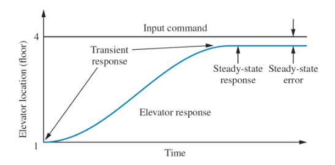

- Open loop control system configurations have an input that feeds directly into an output
  - Cannot compensate for any disturbance
- Closed loop system feed the output signal back into the controller by subtracting it from the input
  - Error drives controller to make corrections

General closed loop feedback control:

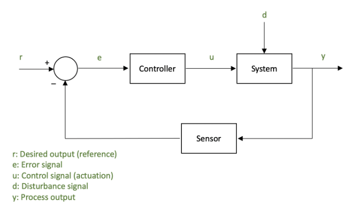

To design control systems, a system model is often needed. There are two general approaches:

- From first principles
  - Uses known physical properties and laws (newton's laws, kirchhoff's laws, etc)
- Data-driven
  - Identifies the system based on data collected
- Models usually take the form of a differential equation which describes the systems dynamics
- Used for simulation, control design, reference tracking, disturbance rejection, etc

## Transfer Functions

Transfer functions give a ratio of output to input for a system.

Consider an $n$th order linear differential equation, where $c(t)$ is the output, $r(t)$ the input, and $a_i$ and $b_i$ are the model parameters:

$$
a_n \frac{d^n c(t)}{dt^n} + a_{n-1} \frac{d^{n-1}c(t)}{dt^{n-1}} + ... + a_0 c(t) = b_m \frac{d^m r(t)}{dt^m} + a_{m-1} \frac{d^{m-1}r(t)}{dt^{m-1}} + ... + b_0 r(t)
$$

Taking laplace transforms an putting into a ratio of input over output:

$$
G(s) = \frac{C(s)}{R(s)} = \frac{b_m s^m + b_{m_-1}s^{m-1} + ... + b_0}{a_n s^n + a_{n_-1}s^{n-1} + ... + a_0}
$$

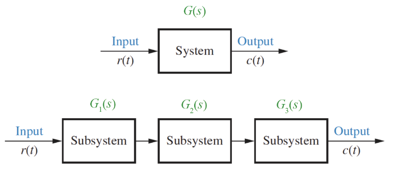

- The transfer function of multiple systems $G(s) = G_1(s)G_2(s)G_3(s)$
- Working with transfer functions is easier than ODEs as it they don't involve any differentials.

### Example

Given the transfer function $G(s) = \frac{1}{s+2}$, find the response to a unit step input $r(t) = u(t)$:

$$
C(S) = \frac{R(s)}{s+2}
$$

Transfer function of the step input $R(s) = \frac{1}{s}$, so:

$$
C(S) = \frac{1}{s+2} \frac{1}{s} = \frac{1}{2s} - \frac{1}{2(s+2)}
$$

Taking inverse laplace transforms:

$$
c(t) = \left(\frac{1}{2} - \frac{1}{2}e^{-2t}\right) u(t)
$$

## Modelling

Two approaches to modelling a system:

- Physical modelling
- Data-driven modelling

Models are developed so we can obtain transfer functions for further system analysis. Focusing on mainly how to build physical models of systems from first principles, there are three main steps:

- Structuring the problem
  - Intended use of the model
  - Inputs/outputs
  - Other parameters
  - How do subsystems interact
  - Draw a block diagram
- Formulate the basic equations
  - Describe relationships between variables
  - Write down conservation laws
  - Write down relevant relationships
- Formulate the ODE
  - Express time derivatives of relevant variables
  - Express outputs as function of inputs

There are two main physical systems relevant to this module, electrical, and rotational mechanical. The properties of the main components of these systems are shown in the tables below:

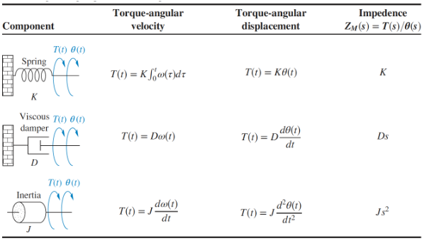

### Rotational Systems

In a rotational system, we are interested in the relationship between applied torque and angular displacement. The sum of the applied torque is the sum of the moments of all the components. For example, obtain the equations of motion for the system shown:

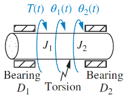

The system has an input torque at $\theta_1$, two inertias $J_1$ and $J_2$, the two bearings act as dampers $D_1$ and $D_2$, and the torsion acts as a spring $K$:

For inertia $J_1$:

$$
K \theta_1(t) + D_1 \dot{\theta}_1(t) + J_1\ddot\theta_1(t) - K\theta_2(t) = T(t)
$$

And for $J_2$:

$$
K \theta_2(t) + D_2 \dot{\theta}_2(t) - J_2\ddot\theta_2(t) - K\theta_1(t) = 0
$$

Note that for both these equations the form is \[sum of impedances connected to motion\] - \[sum of impedance between motions\] = \[sum of applied torque at motion\]. This general form can be applied to any rotational (or electrical) modelling problem.

### Electrial Systems

Obtain the voltage-current relationship of the following electrical system:

Using KVL for loop 1:

$$
L \frac{dI_1 (t)}{dt} + R_1 I_1(t) - L \frac{dI_2(t)}{dt} = V(t)
$$

And loop 2:

$$
L \frac{dI_2(t)}{dt} + R_2I_2(t) + \frac{1}{C} \int^{t}_0 I_2(\tau) \; d\tau - L \frac{dI_1 (t)}{dt} = V_c(t)
$$

Again, noting that the form of the equation is the same as rotational: \[sum of impedances around loop\] - \[sum of impedance between loops\] = \[sum of applied voltage\]

## Block Diagram Algebra

A subsystem can be represented as a block with an input,output, and transfer function. Multiple blocks are connected to form systems, which involve summing junctions and pickoff points:

There are a few familiar forms that always pop up in block diagrams, that can be reduced down into simpler blocks:

### Cascade Form

In a cascade form, each signal is the product of the input and the transfer function. The transfer functions of blocks in a cascade are multiplied to form a single function.

### Parallel Form

In a parallel form, there is a single input, and the output is the sum of the outputs of all the subsystems.

### Feedback Form

Feedback form is the most important form encountered in control systems:

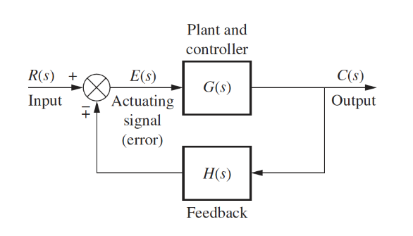

This can be reduced to a single transfer function:

$$
\frac{C(s)}{R(s)} = \frac{G(s)}{1\pm G(s)H(s)}
$$

### Other Identities

Moving left past a summing junction:

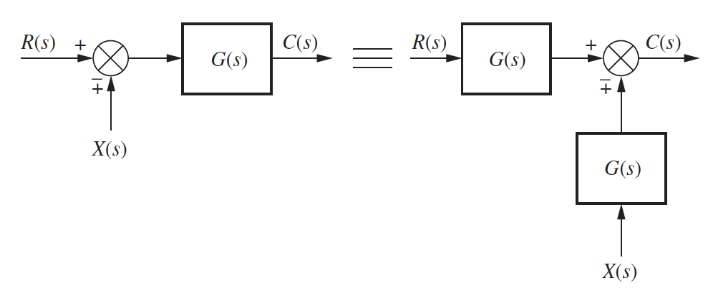

Moving right past a summing junction:

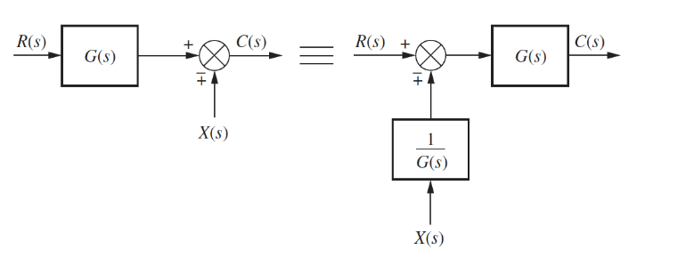

Moving left past a pickoff point:

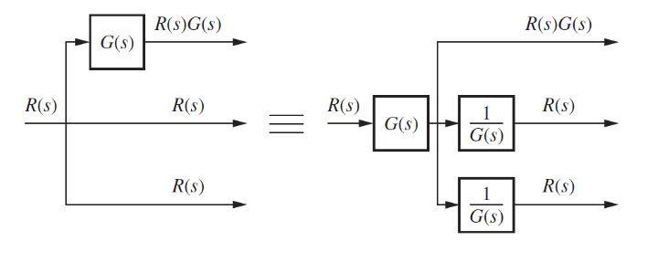

Moving right past a pickoff point:

### Example

The goal is to rearrange diagrams into familiar forms that can then be collapsed

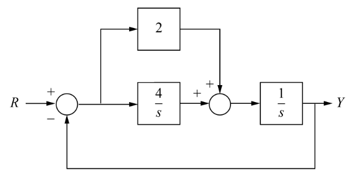

Forming the equivalent parallel system:

Collapsing the cascade:

We now have a single transfer function that is the ratio of output/input for the entire system.

## Poles and Zeros

A system can be analysed to obtain time response characteristics

- Transient response is the initial response that takes place over a time before reaching steady state
- Steady state response is the final response of the system after the transient has diminished

Conside the general form of the transfer function:

$$
G(s) = \frac{(s+ z_1)(s+z_2)\dots (s+z_n)}{(s+ p_1)(s+p_2)\dots (s+p_n)}
$$

- **Poles are the roots of the denominator**
  - The values of $s$ that make $G(s)$ infinite
- **Zeros are the roots of the numerator**
  - The values of $s$ that make $G(s)$ zero

As $s=j\omega + \sigma$ is a complex number, poles and zeros can be plotted on an argand diagram. If $G(s) = \frac{s+2}{s+5}$, then the transfer function has a pole at $s=-5$ and a zero at $s=-2$:

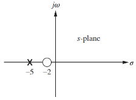

To further analyse this transfer function, we can give it an input step to analyse it's step response. The overall transfer function is now given by:

$$
C(s) = \frac{1}{s} \frac{s+2}{s+5} = \frac{2}{5s} + \frac{3}{5(s+5)}
$$

$$
c(t) = \frac{2}{5} + \frac{3}{5}e^{-5t}
$$

This shows that:

- The pole of the input function generates the form of the forced response (constant term)
  - Step input has a pole at the origin, which generates a step function at the output
- The pole of the transfer function generates the form of the natural response
  - $s=-5$ gave the form $e^{-5t}$
- The pole of the real axis generates an exponential response of the form $e^{st}$
  - The farther to the left a pole is, the faster the transient decays
  - Poles to the right of the imaginary axis will generate unstable responses
- Zeros and poles generate amplitudes for both forced and natural responses

### Stability

- Stability is the most system specification in control design
- Unstable systems are useless
- The definition of stability used here is that of a linear time invariant system
  - Any that can be represented as a transfer function

The response of any system can be expressed as the sum of it's forced and natural responses:

- A system is **stable** if the natural response decays to zero as $t \to \infty$
- A system is **unstable** if the natural response grows without bound ($\to\infty$) as $t \to \infty$
- A system is **marginally stable** if the response is constant or oscillatory

The stability of a system is defined by the poles of it's closed loop transfer function:

- If the poles are all negative, the system is stable and decays exponentially
- An unstable system has at least one negative pole
- If a pole lies on the imaginary axis then the system is oscillatory

## Transient Response Characteristics

The output response of a system for any given input depends on it's order. First and second order systems respond differently to the same input.

### First Order

A first order system only has one pole. A general first order system with one pole and no zeros, subject to a unit step response:

$$
C(S) = R(S)G(S) = \frac{1}{s} \frac{a}{s+a} = frac{a}{s(s+a)}
$$

$$
c(t) = c_f(t) + c_n(t) = 1-e^{-at}
$$

Note that there is only a single parameter, $a$ that describes the dynamics of this system.

- When $t=1/a$, then $c(t) \approx 0.63$
  - This is the time constant, $\tau$ of the system
  - The time it takes for the step response to rise to 63% if it's final value
  - The further the pole from the imaginary axis, the faster the transient response and the lower the time constant
- Rise time $t_r$ is the time for the response to go from 10% to 90%
  - $t_r \approx 2.2/a$
- Settling time $t_s$ is the time for the response to reach, and stay within, 2% of it's final value
- $t_s \approx 4/a$

Often it is not possible to obtain the transfer function of a system analytically, so we can obtain a time constant and other system parameters from data/graphs. The graph below shows a first order step response:

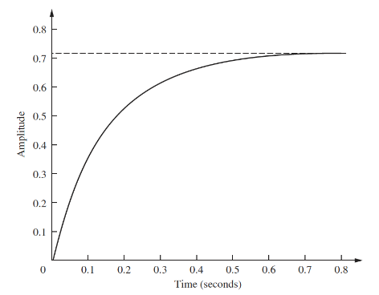

$$
C(s) = \frac{1}{s}\frac{Ka}{s+a}
$$

The final value of the response is 0.72, so the time constant is where the response reaches roughly $0.63\times 0.72 = 0.45$, which is at about 0.13s. Hence $a = \frac{1}{0.13} = 7.7$. To find $K$, we can use the final value theorem:

$$
\lim_{s\to 0} sC(s) = \lim_{s \to 0} \frac{1}{s} \frac{a}{s+a} = frac{a}{s(s+a)} = 0.72 \Rightarrow K = 0.72
$$

### Second Order

A second order system exhibits a wider range of responses than first order. A change in parameter changes the shape of the response entirely. There are four kinds of 2nd order response:

**Overdamped** response has two poles $\sigma_1$ and $\sigma_2$, both on the real axis, which exhibit the combined exponential response of the two poles.

$$
c(t) = K_1 e^{\sigma_1 t} + K_2 e^{\sigma_2 t}
$$

**Underdamped** response has a conjugate pair of complex poles $-\sigma \pm j \omega$, with the real part exhibiting exponential response, and the imaginary part sinusoidal.

$$
c(t) = Ae^{-\sigma t}\cos(\omega t - \phi)
$$

**Undamped** response has two imaginary poles, $\pm j\omega$, exhibiting purely sinusoidal response.

$$
c(t) = A\cos(\omega - \phi)
$$

**Critically damped** response has two repeated real poles, $-\sigma$, so exhibits an exponential response, and an exponential response multiplied by time:

$$
c(t) = K_1 e^{-\sigma t} + K_2 t e^{-\sigma t}
$$

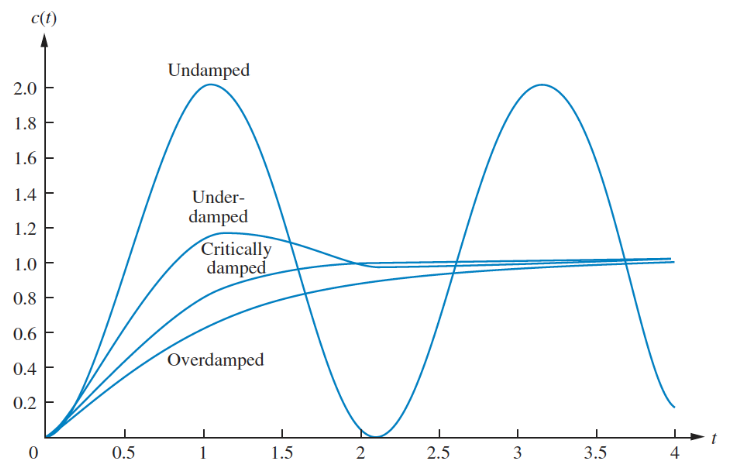

There are two other meaningful parameters of a 2nd order response:

- **Natural frequency** $\omega_n$ is the frequency of oscillation of the system with no damping
- **Damping ratio** $\zeta$ is the ratio of exponential decay frequency to natural frequency

A general 2nd order transfer function is given by:

$$
G(s) = \frac{\omega_n^2}{s^2 + 2\zeta \omega_n s + \omega_n^2}
$$

The damping ratio $\zeta$ determines the characteristics of the system response:

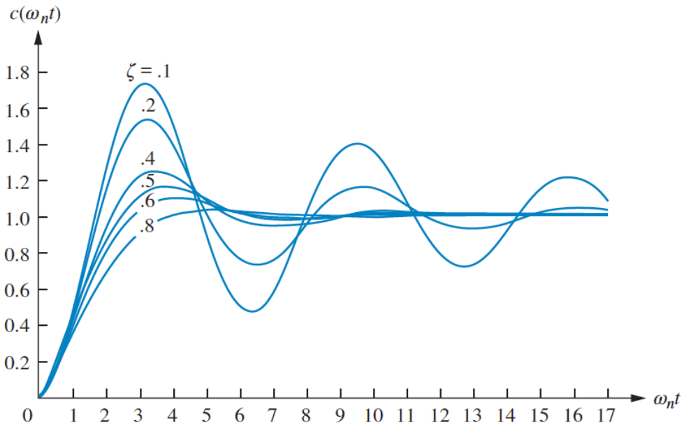

There are additional metrics that describe the response:

- **Settling time** $t_s = \frac{4}{\zeta\omega_n}$
- **Peak time** $t_p$ is the time required to reach the first or maximum peak of the response
- **Percentage overshoot** %$OS$ is the amount that the response overshoots the steady state value at it's peak, expressed as a percentage of the steady state value
- Rise time cannot be trivially defined for a 2nd order system

$$
t_p = \frac{\pi}{\omega_n \sqrt{1-\zeta^2}}
$$

$$
OS = \frac{c(t_p) -1}{1} \times 100 = \exp\left(-\frac{\zeta\pi}{\sqrt{1- \zeta^2}}\right) \times 100
$$

The damping ratio can also be defined in terms of these parameters:

$$
\zeta = - \frac{\ln(OS/100)}{\sqrt{\pi^2 + (\ln(OS/100))^2}}
$$

#### Example

Find the damping ratio, natural frequency, damping characteristics, peak time, overshoot, settling time of:

$$
G(s) = \frac{100}{s^2 + 15s + 100}
$$

$$
\omega_n = 100 \qquad \zeta = \frac{15}{2 \times 10} = 0.75
$$

As $0 < \zeta < 1$, this is an underdamped system.

$$
t_p = \frac{\pi}{10 \sqrt{1-0.75^2}} = 0.475 \qquad  t_s = \frac{4}{10 \times 0.75} = 0.533
$$

$$
OS = \exp\left(-\frac{0.75\pi}{\sqrt{1- 0.75^2}}\right) \times 100 = 2.84 \%
$$

## Steady State Response Characteristics

Steady state response is the final response of the system after the transient has diminished. The primary design focus with control systems is around reducing steady state error, the difference between the input and the output. In the graph below, output 1 has zero error, while output 2 has finite steady state error. It is possible for a system to have infinite steady state error if it continues to diverge from the input.

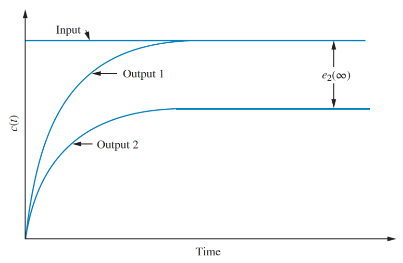

For three different kinds of test input, the corresponding steady state errors are given as

Step input:

$$
e_{\text{step}}(\infty) = \frac{1}{1+K_p}
$$

Ramp input:

$$
e_{\text{ramp}}(\infty) = \frac{1}{K_v}
$$

Parabolic input:

$$
e_{\text{ramp}}(\infty) = \frac{1}{K_a}
$$

$K_p$,$K_v$, and $K_a$ are static error constants associated with different input types.

In order to acheive zero steady state error for a step input the denominator of $G(s)$ has to be 0 as $s \to 0$, which is only possible if $n \geq 1$ in the equation below:

$$
G(s) = \frac{(s+z_1)(s+z_2)...}{s^n(s+p_1)(s+p_2)...}
$$

Meaning that there must be at least one pure integrator (multiple of $1/s$) present in $G(s)$. For ramp and parabolic input, the same applies for $n \geq 2$ and $n \geq 3$.

## PID Controllers

PID controllers are a control method that consits of a proportional, integral, and derivative of an error input $e(t)$:

$$
u(t) = K_p e(t) + K_i \int e(t) \; dt + K_d \frac{de(t)}{dt}
$$

$$
\frac{U(s)}{E(s)} = K_p + \frac{K_i}{s} + sK_d
$$

PID controllers are widely used as they are robust, versatile, and easy to tune. The tuning parameters are the three constants, $K_p$, $K_i$, and $K_d$

- Increasing the proportional term increases the output for the same level of error
  - Causes the controller to react harder to errors so will react more quickly but overshoot more
  - Reduces steady-state error
- The inclusion of an integrator helps to eliminate steady-state error
  - If there is a persistent error the integrator builds and increases the control signal to reduce the error
  - Can make the system respond slower and be more oscillatory
- The derivative term allows the controller to anticipate error
  - The control signal can become large if the error is sloping steeply upwards, irrelevant of magnitude
  - Adds damping to the system to decrease overshoot
  - Does not affect steady-state error

|       | Rise time    | Overshoot | Settling time | Steady-state error |
| ----- | ------------ | --------- | ------------- | ------------------ |
| $K_p$ | Decrease     | Increase  | Small change  | Decrease           |
| $K_i$ | Decrease     | Increase  | Increase      | Decrease           |
| $K_d$ | Small change | Decrease  | Decrease      | No change          |

### PID Tuning

Tuning a PID controller can be done easily if a model of the system can be derived, as then analytical techniques can be applied to determine the ideal parameters. If a model cannot be obtained, then an experimental approach is required. The **Ziegler-Nichols** method is one common approach. The three constants are determined based upon the transient response characteristics of a given system, and there are two different methods, both aiming to give less than 25% overshoot.

Note that for the Ziegler-Nichols method, integral and derivative gains are used, where $K_i = K_p/T_i$ and $K_d = K_p T_d$

- The first method involves experimentally obtaining a unit step input
- If the system involved neither an integrator, or dominant complex poles then the output will look like an s-shaped curve
  - This is when this method applies
  - If this method doesn't apply, the system likely has a built in integrator, and the 2nd method is needed
- The curve is characterised by two parameters, the delay time $L$ and time constant $T$:

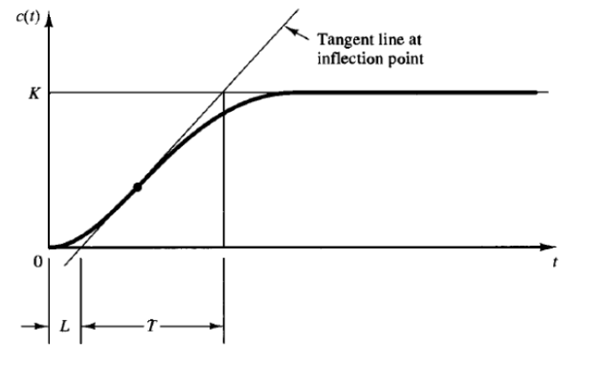

The transfer function can then be approximated by:

$$
\frac{C(s)}{U(s)} = \frac{Ke^{-Ls}}{Ts+1}
$$

And the PID constants are set according to the following:

| Controller type | $K_p$    | $T_i$    | $T_d$  |
| --------------- | -------- | -------- | ------ |
| P               | $T/L$    | $\infty$ | 0      |
| PI              | $0.9T/L$ | $L/0.3$  | 0      |
| PID             | $1.2T/L$ | $2L$     | $0.5L$ |

For the second method:

- Set $T_i = \infty$ and $T_d = 0$. Using $K_p$ only
- Increase the constant to a critical value at which the output exhibits sustained oscillation
  - If this does not happen for any $K_p$, this method is not applicable
- The critical gain, $K_{cr}$ and corresponding critical oscillation period $P_{cr}$ are experimentally determined
- These are then used to set the other constants as per the following:

| Controller type | $K_p$        | $T_i$        | $T_d$         |
| --------------- | ------------ | ------------ | ------------- |
| P               | $0.5K_{cr}$  | $\infty$     | 0             |
| PI              | $0.45K_{cr}$ | $0.83P_{cr}$ | 0             |
| PID             | $0.6K_{cr}$  | $0.5P_{cr}$  | $0.125P_{cr}$ |

Sometimes further tuning is required beyond these two methods to fine-tune the parameters to gain a response suitable to the application.
