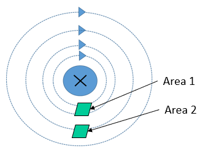
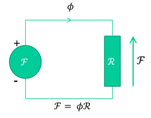
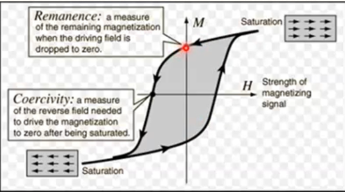
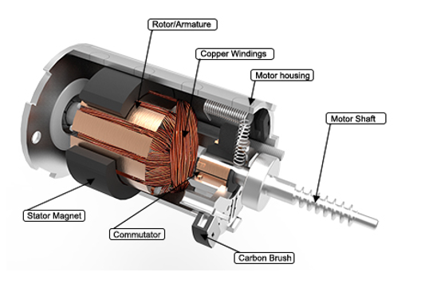
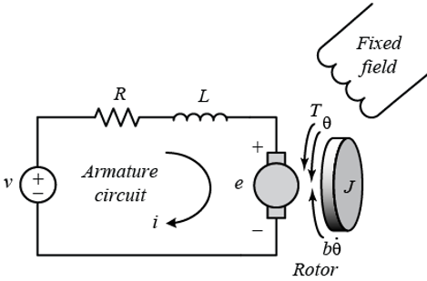
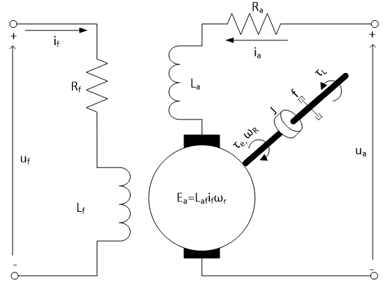
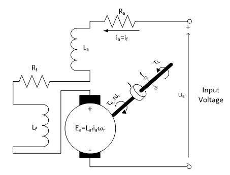
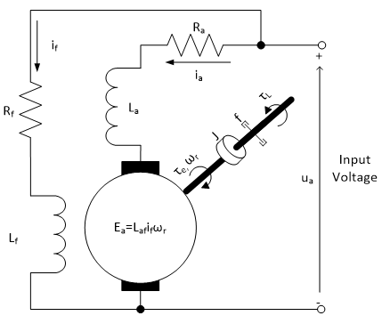
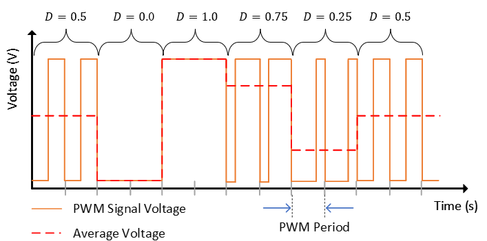
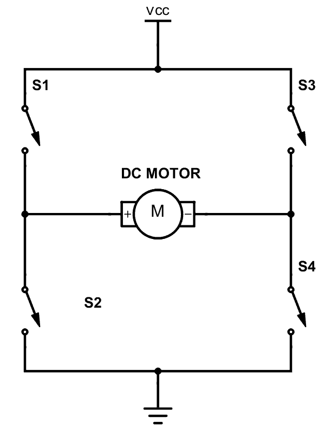

# Electromagnetics

There are 3 basic elements of any electrical machine

- Something to create a magnetic field on demand
- Something to channel said magnetic field
- Something to usefully be acted upon by the field

## Magnetic Fields

- Magnets are dipoles, with a north and south seeking pole
- Moving charge creates a magnetic field
- A magnetic field is a region of influence where a force can act on a particle

- Field lines are closed loops from north to south poles
- Lines never cross
- Closer the lines, stronger the field
- Lines are elastic, will always act to shorten themselves

Moving charges create a magnetic field, so a current moving through a wire will induce a magnetic field around the wire:

- The field radiates outwards from the wire
- Field is stronger close to the wire
- The number of field lines passing through an area is **magnetic flux density** $B$, measure in Teslas
- Area 1 has a higher flux density than area 2
- The direction of the field is determined by the corkscrew rule
  - Make a fist with your right hand
  - Thumb is the current direction
  - Fingers point in field direction

The magnetic flux density around a conductor is $B$ is calculated:

$$
B = \frac{\mu_0 I}{2\pi r}
$$

- $B$ is flux density in Teslas (T)
- $I$ is current in Amps (A)
- $r$ is the distance from the conductor in meters (m)
- $\mu_0$ is the permeability of free space in Henries per meter H/m

Flux density may also be expressed in terms of flux $\phi$:

$$
B = \frac{\phi}{A}
$$

- $\phi$ is magnetic flux in Webers (Wb)
- $A$ is the enclosed area in square meters (m$^2$)

When there is more than one conducting wire, current in the same direction will augment a field

- A long wire with $N$ coils will create a solenoid
- Each extra turn develops a given flux, re-enforced with each turn
- The total flux available in a solenoid is the **flux linkage** $\lambda = N \phi$ in weber-turns

Permeability $\mu$ is a measure of how well a material builds a magnetic field under the influence of a magnetising source. A coil of $N$ turns carrying a current $I$ with length $L$ develops a magnetic field intensity $H$, in amp-turns per meter:

$$
H = \frac{NI}{L}
$$

The useful magnetic field from which is then

$$
B = \mu H
$$

By using a material with higher magnetic permeability, we can create a higher magnetic flux density.

- Permeability $\mu$ is often given in terms of the permeability of free space, and the material's relative permeability: $\mu = \mu_r \mu_0$
- $\mu_0 = 4\pi \times 10^{-7} Hm^{-1}$
- Ferromagnetic materials have high permeability
- Non-ferrous materials have low permeability
- Magnetic cores of ferrous materials are used in solenoids to channel the field
  - An iron core has a higher permeability than air
- Stronger field creates a higher flux density

A current-carrying wire will interact with a magnetic field to create a force

Fleming's left hand rule explains how this works, with force, magnetic field and current all acting in opposite directions.

A loop of wire in a field will have current flowing through it in opposite directions, so the wire will spin as equal forces will be induced on it in opposite directions. This is the basic principle behind how motors work.

The force on a conductor in a magnetic field can be calculated:

$$
F = BIL\sin\theta
$$

- $F$ is the force on the conductor in Newtons (N)
- $B$ is the flux density in Teslas (T)
- $I$ is the current in Amps (A)
- $L$ is the wire length in meters (m)
- $\theta$ is the angle between the plane of the coil and the magnetic field lines

## Magnetic Circuits

Magnetic circuits can be thought of in a similar way to electrical:

- Magneto-motive force $\mathcal{F}$ causes flux $\phi$ to flow through various reluctances $\mathcal{R}$
- $\mathcal{F} = \phi \mathcal{R}$ - Hopkinson's Law

Magneto-motive force is considered the potential for a device to produce flux, and is related to the current and field intensity by:

$$
\mathcal{F}  = NI = Hl = \phi \mathcal{R}
$$

- Flux is akin to magnetic current
- Reluctance defines how much flux a given potential develops
- Reluctance is a function of the geometry and material of the flux pathway
  - Similar to electrical resistivity

$$
\mathcal{R} = \frac{l}{\mu_0 \mu_r A}
$$

### Hysteresis/ B-H Curves

- The magnetic field obtained is a function of field intensity, the direction it is applied, and the existing field
- Saturation is the max possible field strength
- Remanence is the field left when the magnetising source is removed
- Coercivity is how hard it is to swap field direction
- Soft materials are easier to de-magnetise and re-magnetise

### Example

A steel ring, with a coil around it. The ring is 0.2m long with area 400mm$^2$, the coil has 300 turns:

Calculate the magneto-motive force for 500$\mu Wb$ to flow, and the amount of current required to sustain this.

Flux density:

$$
B = \frac{\phi}{A} = \frac{500 \times 10^{-6}}{400 \times 10^{-6}} = 1.25 \,T
$$

The field intensity is given from the table describing the hysteresis characteristics, $H = 1500 \, At/m$. Relating magneto-motive force, current and field intensity:

$$
\mathcal{F} = Hl = 1500 \times 0.2 = 300 \, At
$$

$$
\mathcal{F} = NI = 300
$$

$$
I = \frac{\mathcal{F}}{N} = \frac{300}{300} = 1 A
$$

### Lenz's Law

The direction of an induced EMF is always such that the current it produces acts to oppose the change in flux or motion causing the induced EMF.

- A clockwise field is generated by the first coil
- The flux generated by the first coil links with the second coil's turns
- If this flux is changing, an EMF is induced in the second coil
  - More turns = more linkage = more emf
- The EMF induces a current in the second coil
- The current in the coil causes it to generate it's own flux, in opposition to the flux of the first coil
- EMF out and current out are a function of the ratio between coil turns due to flux linkage
  - This is how transformers work

To induce an EMF, the flux linking the coil must be changing, so typically an AC signal is used. The magnitude of this induced EMF $e$ is the rate of change of flux linkage

$$
e = \frac{d}{dt}(N\phi) = \frac{d\lambda}{dt}
$$

### Reluctance and Force

An armature exposed to a magnetic field will try to move to the point in the field where the least resistance to flux exists

- A current is applied to a the coil to develop a field
- A soft iron bar is inserted which becomes magnetised
- The forced drags the bar in toward the centre of the coil
- As the bar moves in the field a counter current is generated in the coil due to Lenz's law, which reduces net field and force
- The field is not uniform, and is strongest in the centre
- The bar moves back and forth and eventually comes to rest in the centre of the field, where the force is strongest and reluctance is lowest

The energy stored in the coil does work by moving the bar, and the energy comes from inductance, the property of a magnetic field that defines its ability to store energy. THe voltage accross an inductor is given as:

$$
V = L \frac{dI}{dt}
$$

Thus the power is:

$$
VI = P = LI \frac{dI}{dt}
$$

The total work done in Joules is the integral of the power over time:

$$
W_f = \int^t_0 P \, dt = \frac{1}{2}LI^2
$$

The force developed in a field is the Maxwell pulling force, and can be determined in several ways:

$$
F = \frac{LI^2}{2x} = \frac{N^2I^2}{2 \mathcal{R} x} = \mu A \frac{N^2 I^2}{2 x^2} = \frac{B^2 A}{2 \mu}
$$

- $L$ is inductance in henries (H)
- $I$ is current in amps (A)
- $x$ is field length/air gap in meters (m)
- $N$ is coil turns
- $\mathcal{R}$ is reluctance
- $\mu$ is material or air gap permeability
- $A$ is field area in square meters (m$^2$)
- $B$ is flux density in Teslas (T)

## PMDC Motors

Permanent magnet DC motors are widely used in a variety of applications due to their simplicity of control. They consist of two main parts: a stator, and an armature. Stationary magnets are attached to the stator, and coils of wire are wound around the rotating armature:

The circuit below is commonly used as a model of a PMDC motor:

Using this model, the following equations can be derived:

$$
V = L \frac{di}{dt} + Ri + K_e \dot \theta
$$

$$
k_t i = J \ddot\theta + b \dot\theta + T_L
$$

- $V$ is applied voltage in Volts (V)
- $L$ is armature inductance in Henries (H)
- $R$ is armature resistance in ohms ($\Omega$)
- $J$ is inertia in kgm$^2$
- $b$ is friction in Nm/rad/s
- $k_e$ is the back emf constant in V/rad/s
- $k_t$ is the torque constant in Nm/A
- $T_L$ is torque load in Nm
- $i$ is current in Amps (A)
- $\theta$ is position in radians (rad)

### Operating Points

The voltage applied causes motion, and the speed is determined by torque. The motor has linear relationsips in speed, torque, and current.

- For a given voltage, speed will decrease with torque and current will increase with increase torque
- The motor can operate over a range of input voltages
- The voltage applied determines the exact relationship between speed, current, and load
- If a certain known torque load wants to be driven at a certain speed, then a set input voltage can be calculated, which will draw a set amount of current
  - To increase the speed of the same torque load, increase the voltage, which will increase the current
- The combination of speed, current, and load is the motor's **operating point**

Any given voltage and torque produces a speed and current, and the ideal operating point of a motor will be between the maximum efficiency and maximum output power points. When a motor is at a constant speed and current, the dynamic equations can be simplified to steady-state equations (also $k_t = k_e = k$):

$$
V = Ri + k \dot\theta
$$

$$
k i = b \dot\theta + T_L
$$

Steady state current and velocity are therefore:

$$
i = \frac{b \omega + T_L}{k}
$$

$$
\omega = \frac{kV - RT_L}{Rb + k^2}
$$

- Increasing $V$ will cause an increase in $\omega$
- Increasing $T_L$ will cause a decrease in $\omega$
- Increasing $\omega$ will cause an increase in $i$

### Power and Efficiency

The useful output power of a motor is rotational mechanical power. $J\ddot\theta$ and $b\dot\theta$ are considered losses.

$$
P_{out} = T_L \omega
$$

Input electrial power is $P_{in} = iV$, so electrical losses are mainly $P_{loss} = i^2R$. The efficiency is output mechanical power over input electrical power:

$$
\eta = \frac{T_L \omega}{iV} = \frac{T_L}{V} \times \frac{k^2V - kRT_L}{(b \omega + T_L)(Rb + k^2)}
$$

Decreasing the friction $b$ will always increase efficiency, but as the other terms appear in both numerator and denominator, it is hard to find an optimum.

## Wound DC Motors

Wound DC motors have a magnetic field generated by an electromagnet instead of a permanent magnet, so are generally more powerful and controllable.

- Separately excited DC motors use a source of current separate from the armature current to generate the field
- Series connected DC motors have the field windings in series with the armature
- Shunt connected DC motors have the field windings in parallel with the armature

### Separately Excited

- Two separate input voltages
- Both windings used DC current
- Most controllable as field strength is isolated from armature current
- Mutual inductance couples the motor equations as the flux from $L_f$ and $L_a$ interact
- Used when a DC motor with high controllability and high power output is required, such as in electric trains

$$
\frac{di_a}{dt} = -\frac{R_a}{L_a}i_a - \frac{L_{af}}{L_a}i_f \omega_r
$$

$$
\frac{di_f}{dt} = -\frac{R_f}{L_f}i_f + \frac{u_f}{L_f}
$$

$$
\frac{d \omega_r}{dt} = \frac{L_{af}}{J}i_a i_f - \frac{B_m}{J}\omega_r - \frac{\tau_L}{J}
$$

- $i_a$, $i_f$ armature/field current
- $u_a$, $u_f$ armature/field voltage
- $R_a$, $R_f$ armature/field resistance
- $L_a$, $L_f$ armature/field inductance
- $L_{af}$ mutual inductance
- $J$ armature inertia
- $B_m$ armature damping
- $\omega_r$ armature velocity
- $\tau_L$ torque load

### Series Connected

- Self-exciting: no separate input to excite magnetic field
- Field lines are cut by armature field lines
- High starting torque
- Should not be run with no load as they have very high speeds
- Used in heavy industrial equipment with high torques

$$
\frac{di_a}{dt} = -\frac{R_a + R_f}{L_a + L_f}i_a - \frac{L_{af}}{L_a + L_f}i_a  \omega_r + \frac{u_a}{L_a + L_f}
$$

$$
\frac{d \omega_r}{dt} = \frac{L_{af}}{J}i_a^2 - \frac{B_m}{J}\omega_r - \frac{\tau_L}{J}
$$

### Shunt Connected

- Field windings are connected in parallel with armature windings
- Very good speed regulation
- Better at maintaining speed over a range of torque loads
- Best used where torque loads can vary ie in machining tools

$$
\frac{di_a}{dt} = -\frac{R_a}{L_a}i_a - \frac{L_{af}}{L_a}i_f \omega_r + \frac{u_a}{L_a}
$$

$$
\frac{di_f}{dt} = -\frac{R_f}{L_f}i_f + \frac{u_f}{L_f}
$$

$$
\frac{d \omega_r}{dt} = \frac{L_{af}}{J}i_a i_f - \frac{B_m}{J}\omega_r - \frac{\tau_L}{J}
$$

## Motor Control

- Changes in speed are often required in a system.
- This can be done in PMDC motors by changing armature voltage
- Microcontrollers output a control signal to control the voltage

### Pulse Width Modulation

- Works by providing a high-frequency square wave
- The ratio of high/low is called the duty ratio
- Effectively turns a transistor on/off very quickly
- Duty ratio determines voltage accross motor

The graph below shows a PWM signal along with the average voltages

- The signal switches on and off very quickly, meaning the motor control circuit is turned on/off, but the motor has a high inductance meaning it does not respond as quickly
- This has the effect of averaging the voltage
- The PWM frequency is typically very high, and the period must be lower than the response time of the load

Motors can be modelled as an circuit with an inductance in series with a resistor, and an emf representing the motor's back emf:

- The power supply is connected and disconnected by a switch controlled by PWM
- The instantaneous $V_B$ and average $E_r$ voltage accross the motor is shown on the graph for two different duty ratios
- The motor does not stop when disconnected because of the rise and fall time of the current in the RL circuit
- The diode is a freewheeling diode that allows a current path when the voltage switch is off

### Low Side Drive Circuit

- The basic circuit for implementing motor speed control is shown below, known as a "Low Side PMDC Motor Drive Circuit"
  - A high side version swaps the transistor and motor

- The circuit is built around a transistor used to switch the voltage on and off
  - N-type MOSFET generally the best choice
- Freewheeling diode provides a current path for motor current when the switch is off
  - Typically a schottky diode
  - Forward rated current should be greater than max current
  - Reverse voltage should be higher than motor voltage
- Pull down resistor ensures transistor gate voltage is 0 when no input is applied
  - Typically 10k
- Current limiting resistor protects transistor from damage

The signal from the controller will be connected to the transistor gate, switching on and off at the PWM frequency. The duty ratio $D$ determines the ratio of on/off, so the average voltage is:

$$
\bar{V} =D \times V_{cc}
$$

### H-Bridge

A H-Bridge is a power electronic circuit that can convert DC to AD current. For motor control, it can be used to drive a motor in either direction or apply PWM control.

- The switches $S_1$ and $S_4$, and $S_2$ and $S_3$ work in pairs
- The state of each pair should always be opposite
- Current flowing in different directions causes the motor to rotate in different directions
- There are also 3 other states:
  - Shorting is when one side of the circuit has both switches closed and current flows straight to ground
    - This is a short circuit and will cause damage
    - Do not do this
  - Braking
    - $S_2$ and $S_4$ are closed, connecting both terminals to ground and causing the motor to brake sharply
  - Coasting
    - All switches open, motor will continue to spin until mechanical load brings it to a stop
