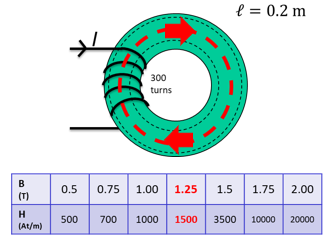

# Electromagnetics

There are 3 basic elements of any electrical machine

- Something to create a magnetic field on demand
- Something to channel said magnetic field
- Something to usefully be acted upon by the field

## Magnetic Fields

- Magnets are dipoles, with a north and south seeking pole
- Moving charge creates a magnetic field
- A magnetic field is a region of influence where a force can act on a particle

- Field lines are closed loops from north to south poles
- Lines never cross
- Closer the lines, stronger the field
- Lines are elastic, will always act to shorten themselves

Moving charges create a magnetic field, so a current moving through a wire will induce a magnetic field around the wire:

- The field radiates outwards from the wire
- Field is stronger close to the wire
- The number of field lines passing through an area is **magnetic flux density** $B$, measure in Teslas
- Area 1 has a higher flux density than area 2
- The direction of the field is determined by the corkscrew rule
  - Make a fist with your right hand
  - Thumb is the current direction
  - Fingers point in field direction

The magnetic flux density around a conductor is $B$ is calculated:

$$
B = \frac{\mu_0 I}{2\pi r}
$$

- $B$ is flux density in Teslas (T)
- $I$ is current in Amps (A)
- $r$ is the distance from the conductor in meters (m)
- $\mu_0$ is the permeability of free space in Henries per meter H/m

Flux density may also be expressed in terms of flux $\phi$:

$$
B = \frac{\phi}{A}
$$

- $\phi$ is magnetic flux in Webers (Wb)
- $A$ is the enclosed area in square meters (m$^2$)

When there is more than one conducting wire, current in the same direction will augment a field

- A long wire with $N$ coils will create a solenoid
- Each extra turn develops a given flux, re-enforced with each turn
- The total flux available in a solenoid is the **flux linkage** $\lambda = N \phi$ in weber-turns

Permeability $\mu$ is a measure of how well a material builds a magnetic field under the influence of a magnetising source. A coil of $N$ turns carrying a current $I$ with length $L$ develops a magnetic field intensity $H$, in amp-turns per meter:

$$
H = \frac{NI}{L}
$$

The useful magnetic field from which is then

$$
B = \mu H
$$

By using a material with higher magnetic permeability, we can create a higher magnetic flux density.

- Permeability $\mu$ is often given in terms of the permeability of free space, and the material's relative permeability: $\mu = \mu_r \mu_0$
- $\mu_0 = 4\pi \times 10^{-7} Hm^{-1}$
- Ferromagnetic materials have high permeability
- Non-ferrous materials have low permeability
- Magnetic cores of ferrous materials are used in solenoids to channel the field
  - An iron core has a higher permeability than air
- Stronger field creates a higher flux density

A current-carrying wire will interact with a magnetic field to create a force

Fleming's left hand rule explains how this works, with force, magnetic field and current all acting in opposite directions.

A loop of wire in a field will have current flowing through it in opposite directions, so the wire will spin as equal forces will be induced on it in opposite directions. This is the basic principle behind how motors work.

The force on a conductor in a magnetic field can be calculated:

$$
F = BIL\sin\theta
$$

- $F$ is the force on the conductor in Newtons (N)
- $B$ is the flux density in Teslas (T)
- $I$ is the current in Amps (A)
- $L$ is the wire length in meters (m)
- $\theta$ is the angle between the plane of the coil and the magnetic field lines

## Magnetic Circuits

Magnetic circuits can be thought of in a similar way to electrical:

- Magneto-motive force $\mathcal{F}$ causes flux $\phi$ to flow through various reluctances $\mathcal{R}$
- $\mathcal{F} = \phi \mathcal{R}$ - Hopkinson's Law

Magneto-motive force is considered the potential for a device to produce flux, and is related to the current and field intensity by:

$$
\mathcal{F}  = NI = Hl = \phi \mathcal{R}
$$

- Flux is akin to magnetic current
- Reluctance defines how much flux a given potential develops
- Reluctance is a function of the geometry and material of the flux pathway
  - Similar to electrical resistivity

$$
\mathcal{R} = \frac{l}{\mu_0 \mu_r A}
$$

### Hysteresis/ B-H Curves

- The magnetic field obtained is a function of field intensity, the direction it is applied, and the existing field
- Saturation is the max possible field strength
- Remanence is the field left when the magnetising source is removed
- Coercivity is how hard it is to swap field direction
- Soft materials are easier to de-magnetise and re-magnetise

### Example

A steel ring, with a coil around it. Ring is 0.2m long with area 400mm$^2$, the coil has 300 turns:

Calculate the magneto-motive force for 500$\mu Wb$ to flow, and the amount of current required to sustain this.

Flux density:

$$
B = \frac{\phi}{A} = \frac{500 \times 10^{-6}}{400 \times 10^{-6}} = 1.25 \,T
$$

The field intensity is given from the table describing the hysteresis characteristics, $H = 1500 \, At/m$. Relating magneto-motive force, current and field intensity:

$$
\mathcal{F} = Hl = 1500 \times 0.2 = 300 \, At
$$

$$
\mathcal{F} = NI = 300
$$

$$
I = \frac{\mathcal{F}}{N} = \frac{300}{300} = 1 A
$$

### Lenz's Law

### Reluctance and Force

## PMDC Motors

## Wound DC Motors

$$
$$
