# Sensors

Sensors measure physical quantities that are outputs from electromechanical systems. A sensed signal will go through a few steps before we have access to the data:

- The physical phenomena, the signal source, will happen
- The sensor will detect this by some mechanism and output a noisy signal
- Some signal conditioning/processing will take place to make the signal easier to read
- Analogue to Digital conversion samples and digitises the data
- The digitised data is presented to software as binary information

## Performance of Sensors

There are a number of metrics used to measure the performance of a sensor, and which metrics are considered will depend upon the use case.

- Accuracy
  - How close is the output to the true value of the input?
  - A sensor with high accuracy will give readings close to the quantity being sensed
- Precision
  - How consistent are the readings for the same input?
  - How repeatable are the readings?
  - Precise data is close to each other, but not necessarily to the true value
  - High precision with low accuracy may be acceptable if the systematic inaccuracy can be compensated for
- Drift
  - Changes in the output of the sensor not related to the input
  - Often related to temperature, as this affects electrical properties
- Hysteresis
  - The difference between the output when the input is increasing, and the output when the input is decreasing
  - Quantities may be sensed differently depending upon their rate of change
  - Common phenomenon and is often useful in other applications
  - Often provided as an average percentage
- Linearity
  - How the output changes with input over its operating range
  - Linear behaviour is ideal as it simplifies output processing
  - Many sensors have a linearity error of how much the output deviates from linear behaviour
- Resolution
  - Changes in measured quantity may be too small to detect
  - Sensor will have a max resolution which is the smallest changes it can sense
  - Resolution also limited by ADC
- Gain
  - How much the output changes with the input
  - Too high and small changes will give large output swings and low noise tolerance
  - Too low and the system will not respond to small changes
  - Often given as how much voltage changes per measured unit
    - A temperature sensor will have a gain in mV/°C
- Range
  - The max and min values that can be sensed
  - Can also define a linear range, the range for which the sensor has linear behaviour
  - Can set a fixed operating range, to increase sensitivity or resolution over a smaller range
  - Wider range usually gives lower sensitivity/resolution

## Signal Conditioning

Generally sensor output is some voltage, which will be given as input to a microcontroller. Voltage signals can be too large, too small, or too noisy, so some conditioning/processing is required

- Filtering to remove noise
- Amplification to increase the range of the signal
- Attenuation to decrease the range of the signal
  - Too large a voltage may damage the electronics

Op-amp circuits are usually involved in signal conditioning.

- $V_{\text{out}} = A(V_2 - V_1)$
  - $A$ is the open loop gain
  - Both open loop gain and input resistance are $\infty$ in an ideal op amp
- **No current flows in or out of the inputs**
- **The two inputs are always at the same voltage**

### Buffer

- The output is connected to the inverting input
  - Negative feedback
- Provides decoupling between circuits
- No current flows into $V_2$, but $V_{\text{out}}$ will still equal $V_2$ as the two inputs are always at the same voltage
  - Ensures no current flows to provide protection
- No current is drawn from the supply by the op-amp
- $V_{\text{out}} = V_2$

### Comparator

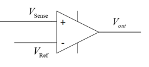

- Amplifies the difference between the two input voltages
- Output saturates at power rail voltages
- Useful for indicating when output reaches a threshold

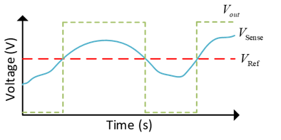

### Inverting Op-Amp

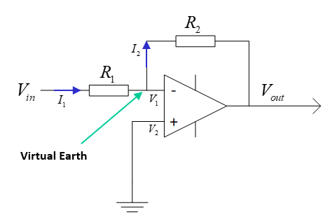

$$
\frac{V_{\text{out}}}{V_{\text{in}}} = -\frac{R_2}{R_1}
$$

- Inverts and amplifies the input
- Amplifies small sensor output voltages
- (see [ES191](../es191/opamps.md))

### Non-Inverting Op-Amp

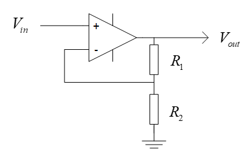

$$
\frac{V_{\text{out}}}{V_{\text{in}}} = 1 + \frac{R_1}{R_2}
$$

- Amplifies and does not invert input

### Attenuation

Voltage attenuation can be easily achevied with just a voltage divider

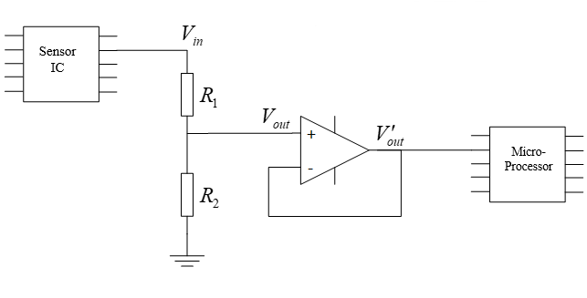

- $V_{\text{in}}$ has range 0 to 20V
- $R_1 = 30 \, k\Omega$, $R_2 = 30 \,k\Omega$,
  - $V_{\text{out}}/V_{\text{in}} = 0.25$
- $V_{\text{out}}$ has range 0 to 5V

### Low Pass Filter

A low pass filter attenuates the high frequency components of a signal:

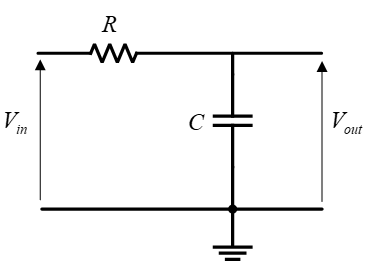

This is a voltage divider with a capacitor:

$$
V_{\text{out}} = V_{\text{in}} \frac{X_c}{\sqrt{R^2+ X_c^2}}
$$

- The impedance of a capacitor $X_c$ is dependant upon frequency: $X_c = 1/ 2\pi f C$
  - Higher frequency, lower impedance
- The corner/cutoff frequency $f_c$ is where the output is -3 decibels smaller than the input (about 71%)
  - $f_c = 1/2 \pi R C$

## Reading Signals and ADC

- Signals are typically read with microcontrollers
- Input to microcontrollers has a maximum which if exceeded will damage the part
- Signals are read and digitised so they can be understood by digital electronics
- Signal is sampled at discrete time steps, at a sampling frequency $f_s$
  - Each sample is the value of the signal at time $t$
- The sample value is held until the next sample, when the sample value is updated
  - This creates a digital signal, an approximation to the input signal
- Sampling frequency has a large affect on how close the digital signal is to the original
  - To maintain the highest frequency components of the signal $f_s \geq 2 f_{max}$
  - $f_{max}$ is the highest frequency present in the signal, the nyquist frequency
  - In practice, sample rate should be much higher than double
- Signal sample levels may only take a finite, discrete number of values
  - Quantisation level
  - Samples are rounded to nearest quantum
  - Higher sampling resolution means more accurate digital signal

A signal measured with a 4-bit ADC:

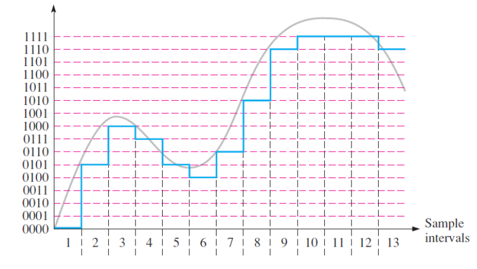

The circuit below shows a 3-bit ADC implemented with a priority encoder and op amps:

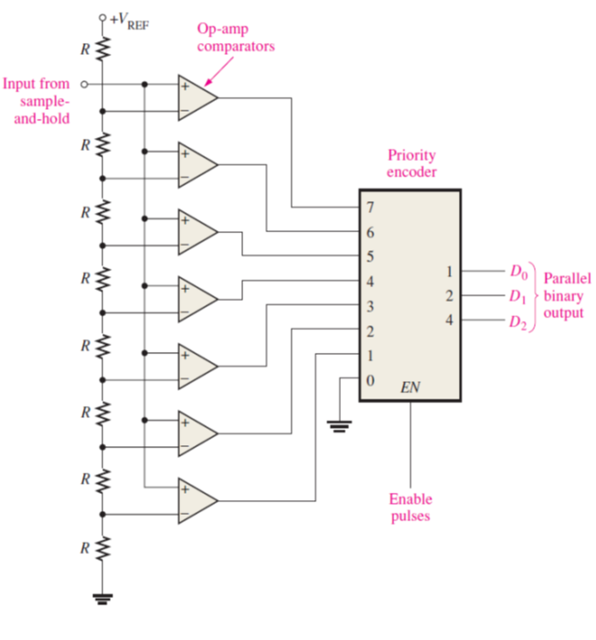

## Wheatstone Bridge

A wheatsone bridge is a common circuit used to measure an unknown resistance:
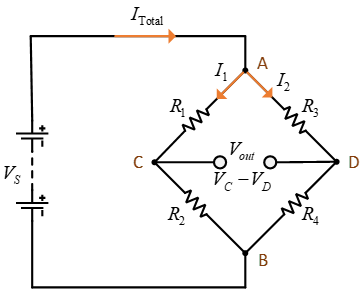

- 4 resistors, one with an unknown value
- Input is a known voltage $V_S$
- Output is the measured difference between $V_C$ and $V_D$
  - Output of two potential dividers in parallel
- When $V_{\text{out}}= 0$, the bridge is balanced
  - $R_1 / R_2 = R_3 / R_4$

This can be exploited to find the value of an unknown resistance. If $V_{out}=0$, and $R_1$ is unknown and the rest are fixed values:

$$
R_1 = R_2 \frac{R_3}{R_4}
$$

Can also derive an expression for $R_1$ in terms of the rest of the circuit, if $V_{out}$ is non-zero:

$$
R_1 = R_2 \left(\frac{V_S (R_3 + R_4)}{V_{out}(R_3 + R_4) + V_S R_4 } -1\right)
$$

The unknown resistance may be some sensor which changes its resistance based upon a physical quantity, ie an LDR or strain gauge. The circuit below shows a photoresistor in a wheatstone bridge, with buffered outputs connected to a differential amplifier, which will provide an output voltage:

## Force and Torque Sensors

### Strain Gauge

- A thin strip of semiconductor which is wafer thin and can be stuck onto things
- The strip deforms as the surface deforms
- When subject to a strain, its resistance changes
  - $\Delta R / R = G\varepsilon $
  - $G$ is the gauge factor, $\varepsilon$ is the strain
- Strain is the ratio of change in length to original length, so this will measure how much a material has stretched by
  - The diagram below shows how

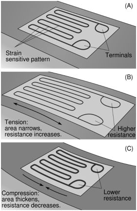

### Load Cell

A load cell uses strain gauges to measure force:

- As the force causes the shape to deform, the strain gauges sense this and the applied force can be calculated
- Important factors to consider are:
  - Maximum force load
  - How the force can be applied to the cell
  - Rated output

### Rotary Torque Sensor

Torque sensors work similar to load cells, using strain gauges to detect deformation.

- The sensor is coupled to a rotating shaft
- The rotation of the shaft causes small deformations within the torque sensor, which are detected by strain gauges

## Position and Speed Sensors

An encoder is a device that gives a digital output dependent upon linear or angular displacement.

- Incremental encoders detect changes in rotary postition from a starting point
- Absolute encoders give a rotational position

### Incremental Encoder

- Incremental encodes contain a disc with multiple holes
- As the disc rotates, the holes will create pulses of light, with each pulse representing a displacement of a certain number of degrees
- Outer two layers slightly offset so direction of rotation can be determined
- Innermost hole counts number of revolutions
- The one shown has 12 holes so a 30° resolution

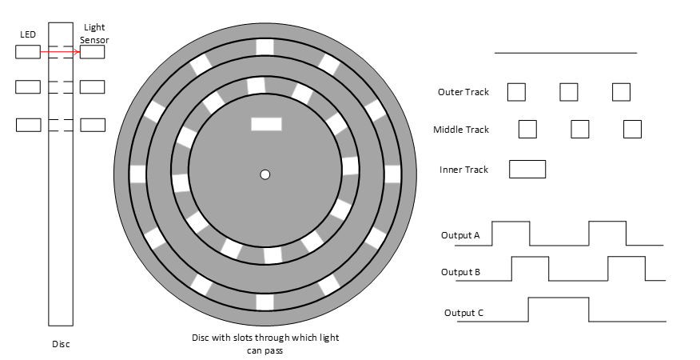

### Absolute Encoder

- An absolute encoder works on a similar principal to an incremental encoder
- The output takes the form of binary code whose value is related to the absolute position of the disc
  - Multiple layers used to provide unique encoding for each disc segment
- Encoders use gray coding so that if any holes are misaligned then error is minimised
- An 8-bit encoder has 360/256 = 1.4° resolution

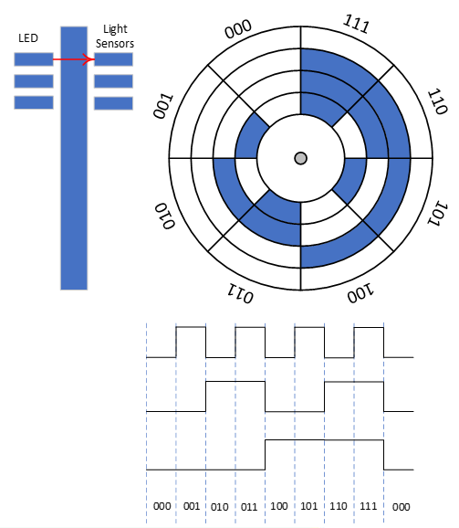

### Speed sensors

- Encoders can also be used to measure angular velocity by measuring the time taken between pulses within the encoder
- Reflective photoelectric sensors work by reflecting light off a disc with reflective and matte colours, and measuring the rate at which the reflected light changes intensity
- Slotted photoelectric sensors work by detecting if a rotating part is blocking a beam of light or not

## Current Sensors

### Current Sense Resistors

- Due to Ohm's law, a current passing through a resistor will cause a voltage drop
- That voltage can be measured, and the current accross it calculated
- This will modify the voltage accross the load and cause a power drop
  - A small resistor should be used, typically less than 10 ohms

### Hall Effect Sensors

- Hall effect sensors use the physical phenomena of flowing electrons being deflected in a magnetic field to measure current
- A magnetic field will cause electrons to be deflected, which will charge either side of a sensor plate depending upon current direction

The potential difference between either side of the plate is given by

$$
V = K_H \frac{BI}{t}
$$

- $K_H$ is hall coefficient
- $B$ is the flux density of the magnetic field
- $I$ is current
- $t$ is plate thickness

Since $K_H$, $B$, and $t$ are constants, the relationship between current and voltage is linear.
