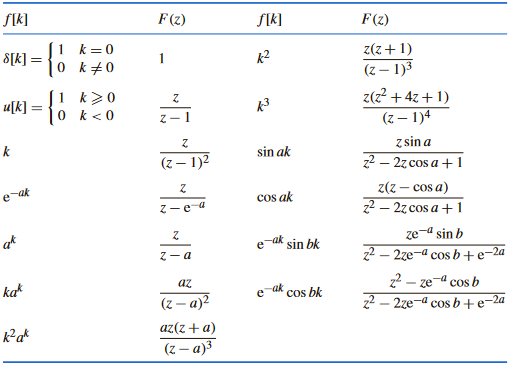

# Z Transforms

## Difference Equations

A difference equation is a discrete equivalent of a differential equation, used in situations where only discrete values can be measured:

$$
\frac{d^2x}{dt^2} + 5\frac{dx}{dt} + 2x = 3t

$$

becomes

$$
x[n+2] + 5x[n+1] + 2x[n] = 3n \qquad n=0,1,2,...

$$

These can be solved numerically by just evaluating the output for each value of n. For example:

$$
y[n] - 0.5y[n-1] = x[n]

$$

$$
x[n] =
\begin{cases}
0 & n < 0 \\
1 & n \geq 0
\end{cases}

$$

This evaluates to:

$$
y[0] = 0.5y[-1] + x[0] = 0.5(0) + 1 = 1 \\
y[1] = 0.5y[0] + x[1] = 0.5(1) + 1 = 1.5 \\
y[2] = 0.5y[1] + x[2] = 0.5(1.5) + 1 = 1.75 \\
\dots

$$

Alternatively, there is an analytical solution...

## The z Transform

Consider a discrete sequence $f[k], n \in \N$. The z transform of this sequence is defined as:

$$
F(z) = \mathcal{Z}\{f[k]\} = \sum^{\infty}_{k=0}f[k]z^{-k}\\ = F(z) = f[0] + \frac{f[1]}{z} + \frac{f[2]}{z^2} + \frac{f[3]}{z^3}...

$$

A closed-form expression can generally be found by the sum of the infinite series. For example, the z transform of the unit step $f[k] = 1$:

$$
\sum^{\infty}_{k=0}f[k]z^{-k} = 1 + \frac{1}{z} + \frac{1}{z^2} + ...

$$

This is a geometric series with $a=1$, $r=z^{-1}$, hence the sum is $\frac{a}{1-r}$

$$
F(z) = \frac{z}{z-1} \text{for} |z| > 1

$$

Taking a z transform of a difference equation converts it to a continuous function. The z domain is similar to the laplace domain, but for discrete time signals instead.

## Common z Transforms

## z Transform Properties

z transforms have linearity, the same as laplace and fourier transforms.

### First Shift Theorem

If $f[k]$ is a sequence and $F(z)$ it's transform, then

$$
\mathcal{Z}\{f[k+i]\} = z^iF(z) - (z^i f[0] + z^{i-1} f[1] + ... + zf[i-1])

$$

For example, if $i=1$:

$$
\mathcal{Z}\{f[k+1]\} = zF(z) - zf[0]

$$

For $i=2$:

$$
\mathcal{Z}\{f[k+2]\} = z^2F(z) - z^2f[0] - zf[1]

$$

### Second Shift Theorem

The function $f(t)u(t)$ is defined:

$$
f(t)u(t)=
\begin{cases}
f(t) & t \geq 0\\
0 & t < 0
\end{cases}

$$

Where $u(t)$ is the unit step function. The function $f(t-iT)u(t-iT)$, where $i$ is a positive integer, represents a shift to the right of this function by $i$ sample intervals. If this shifted function is sampled, we have $f[k-i]u[k-i] $. The second shift theorem states:

$$
\mathcal{Z}\{f[k-i]u[k-i]\} = z^{-i}F(z)

$$

## Inverse z Transforms

z transforms are inverted using lookup tables, but to get them into a recognisable form, some manipulation is often needed, including partial fractions. For example, finding the inverse transform of $F(z) = \frac{z+3}{z-2}$:

$$
F(z) = \frac{z+3}{z-2} = \frac{z}{z-2} + \frac{3}{z-2}

$$

The first term can be seen immediately from the table:

$$
\mathcal{Z}\{\frac{z}{z-2}\} = 2^k

$$

The second term rearranges to give:

$$
\frac{3}{z-2} = \frac{3}{z} \frac{z}{z-2} = 3z^{-1} \frac{z}{z-2}

$$

This is in the form of the second shift theorem, so this can be applied to give:

$$
\mathcal{Z}\{3(2)^{k-1} u[k-1]\} = 3z^{-1} \frac{z}{z-2}

$$

Thus,

$$
\mathcal{Z}^{-1}\left\{\frac{z+3}{z-2}\right\} = 2^k + 3(2)^{k-1} \,u[k-1]

$$

## Example

Solve $y[k+2] - 5y[k+1] + 6y[k]=0$, where $y[0] = 0$, $y[1] = 2$.

$$
\mathcal{Z}\{y[k+2]\} - 5\mathcal{Z}\{y[k+1]\} + 6\mathcal{Z}\{y[k]\} = 0

$$

Taking z transforms:

$$
z^2Y(z) - zy[0] - zy[1] - 5zY(z) + 5zy[0] + 6Y(z) = 0

$$

Rearranging and using initial conditions:

$$
(z^2-5z+6)Y(z) = 2z

$$

$$
Y(z) = \frac{2z}{z^2-5z+6}

$$

Using partial fractions:

$$
Y(z) = \frac{2}{z-3} + \frac{2}{z-2}

$$

Using inverse transforms straight from the table to get the solution:

$$
y[k] = 2 \times 3^k - 2\times 2^k

$$
