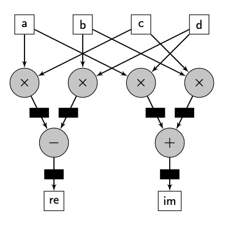
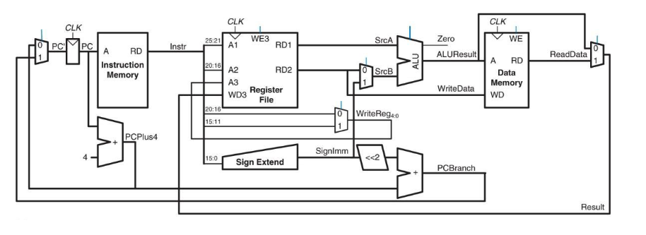
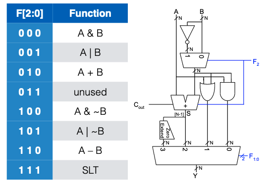
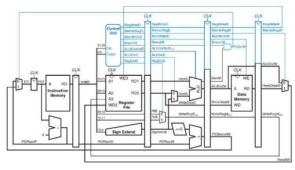

# Processor Implementation

## Fixed Purpose Processors

- Digital circuits designed to implement a specific application, when fabricated so silicon, are Application Specific Integrated Circuits (ASICs).
- The alternative is creating FPGA bitstreams and loading them into FPGAs
- Changing the function of an FPGA is easy, creating new ASICs is expensive.

Custom datapaths for specific applications have the benefit of high performance due to being tailored for the use case, and being able to exploit parallelism. When repeating the same computation on a stream of data, a simple feed forward datapath is most performant, and can be pipelined to improve throughput

The example below shows a feed-forward data path for multiplying two complex numbers, with six pipeline stages.



Finite Impulse Response (FIR) filters are also easy to map to hardware. The delay blocks are just registers, and the arithmetic blocks are implemented directly. Using the transpose form shortens the critical path to improve performance further.


## General Purpose Processors

General purpose processors need to support:

- A set of arithmetic operations
- Movement of data in and out of arithmetic logic
- A way of breaking down functions into discrete steps
- A way to program the circuit to carry out the steps



Each of these components can be constructed in Verilog using basic synchronous elements.

### Program Counter

Just a register with an input and output (32 bits).

```verilog
module pc_reg(input clk, rst, input [31:0] pcnext, output reg [31:0] pc);

always @ (posedge clk) begin
    if (rst) //point to base address on reset
        pc <= 32'd0;
    else
        ps <= pcnext;
end
endmodule
```

### Register File
The register file constains 32 32-bit registers, and has two read ports.

- Two read address, one for each port (`ra1`,`ra2`)
- A write address (`wa3`)
- A write data input (`wd3`)
- Two read outputs (`rd1`, `rd2`)
- A write enable input (`we3`)

```verilog

module regfile (input clk, we3,
    input [4:0] ra1, ra2, wa3,
    input [31:0] wd3,
    output [31:0] rd1, rd2);

reg [31:0] rf [0:31];

always @ (posedge clk) begin
    if(we3) rf[wa3] <= wd3;
end

assign rd1 = (ra1 != 32’d0) ? rf[ra1] : 0;
assign rd2 = (ra2 != 32’d0) ? rf[ra2] : 0;

endmodule
```

### RAM

- Standard memory with one read and one write port
- Reads are combinational and writes synchronous

```verilog
module dmem (input clk, we,
    input [31:0] ad, wd,
    output [31:0] rd);

reg [31:0] ram [0:65535];

// byte-addressing to word-aligned
always @ (posedge clk)
    if(we) ram[ad[31:2]] <= wd;

assign rd = ram[ad[31:2]];

endmodule
```

### Combinational elements

There are other combinational elements in the processor, multiplexers, incrementers, sign extension, etc, all of which are fairly easy to implement. The ALU may be more complex, but a simple example of one is shown below, which supports 8 different functions, selected using a function control input `F[2:0]`.



```verilog
module alu (input [31:0] a,b, input [2:0] func,
    output reg [31:0] out);

wire [31:0] bfin = func[2] ? ~b : b;
wire [31:0] sumout = a + bfin + func[2];

always @ *
    case (func[1:0])
        2'b00: out = a & bfin;
        2'b01: out = a | bfin;
        2'b10: out = sumout;
        2'b11: out = sumout[31];
    endcase

endmodule
```

### Processor control

The processor also has a control unit, which asserts signals to inform the datapath for the processing of a particular instruction. The control unit uses combinational logic to break down the instruction and then output signals to control the rest of the processor

### Pipelining

A pipeline processor requires register stages to be added within the data and control paths.


